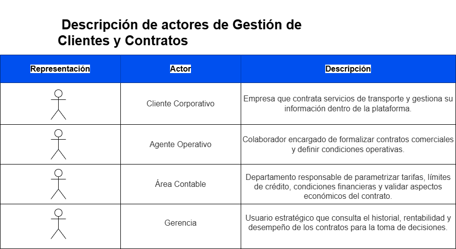

# 1. Descripción de actores de Gestión de Usuarios y Contratos

-------------------------------------------------------------------
# Caso de Uso de Alto Nivel

](<../images/CDU1/dcu alto nivel.drawio.png>)

-------------------------------------------------------------------
# Primera Descomposición
## Procesos Críticos Generales

- **CDU001** – Gestión de Usuarios y Contratos

> **Nota:** Este caso de uso engloba tanto la gestión de todos los usuarios del sistema (clientes corporativos y usuarios internos) como la gestión completa del ciclo de vida de los contratos comerciales, incluyendo tarifas, validaciones y vinculación operativa.

](<../images/CDU1/Primera descomposicion.drawio.png>)

-------------------------------------------------------------------

# Casos Expandidos

## CDU001 – Gestión de Usuarios y Contratos

**Gestión de Usuarios:**
- CDU001.1 – Registrar Usuario
- CDU001.2 – Consultar Usuario
- CDU001.3 – Modificar Usuario
- CDU001.4 – Gestionar Credenciales
- CDU001.5 – Bloquear / Desactivar Usuario

**Gestión de Contratos:**
- CDU001.6 – Crear Contrato
- CDU001.7 – Modificar Contrato
- CDU001.8 – Consultar Contrato
- CDU001.9 – Parametrizar Tarifario
- CDU001.10 – Aplicar Descuento Especial
- CDU001.11 – Validar Vigencia y Capacidad
- CDU001.12 – Vinculación Operativa Automática
- CDU001.13 – Actualizar Historial y Desempeño

-------------------------------------------------------------------
## Diagrama de expandidos para el CDU001

> Este diagrama muestra todos los casos de uso expandidos del CDU001 con sus relaciones:
> - **Agente Operativo** interactúa con: CDU001.1, CDU001.2, CDU001.3, CDU001.4, CDU001.6, CDU001.7, CDU001.8, CDU001.10
> - **Cliente Corporativo** interactúa con: CDU001.2, CDU001.4, CDU001.12
> - **Área Contable** interactúa con: CDU001.2, CDU001.5, CDU001.6, CDU001.7, CDU001.8, CDU001.9, CDU001.10, CDU001.11
> - **Gerencia** interactúa con: CDU001.2, CDU001.8, CDU001.13
> - CDU001.1 <<extend>> -> CDU001.4 Gestionar Credenciales
> - CDU001.2 <<extend>> -> CDU001.3 Modificar Usuario
> - CDU001.2 <<extend>> -> CDU001.5 Bloquear/Desactivar Usuario
> - CDU001.6 <<include>> -> CDU001.9 Parametrizar Tarifario
> - CDU001.6 <<include>> -> CDU001.11 Validar Vigencia y Capacidad
> - CDU001.6 <<extend>> -> CDU001.10 Aplicar Descuento Especial
> - CDU001.7 <<extend>> -> CDU001.10 Aplicar Descuento Especial
> - CDU001.11 <<include>> -> CDU001.12 Vinculacion Operativa Automatica
> - CDU001.12 <<include>> -> CDU001.13 Actualizar Historial y Desempeno

-------------------------------------------------------------------
## CDU001.1 - Registrar Usuario

| Campo | Detalle |
| ----- | ------- |
| **Nombre** | Registrar Usuario |
| **Codigo** | CDU001.1 |
| **Actores** | Agente Operativo |
| **Descripcion** | Permite registrar en el sistema a cualquier usuario de la plataforma, ya sea un cliente corporativo (importadora, exportadora o comercio) o un usuario interno. Los usuarios internos que pueden ser registrados son: Agente Operativo, Agente Logistico, Agente Financiero, Encargado de Patio, Area Contable, Gerencia y Piloto. Para clientes corporativos incluye la captura de datos fiscales, contactos clave y categoria de riesgo, garantizando que todos los departamentos accedan a la misma informacion actualizada. |
| **Precondiciones** | El usuario no debe estar previamente registrado en el sistema. El Agente Operativo debe haber iniciado sesion. |
| **Postcondiciones** | Usuario registrado correctamente en el sistema, o proceso cancelado sin modificaciones. |
| **Flujo Principal** | 1. El Agente Operativo accede al modulo de registro de usuarios. 2. Selecciona el tipo de usuario a registrar: cliente corporativo (importadora, exportadora o comercio) o usuario interno (Agente Operativo, Agente Logistico, Agente Financiero, Encargado de Patio, Area Contable, Gerencia o Piloto). 3. Ingresa el NIT o identificador unico del usuario. 4. Registra los datos generales (nombre, contactos clave, rol en el sistema). 5. Para clientes corporativos, asigna la categoria de riesgo (capacidad de pago, riesgo de mercancia, riesgo en aduanas, lavado de dinero). 6. El sistema valida que todos los campos obligatorios esten completos. 7. El Agente Operativo confirma el registro presionando "Guardar". 8. El sistema almacena los datos y muestra confirmacion de registro exitoso. |
| **Flujos Alternos** | **FA1:** El identificador ingresado ya existe en el sistema. FA1.1 El sistema muestra mensaje: "El usuario ya se encuentra registrado". FA1.2 El Agente Operativo verifica el identificador ingresado. FA1.3 El Agente Operativo corrige el identificador o cancela el proceso. FA1.4 Si corrige, se continua con el flujo principal (4).  **FA2:** El Agente Operativo no ingresa el identificador unico. FA2.1 El sistema muestra notificacion de campo obligatorio. FA2.2 El Agente Operativo ingresa el identificador. FA2.3 Se continua con el flujo principal (4).  **FA3:** La categoria de riesgo no fue asignada para un cliente corporativo. FA3.1 El sistema muestra notificacion de campo obligatorio. FA3.2 El Agente Operativo selecciona la categoria de riesgo correspondiente. FA3.3 Se continua con el flujo principal (6). |
| **Reglas de Negocio** | El identificador de usuario debe ser unico en el sistema. La categoria de riesgo es obligatoria unicamente para clientes corporativos. El rol del usuario debe definirse al momento del registro. |
| **Reglas de Calidad** | El sistema debe validar los campos en tiempo real conforme el usuario los ingresa. El tiempo de respuesta al guardar no debe exceder 3 segundos. |

-------------------------------------------------------------------
## CDU001.2 - Consultar Usuario

| Campo | Detalle |
| ----- | ------- |
| **Nombre** | Consultar Usuario |
| **Codigo** | CDU001.2 |
| **Actores** | Agente Operativo, Cliente Corporativo, Area Contable, Gerencia |
| **Descripcion** | Permite visualizar la informacion registrada de cualquier usuario del sistema, incluyendo datos generales, rol asignado, categoria de riesgo y estado de cuenta para clientes corporativos. Cada actor puede acceder unicamente a la informacion que su rol le permite visualizar dentro de la plataforma. |
| **Precondiciones** | El usuario debe estar previamente registrado en el sistema. El actor debe haber iniciado sesion con credenciales validas. |
| **Postcondiciones** | Informacion del usuario mostrada correctamente al actor solicitante. |
| **Flujo Principal** | 1. El actor accede al modulo de consulta de usuarios. 2. Ingresa el criterio de busqueda (nombre, NIT u otro identificador). 3. El sistema realiza la consulta en la base de datos. 4. El sistema muestra la informacion del usuario segun los permisos del actor. 5. El actor visualiza la informacion y finaliza la consulta. |
| **Flujos Alternos** | **FA1:** El usuario no es encontrado con el criterio ingresado. FA1.1 El sistema muestra el mensaje: "No se encontraron resultados". FA1.2 El actor verifica y corrige el criterio de busqueda. FA1.3 Se continua con el flujo principal (3).  **FA2:** El actor no tiene permisos para visualizar la informacion solicitada. FA2.1 El sistema muestra mensaje: "Acceso denegado. Permisos insuficientes". FA2.2 El actor cierra el mensaje y regresa al menu principal. |
| **Reglas de Negocio** | Solo usuarios autorizados con el rol correspondiente pueden consultar la informacion. La informacion financiera solo puede ser visualizada por el Area Contable y Gerencia. |
| **Reglas de Calidad** | El tiempo de respuesta de la consulta no debe exceder 2 segundos. Todo acceso a informacion de usuarios debe quedar registrado en la bitacora de auditoria. |

-------------------------------------------------------------------
## CDU001.3 - Modificar Usuario

| Campo | Detalle |
| ----- | ------- |
| **Nombre** | Modificar Usuario |
| **Codigo** | CDU001.3 |
| **Actores** | Agente Operativo |
| **Descripcion** | Permite actualizar los datos generales, contactos clave, rol o categoria de riesgo de cualquier usuario previamente registrado en el sistema, garantizando que la informacion se mantenga vigente y correcta para todos los departamentos. |
| **Precondiciones** | El usuario debe estar registrado en el sistema. El Agente Operativo debe haber iniciado sesion. |
| **Postcondiciones** | Informacion del usuario actualizada correctamente, o proceso cancelado sin cambios. |
| **Flujo Principal** | 1. El Agente Operativo consulta al usuario (CDU001.2). 2. Selecciona la opcion "Editar" sobre el registro del usuario. 3. Modifica los campos necesarios (datos generales, contactos o categoria de riesgo). 4. El sistema valida los cambios ingresados. 5. El Agente Operativo confirma los cambios presionando "Guardar". 6. El sistema almacena las modificaciones y registra el evento en auditoria. 7. El sistema muestra confirmacion de actualizacion exitosa. |
| **Flujos Alternos** | **FA1:** Los datos ingresados no son validos. FA1.1 El sistema muestra notificacion indicando el campo con error. FA1.2 El Agente Operativo corrige el dato indicado. FA1.3 Se continua con el flujo principal (4).  **FA2:** El Agente Operativo intenta modificar el identificador unico con historial asociado. FA2.1 El sistema muestra mensaje: "El identificador no puede ser modificado porque tiene historial de contratos u ordenes asociadas". FA2.2 El Agente Operativo cancela la modificacion del identificador. FA2.3 Se continua con el flujo principal (3) para modificar otros campos permitidos. |
| **Reglas de Negocio** | No se permite modificar el identificador unico si el usuario ya tiene contratos u ordenes de servicio asociadas. Toda modificacion debe quedar registrada en la bitacora de auditoria con fecha, hora y usuario que realizo el cambio. |
| **Reglas de Calidad** | El sistema debe registrar auditoria de cada modificacion realizada. El tiempo de confirmacion de cambios no debe exceder 3 segundos. |

-------------------------------------------------------------------
## CDU001.4 - Gestionar Credenciales

| Campo | Detalle |
| ----- | ------- |
| **Nombre** | Gestionar Credenciales |
| **Codigo** | CDU001.4 |
| **Actores** | Cliente Corporativo, Agente Operativo |
| **Descripcion** | Permite generar, actualizar o recuperar las credenciales de acceso a la plataforma de cualquier usuario del sistema, aplicando estrategias de proteccion y recuperacion en caso de extravio o hurto de credenciales, garantizando que el acceso sea seguro y exclusivo del titular. |
| **Precondiciones** | El usuario debe estar registrado y activo en el sistema. |
| **Postcondiciones** | Credenciales generadas, actualizadas o recuperadas correctamente, o proceso cancelado. |
| **Flujo Principal** | 1. El actor accede al modulo de gestion de credenciales. 2. Selecciona la operacion deseada (crear, actualizar o recuperar credenciales). 3. El sistema solicita validacion de identidad del usuario. 4. El actor proporciona los datos de validacion requeridos. 5. El sistema verifica la identidad del solicitante. 6. El sistema genera o actualiza las credenciales segun la operacion seleccionada. 7. El sistema notifica al usuario mediante correo electronico registrado. 8. El proceso finaliza con confirmacion exitosa. |
| **Flujos Alternos** | **FA1:** La validacion de identidad falla. FA1.1 El sistema muestra mensaje: "No fue posible verificar su identidad". FA1.2 El actor puede reintentar ingresando los datos correctos. FA1.3 Si falla tres veces, el sistema bloquea el proceso y notifica al Agente Operativo. FA1.4 Se cancela el proceso.  **FA2:** La nueva contrasena no cumple la politica de seguridad. FA2.1 El sistema muestra los requisitos de seguridad que no se cumplen. FA2.2 El actor ingresa una nueva contrasena que cumpla los requisitos. FA2.3 Se continua con el flujo principal (6). |
| **Reglas de Negocio** | La contrasena debe cumplir la politica de seguridad definida (minimo 8 caracteres, combinacion de letras, numeros y caracteres especiales). Las credenciales solo pueden ser gestionadas por el titular o un Agente Operativo autorizado. |
| **Reglas de Calidad** | Las credenciales deben almacenarse cifradas en la base de datos. El envio de notificaciones de credenciales no debe exceder 30 segundos. |

-------------------------------------------------------------------
## CDU001.5 - Bloquear / Desactivar Usuario

| Campo | Detalle |
| ----- | ------- |
| **Nombre** | Bloquear o Desactivar Usuario |
| **Codigo** | CDU001.5 |
| **Actores** | Area Contable |
| **Descripcion** | Permite al Area Contable desactivar manualmente a un usuario del sistema por incumplimiento financiero o decision administrativa. Para clientes corporativos, el bloqueo automatico por facturas vencidas o limite de credito excedido es el ultimo paso del proceso de validacion financiera (CDU001.11). |
| **Precondiciones** | El usuario debe estar registrado y activo en el sistema. El Area Contable debe haber iniciado sesion con permisos de gestion de usuarios. |
| **Postcondiciones** | Usuario desactivado o bloqueado sin posibilidad de operar en el sistema, o usuario reactivado si regulariza su situacion. |
| **Flujo Principal** | 1. El Area Contable accede al perfil del usuario. 2. Selecciona la opcion "Desactivar Usuario". 3. Ingresa el motivo de la desactivacion. 4. El sistema cambia el estado del usuario a "Inactivo" y registra el evento en auditoria. 5. El sistema notifica al usuario sobre la desactivacion de su cuenta. 6. El usuario queda inhabilitado para operar en el sistema. |
| **Flujos Alternos** | **FA1:** El usuario regulariza su situacion y solicita reactivacion. FA1.1 El Area Contable verifica que el usuario no tiene facturas vencidas ni limite de credito excedido. FA1.2 El Area Contable cambia el estado del usuario a "Activo". FA1.3 El sistema registra la reactivacion en auditoria y notifica al usuario. FA1.4 El usuario queda habilitado para operar nuevamente en el sistema. |
| **Reglas de Negocio** | No se permite operar en el sistema si el usuario esta bloqueado o inactivo. Solo el Area Contable puede desactivar o reactivar manualmente a un usuario. |
| **Reglas de Calidad** | Todo cambio de estado debe registrarse en la bitacora con fecha, hora y usuario responsable. La notificacion al usuario debe enviarse en un maximo de 60 segundos tras el cambio de estado. |

-------------------------------------------------------------------
## CDU001.6 - Crear Contrato

| Campo | Detalle |
| ----- | ------- |
| **Nombre** | Crear Contrato Comercial |
| **Codigo** | CDU001.6 |
| **Actores** | Agente Operativo, Area Contable |
| **Descripcion** | Permite generar un contrato digital para un cliente corporativo, definiendo las reglas de operacion, condiciones financieras, rutas autorizadas, tipos de carga permitidos y parametros tarifarios acordados. Este contrato es el respaldo legal para la prestacion de cada servicio de transporte. |
| **Precondiciones** | El cliente corporativo debe estar previamente registrado y activo en el sistema. El tarifario debe estar parametrizado por el Area Contable. |
| **Postcondiciones** | Contrato creado y asociado al cliente con condiciones financieras y tarifarias definidas, o proceso cancelado sin cambios. |
| **Flujo Principal** | 1. El Agente Operativo selecciona al cliente corporativo registrado. 2. Define el limite de credito y los plazos de pago (15, 30 o 45 dias). 3. Registra la fecha de inicio y fecha de finalizacion del contrato. 4. Registra las rutas autorizadas para el contrato. 5. Define los tipos de carga permitidos. 6. El sistema vincula el tarifario parametrizado por el Area Contable. 7. El Agente Operativo valida las condiciones financieras ingresadas. 8. Registra el contrato en el sistema. 9. El sistema almacena el contrato y muestra confirmacion de creacion exitosa. |
| **Flujos Alternos** | **FA1:** El cliente esta inactivo o bloqueado. FA1.1 El sistema muestra mensaje: "No es posible crear un contrato. El cliente se encuentra inactivo o bloqueado". FA1.2 El Agente Operativo verifica el estado del cliente. FA1.3 Si el estado no puede corregirse, se cancela el proceso.  **FA2:** Las condiciones financieras ingresadas no son validas. FA2.1 El sistema indica los campos con error o datos fuera de rango. FA2.2 El Agente Operativo corrige las condiciones financieras. FA2.3 Se continua con el flujo principal (7).  **FA3:** Se desea aplicar un descuento especial. FA3.1 El Agente Operativo selecciona la opcion de descuento especial. FA3.2 Ingresa el porcentaje o monto del descuento acordado. FA3.3 El sistema registra el descuento asociado al contrato. FA3.4 Se continua con el flujo principal (8). |
| **Reglas de Negocio** | El cliente debe estar activo para poder crear un contrato. Debe definirse obligatoriamente el limite de credito y el plazo de pago. El tarifario debe estar previamente parametrizado por el Area Contable antes de formalizar el contrato. |
| **Reglas de Calidad** | El contrato debe almacenarse en formato digital seguro. El proceso de confirmacion no debe exceder 5 segundos. Debe registrarse auditoria de creacion con fecha, hora y usuario responsable. |

-------------------------------------------------------------------
## CDU001.7 - Modificar Contrato

| Campo | Detalle |
| ----- | ------- |
| **Nombre** | Modificar Contrato Comercial |
| **Codigo** | CDU001.7 |
| **Actores** | Agente Operativo, Area Contable |
| **Descripcion** | Permite actualizar las condiciones de un contrato previamente registrado, incluyendo limites de credito, plazos de pago, rutas autorizadas, tipos de carga y condiciones tarifarias acordadas con el cliente. |
| **Precondiciones** | El contrato debe estar previamente creado y asociado a un cliente activo. |
| **Postcondiciones** | Contrato actualizado con las nuevas condiciones registradas en el sistema, o proceso cancelado sin cambios. |
| **Flujo Principal** | 1. El Agente Operativo busca el contrato existente. 2. El sistema muestra la informacion actual del contrato. 3. El Agente Operativo modifica las condiciones financieras o operativas requeridas. 4. El sistema valida los cambios realizados. 5. El Agente Operativo confirma los cambios presionando "Guardar". 6. El sistema almacena las modificaciones y registra el evento en auditoria. 7. El sistema muestra confirmacion de actualizacion exitosa. |
| **Flujos Alternos** | **FA1:** El contrato no es encontrado. FA1.1 El sistema muestra mensaje: "No se encontro el contrato buscado". FA1.2 El Agente Operativo verifica y corrige el criterio de busqueda. FA1.3 Se continua con el flujo principal (1).  **FA2:** Los datos modificados no son validos. FA2.1 El sistema indica el campo con error. FA2.2 El Agente Operativo corrige el dato indicado. FA2.3 Se continua con el flujo principal (4).  **FA3:** Se desea aplicar un descuento especial durante la modificacion. FA3.1 El Agente Operativo selecciona la opcion de descuento especial. FA3.2 Ingresa el porcentaje o monto del descuento. FA3.3 El sistema registra el descuento asociado al contrato. FA3.4 Se continua con el flujo principal (5). |
| **Reglas de Negocio** | Solo se pueden modificar contratos activos. Las condiciones financieras deben cumplir las politicas internas de la empresa. |
| **Reglas de Calidad** | El sistema debe registrar historial de cambios en auditoria con fecha, hora y usuario. La confirmacion de actualizacion no debe exceder 5 segundos. |

-------------------------------------------------------------------
## CDU001.8 - Consultar Contrato

| Campo | Detalle |
| ----- | ------- |
| **Nombre** | Consultar Contrato Comercial |
| **Codigo** | CDU001.8 |
| **Actores** | Agente Operativo, Area Contable, Gerencia |
| **Descripcion** | Permite visualizar la informacion de un contrato previamente registrado, incluyendo condiciones financieras, limites de credito, rutas autorizadas, tipos de carga y parametros tarifarios asociados al cliente. |
| **Precondiciones** | El contrato debe estar previamente registrado en el sistema. El actor debe haber iniciado sesion con credenciales validas. |
| **Postcondiciones** | Informacion del contrato mostrada correctamente al actor solicitante. |
| **Flujo Principal** | 1. El actor accede al modulo de consulta de contratos. 2. Ingresa los criterios de busqueda (NIT del cliente, numero de contrato u otro). 3. El sistema localiza el contrato en la base de datos. 4. El sistema muestra la informacion detallada del contrato segun los permisos del actor. 5. El actor visualiza la informacion y finaliza la consulta. |
| **Flujos Alternos** | **FA1:** El contrato no es encontrado. FA1.1 El sistema muestra mensaje: "No se encontraron contratos con los criterios indicados". FA1.2 El actor corrige el criterio de busqueda. FA1.3 Se continua con el flujo principal (3).  **FA2:** El actor no tiene permisos para visualizar la informacion. FA2.1 El sistema muestra mensaje: "Acceso denegado. Permisos insuficientes". FA2.2 El actor cierra el mensaje y regresa al menu principal. |
| **Reglas de Negocio** | Solo usuarios autorizados con el rol correspondiente pueden consultar los contratos. La informacion financiera solo puede ser visualizada por el Area Contable y Gerencia. |
| **Reglas de Calidad** | La consulta no debe exceder 3 segundos de tiempo de respuesta. Todo acceso a contratos debe registrarse en la bitacora de auditoria. |

-------------------------------------------------------------------
## CDU001.9 - Parametrizar Tarifario

| Campo | Detalle |
| ----- | ------- |
| **Nombre** | Parametrizar Tarifario |
| **Codigo** | CDU001.9 |
| **Actores** | Area Contable |
| **Descripcion** | Permite al Area Contable configurar y actualizar los parametros del tarifario del sistema, incluyendo los limites de peso (tonelaje) y los montos de cobro por kilometro para cada tipo de unidad de transporte. Este tarifario es la base para calcular el costo de cualquier servicio de transporte contratado. |
| **Precondiciones** | El usuario del Area Contable debe haber iniciado sesion con permisos de configuracion de tarifas. |
| **Postcondiciones** | Tarifario actualizado correctamente en el sistema, o proceso cancelado sin cambios. |
| **Flujo Principal** | 1. El Area Contable accede al modulo de parametrizacion de tarifas. 2. Selecciona el tipo de unidad a configurar (Unidad Ligera, Camion Pesado o Cabezal/Trailer). 3. Ingresa o actualiza el limite de peso (tonelaje) permitido para el tipo de unidad. 4. Ingresa o actualiza el monto base de cobro por kilometro. 5. El sistema valida que los valores esten dentro de los rangos permitidos. 6. El Area Contable confirma los cambios presionando "Guardar". 7. El sistema almacena el tarifario actualizado y registra el evento en auditoria. 8. El sistema muestra confirmacion de parametrizacion exitosa. |
| **Flujos Alternos** | **FA1:** Los valores ingresados estan fuera del rango permitido. FA1.1 El sistema muestra mensaje indicando el rango valido. FA1.2 El Area Contable corrige el valor ingresado. FA1.3 Se continua con el flujo principal (5).  **FA2:** Se intenta guardar sin completar todos los campos obligatorios. FA2.1 El sistema muestra notificacion de campo obligatorio pendiente. FA2.2 El Area Contable completa el campo requerido. FA2.3 Se continua con el flujo principal (5). |
| **Reglas de Negocio** | Los rangos de referencia son: Unidad Ligera hasta 3.5 Ton a Q8.00/km, Camion Pesado entre 10-12 Ton a Q12.50/km, Cabezal/Trailer desde 22 Ton a Q18.00/km. Solo el Area Contable tiene permisos para modificar el tarifario. Cualquier cambio en el tarifario afecta unicamente los contratos nuevos o modificados. |
| **Reglas de Calidad** | El sistema debe registrar en auditoria cada cambio al tarifario con fecha, hora y usuario. La confirmacion de cambios no debe exceder 3 segundos. |

-------------------------------------------------------------------
## CDU001.10 - Aplicar Descuento Especial

| Campo | Detalle |
| ----- | ------- |
| **Nombre** | Aplicar Descuento Especial |
| **Codigo** | CDU001.10 |
| **Actores** | Agente Operativo, Area Contable |
| **Descripcion** | Permite registrar un descuento especial negociado con el cliente durante la creacion o modificacion de un contrato comercial. Este descuento se aplica sobre la tarifa base del servicio y queda vinculado al contrato de forma permanente hasta su modificacion o vencimiento. |
| **Precondiciones** | Debe existir un contrato en proceso de creacion o modificacion activa. El tarifario debe estar previamente parametrizado. |
| **Postcondiciones** | Descuento especial registrado y asociado al contrato del cliente, o proceso cancelado sin cambios. |
| **Flujo Principal** | 1. El Agente Operativo selecciona la opcion "Aplicar Descuento Especial" durante la creacion o modificacion del contrato. 2. El sistema muestra la tarifa base actual del contrato. 3. El Agente Operativo ingresa el porcentaje o monto del descuento negociado. 4. El sistema calcula la tarifa resultante con el descuento aplicado. 5. El Agente Operativo revisa el resultado y confirma el descuento. 6. El sistema registra el descuento vinculado al contrato. 7. El sistema muestra confirmacion de descuento aplicado exitosamente. |
| **Flujos Alternos** | **FA1:** El descuento ingresado supera el porcentaje maximo permitido. FA1.1 El sistema muestra mensaje: "El descuento ingresado supera el limite permitido". FA1.2 El Agente Operativo solicita autorizacion al Area Contable. FA1.3 El Area Contable aprueba o rechaza el descuento. FA1.4 Si es aprobado, se continua con el flujo principal (5). Si es rechazado, se cancela el descuento.  **FA2:** El Agente Operativo ingresa un valor de descuento invalido. FA2.1 El sistema muestra notificacion de valor invalido. FA2.2 El Agente Operativo corrige el valor ingresado. FA2.3 Se continua con el flujo principal (4). |
| **Reglas de Negocio** | El descuento especial debe ser autorizado por el Area Contable si supera el porcentaje maximo definido. El descuento debe quedar registrado explicitamente en el contrato como condicion financiera acordada. |
| **Reglas de Calidad** | El sistema debe calcular y mostrar automaticamente la tarifa resultante al ingresar el descuento. El registro del descuento debe quedar en auditoria con fecha, hora y usuario responsable. |

-------------------------------------------------------------------
## CDU001.11 - Validar Vigencia y Capacidad

| Campo | Detalle |
| ----- | ------- |
| **Nombre** | Validar Vigencia y Capacidad del Contrato |
| **Codigo** | CDU001.11 |
| **Actores** | Area Contable |
| **Descripcion** | Permite verificar de forma activa que el contrato de un cliente se encuentre vigente y que las condiciones de credito esten al dia antes de autorizar cualquier operacion. Si se detecta incumplimiento financiero o vencimiento del contrato, el sistema ejecuta automaticamente el bloqueo del cliente como ultimo paso de este proceso. |
| **Precondiciones** | El cliente debe tener un contrato registrado en el sistema. Debe existir una solicitud de operacion pendiente de autorizacion. |
| **Postcondiciones** | Operacion autorizada si el contrato esta vigente y el cliente cumple las condiciones de credito, o cliente bloqueado automaticamente si presenta incumplimiento. |
| **Flujo Principal** | 1. El Area Contable recibe una solicitud de autorizacion de operacion. 2. El sistema verifica que el contrato del cliente este vigente (fecha de inicio y fin). 3. El sistema verifica que el cliente no haya excedido su limite de credito. 4. El sistema verifica que los plazos de pago del cliente esten al dia. 5. Si todas las validaciones son exitosas, la operacion es autorizada. 6. El sistema registra la validacion en auditoria. |
| **Flujos Alternos** | **FA1:** El contrato del cliente esta vencido. FA1.1 El sistema bloquea la operacion y notifica al Area Contable y al cliente. FA1.2 El Area Contable gestiona la renovacion del contrato (CDU001.7). FA1.3 Una vez renovado, se continua con el flujo principal (2).  **FA2:** El cliente ha excedido su limite de credito o tiene facturas vencidas. FA2.1 El sistema bloquea la operacion. FA2.2 El sistema notifica al Area Contable y al cliente sobre el incumplimiento. FA2.3 El sistema cambia el estado del cliente a "Bloqueado" automaticamente. FA2.4 El cliente queda inhabilitado para nuevas ordenes hasta regularizar su situacion. |
| **Reglas de Negocio** | No se puede autorizar una orden si el contrato esta vencido. No se puede autorizar una orden si el cliente ha excedido su limite de credito o tiene facturas vencidas. Los plazos de pago aceptados son 15, 30 o 45 dias segun lo acordado en el contrato. |
| **Reglas de Calidad** | La validacion debe ejecutarse automaticamente en menos de 2 segundos. Todo resultado de validacion debe registrarse en la bitacora de auditoria. |

-------------------------------------------------------------------
## CDU001.12 - Vinculacion Operativa Automatica

| Campo | Detalle |
| ----- | ------- |
| **Nombre** | Vinculacion Operativa Automatica |
| **Codigo** | CDU001.12 |
| **Actores** | Cliente Corporativo |
| **Descripcion** | Al momento de que el Cliente Corporativo genera una solicitud de carga, el sistema vincula automaticamente la orden de servicio con el contrato correspondiente, asignando el precio del servicio y los requisitos de transporte como pasos automaticos dentro del proceso. |
| **Precondiciones** | El cliente debe tener un contrato vigente y activo. La validacion de vigencia y capacidad (CDU001.11) debe haber sido exitosa. |
| **Postcondiciones** | Orden de servicio vinculada al contrato correspondiente con tarifa y requisitos asignados automaticamente. |
| **Flujo Principal** | 1. El Cliente Corporativo genera una solicitud de orden de servicio. 2. El sistema identifica el contrato vigente asociado al cliente. 3. El sistema verifica que la ruta solicitada este autorizada en el contrato. 4. El sistema verifica que el tipo de carga este dentro de los permitidos por el contrato. 5. El sistema asigna automaticamente la tarifa correspondiente segun el tipo de carga y ruta solicitada. 6. El sistema vincula la orden al contrato y confirma la asignacion. 7. La orden queda lista para el proceso de planificacion y asignacion de recursos. |
| **Flujos Alternos** | **FA1:** La ruta solicitada no esta autorizada en el contrato. FA1.1 El sistema muestra mensaje: "La ruta solicitada no esta incluida en su contrato vigente". FA1.2 El Cliente Corporativo contacta al Agente Operativo para gestionar la modificacion del contrato. FA1.3 Se cancela la orden hasta que el contrato sea actualizado.  **FA2:** El tipo de carga solicitado no esta permitido en el contrato. FA2.1 El sistema muestra mensaje: "El tipo de carga no esta autorizado en su contrato". FA2.2 El Cliente Corporativo contacta al Agente Operativo para gestionar la ampliacion del contrato. FA2.3 Se cancela la orden hasta que el contrato sea actualizado. |
| **Reglas de Negocio** | Solo se pueden procesar ordenes para rutas y tipos de carga autorizados en el contrato vigente. La tarifa asignada debe corresponder al tarifario parametrizado y las condiciones del contrato, incluyendo descuentos especiales. |
| **Reglas de Calidad** | La vinculacion automatica debe ejecutarse en menos de 3 segundos. El sistema no debe requerir intervencion manual para asignar tarifas en operaciones estandar. |

-------------------------------------------------------------------
## CDU001.13 - Actualizar Historial y Desempeno

| Campo | Detalle |
| ----- | ------- |
| **Nombre** | Actualizar Historial y Desempeno del Cliente |
| **Codigo** | CDU001.13 |
| **Actores** | Gerencia |
| **Descripcion** | Al cierre de cada servicio de transporte, el sistema actualiza automaticamente el historial del cliente como ultimo paso del proceso de cierre, registrando el volumen de carga movida, puntualidad en pagos y siniestralidad. Esta informacion proporciona a la Gerencia un tablero de control real para identificar contratos rentables. |
| **Precondiciones** | La orden de servicio debe haber sido completada y cerrada administrativamente. |
| **Postcondiciones** | Historial del cliente actualizado con los indicadores del servicio finalizado y disponible para consulta gerencial. |
| **Flujo Principal** | 1. La Gerencia accede al tablero de control del sistema. 2. El sistema muestra los indicadores actualizados por cliente (volumen de carga, puntualidad de pagos, siniestralidad). 3. La Gerencia consulta el historial de desempeno de un cliente especifico. 4. El sistema presenta el detalle consolidado de servicios completados. 5. La Gerencia utiliza la informacion para la toma de decisiones estrategicas. 6. Al cierre de cada orden de servicio, el sistema actualiza automaticamente los indicadores del historial. |
| **Flujos Alternos** | **FA1:** La orden cerrada presenta datos incompletos para el historial. FA1.1 El sistema marca los campos incompletos y notifica al Agente Operativo. FA1.2 El Agente Operativo completa la informacion faltante. FA1.3 El sistema actualiza el historial con los datos completos. |
| **Reglas de Negocio** | El historial se actualiza automaticamente al cierre de cada orden sin intervencion manual. Los datos de historial son de solo lectura para la Gerencia. |
| **Reglas de Calidad** | La actualizacion del historial debe completarse en menos de 5 segundos tras el cierre de la orden. Los indicadores del tablero deben reflejar los datos actualizados en tiempo real. |

-------------------------------------------------------------------

# Matrices de Trazabilidad

-------------------------------------------------------------------

## Matriz 1: Actores vs Casos de Uso (Primera Descomposicion)

|                         | **CDU001** |
| ----------------------- | ---------- |
| **Cliente Corporativo** | X          |
| **Agente Operativo**    | X          |
| **Area Contable**       | X          |
| **Gerencia**            | X          |

-------------------------------------------------------------------

## Matriz 2: Actores vs Casos de Uso Expandidos - Gestion de Usuarios

|                         | **CDU001.1** | **CDU001.2** | **CDU001.3** | **CDU001.4** | **CDU001.5** |
| ----------------------- | ------------ | ------------ | ------------ | ------------ | ------------ |
| **Agente Operativo**    | X            | X            | X            |              |              |
| **Cliente Corporativo** |              | X            |              | X            |              |
| **Area Contable**       |              |              |              |              | X            |
| **Gerencia**            |              | X            |              |              |              |

-------------------------------------------------------------------

## Matriz 3: Actores vs Casos de Uso Expandidos - Gestion de Contratos

|                         | **CDU001.6** | **CDU001.7** | **CDU001.8** | **CDU001.9** | **CDU001.10** | **CDU001.11** | **CDU001.12** | **CDU001.13** |
| ----------------------- | ------------ | ------------ | ------------ | ------------ | ------------- | ------------- | ------------- | ------------- |
| **Agente Operativo**    | X            | X            | X            |              | X             |               |               |               |
| **Area Contable**       |              |              | X            | X            | X             | X             |               |               |
| **Gerencia**            |              |              | X            |              |               |               |               | X             |
| **Cliente Corporativo** |              |              |              |              |               |               | X             |               |

-------------------------------------------------------------------