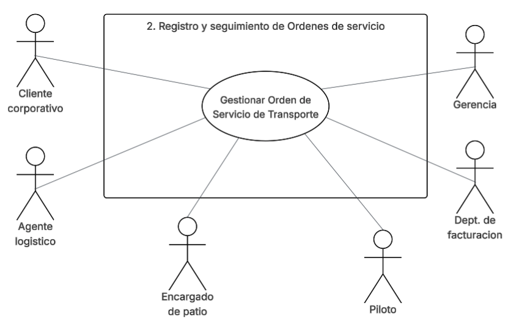
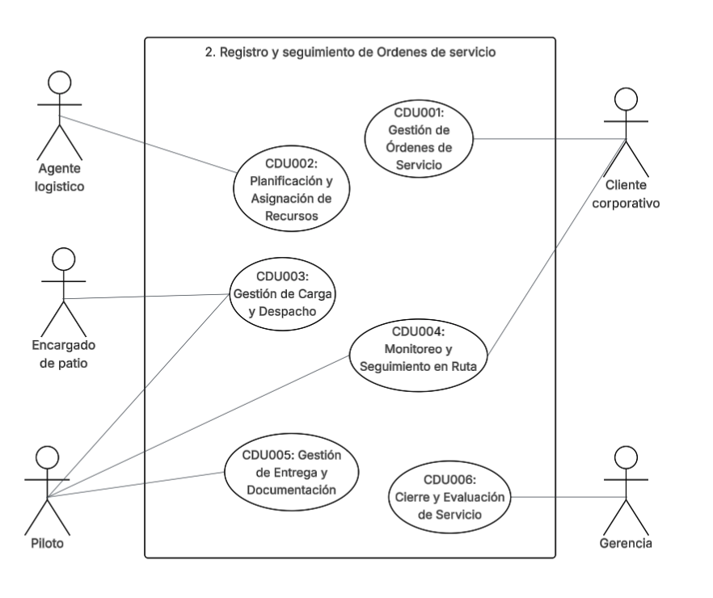
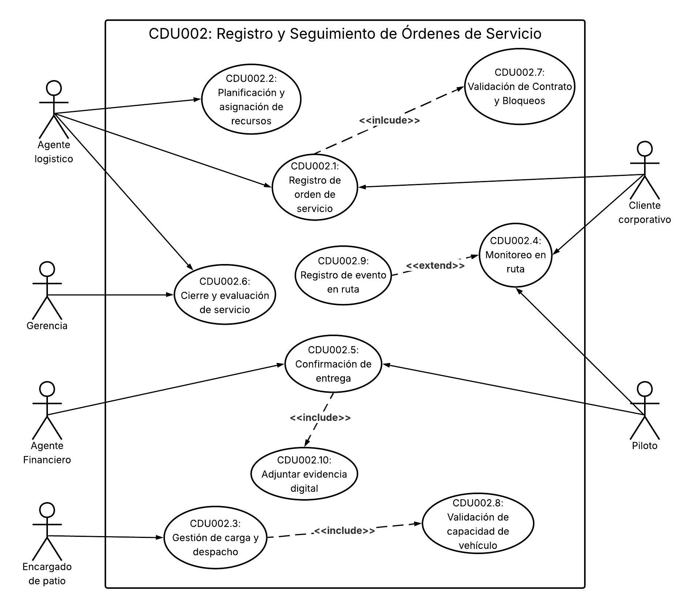

# DCU 2 - Registro y seguimiento de Órdenes de servicio

## 1. Descripción de actores del sistema
Analizando el flujo completo (desde que se genera la orden hasta su cierre administrativo), los actores que interactúan con el sistema son:

|| **Representación** |           **Actor**          | **Descripción** |
|:-:|:------------------:|:----------------------------:|:---------------|
|1|| Cliente Corporativo          |Empresa (importadora, exportadora o comercio) que contrata los servicios de transporte de LogiTrans y opera dentro de la plataforma.|
|2|| Agente Logístico             |Colaborador interno de LogiTrans responsable de la planificación operativa de cada orden de transporte.|
|3|| Encargado de Patio           |Colaborador interno que opera físicamente en las instalaciones de carga y es responsable de formalizar la salida de la unidad.|
|4|| Piloto                       |Conductor asignado a la unidad de transporte, responsable del traslado de la mercancía de origen a destino.|
|5|| Agente financiero  |Colaborador del área financiera responsable de procesar la facturación a partir de las órdenes completadas.|
|6|| Gerencia                     |Usuario estratégico de LogiTrans que consume información consolidada para la toma de decisiones.|

    Nota: en el Agente financiero solo recibe una notificación automática,lo cual es una interacción pasiva muy limitada. Sin embargo, sí es válido mantenerlo como actor porque en UML, un actor que recibe información del sistema cuenta como interacción.

## 2. Caso de uso de alto nivel

Permite administrar el ciclo completo de una orden de transporte de mercancías, 
desde su creación hasta su cierre administrativo, asegurando planificación, 
trazabilidad en ruta, confirmación de entrega y generación de información para control operativo y financiero.

## 3. Primera descomposición
* CDU001: Gestión de Órdenes de Servicio
* CDU002: Planificación y Asignación de Recursos
* CDU003: Gestión de Carga y Despacho
* CDU004: Monitoreo y Seguimiento en Ruta
* CDU005: Gestión de Entrega y Documentación
* CDU006: Cierre y Evaluación de Servicio

## 4. Caso de uso expandidos - respecto al General
### CDU002: Registro y Seguimiento de Órdenes de Servicio
* CDU002.1: Registro de Orden de Servicio
* CDU002.2: Planificación y Asignación de Recursos
* CDU002.3: Gestión de Carga y Despacho
* CDU002.4: Monitoreo en Ruta
* CDU002.5: Confirmación de Entrega
* CDU002.6: Cierre y Evaluación de Servicio
* CDU002.7: Validación de Contrato y Bloqueos
* CDU002.8: Validación de Capacidad de Vehículo
* CDU002.9: Registro de Evento en Ruta
* CDU002.10: Adjuntar Evidencia Digital 

### CDU002.1: Registro de Orden de Servicio

| **CAMPO** | **DETALLE** |
|-|-|
| Nombre | Registro de Orden de Servicio |
| Código | CDU002.1 |
| Actores | Cliente Corporativo, Agente Logístico |
| Descripción | El cliente corporativo o el agente logístico genera una nueva solicitud de transporte dentro de la plataforma, ingresando los datos fundamentales del envío: origen, destino, tipo de mercancía y peso estimado. El sistema vincula automáticamente la orden con el contrato activo del cliente para asignar la tarifa correspondiente. |
| Precondiciones | El cliente debe tener una sesión activa en la plataforma. El cliente debe tener al menos un contrato registrado en el sistema. |
| Post Condiciones | Orden de servicio creada con estado "Pendiente de Planificación". Tarifa asignada automáticamente según el contrato vinculado. Orden disponible para que el agente logístico inicie la planificación. |
| Flujo principal | 1. El cliente corporativo accede al módulo de órdenes de servicio. 2. El cliente selecciona la opción "Nueva Orden". 3. El cliente ingresa el lugar de origen del envío. 4. El cliente ingresa el lugar de destino. 5. El cliente selecciona el tipo de mercancía. 6. El cliente ingresa el peso estimado de la carga. 7. El sistema ejecuta CDU002.7 (Validación de Contrato y Bloqueos). 8. El sistema vincula la orden con el contrato activo y asigna la tarifa. 9. El sistema genera el número único de orden. 10. La orden queda registrada con estado "Pendiente de Planificación". |
| Flujos alternos | FA1: El cliente no completa todos los campos obligatorios FA1.1 El sistema notifica los campos faltantes. FA1.2 El cliente completa los campos indicados. FA1.3 Continúa en el flujo principal (paso 7).  FA2: El cliente tiene un bloqueo administrativo activo (resultado de CDU002.7) FA2.1 El sistema muestra un mensaje indicando que la cuenta está bloqueada. FA2.2 El sistema indica el motivo del bloqueo (límite de crédito o facturas vencidas). FA2.3 La orden no se genera hasta que el bloqueo sea resuelto.  FA3: El agente logístico registra la orden en nombre del cliente FA3.1 El agente logístico selecciona el cliente corporativo correspondiente. FA3.2 Continúa en el flujo principal (paso 3). |
| Reglas de negocio | Solo se puede crear una orden si el cliente tiene contrato vigente. El peso ingresado debe ser un valor numérico positivo mayor a cero. La tarifa se asigna automáticamente según el tipo de vehículo requerido y el contrato activo, sin intervención manual del operador. Un cliente con facturas vencidas o límite de crédito excedido no puede generar nuevas órdenes. |
| Reglas de calidad | El formulario de registro no debe exceder 3 pasos para completarse. El sistema debe responder la validación del contrato de froma eficaz. El número de orden generado debe ser único, irrepetible y visible al cliente de forma inmediata tras su creación. |

### CDU002.2: Planificación y Asignación de Recursos

| **CAMPO** | **DETALLE** |
|-|-|
| Nombre | Planificación y Asignación de Recursos |
| Código | CDU002.2 |
| Actores | Agente Logístico |
| Descripción | El agente logístico revisa la orden registrada y asigna la unidad de transporte más adecuada según el tipo y peso de la carga, junto con el piloto disponible. Verifica que el vehículo cumpla los requisitos técnicos del envío y que el piloto tenga toda su documentación vigente, lo cual es especialmente crítico para rutas internacionaless. |
| Precondiciones | La orden debe existir con estado "Pendiente de Planificación". Debe haber al menos una unidad de transporte disponible en el sistema. Debe haber al menos un piloto con documentación vigente disponible. |
| Post Condiciones | Unidad de transporte asignada a la orden. Piloto asignado a la orden. Estado de la orden actualizado a "Planificada". Recursos bloqueados para otras asignaciones durante el período de la orden. |
| Flujo principal | 1. El agente logístico accede a la lista de órdenes con estado "Pendiente de Planificación". 2. El agente selecciona la orden a planificar. 3. El agente revisa el tipo de carga, peso y ruta de la orden. 4. El agente consulta el listado de unidades disponibles compatibles con la carga. 5. El agente selecciona la unidad de transporte. 6. El sistema verifica que la unidad cumple los requisitos técnicos de la carga (tipo de carrocería, refrigeración, capacidad). 7. El agente consulta el listado de pilotos disponibles. 8. El agente selecciona el piloto. 9. El sistema verifica que el piloto tiene licencia y documentos vigentes para la ruta asignada. 10. El agente confirma la asignación. 11. El estado de la orden cambia a "Planificada". |
| Flujos alternos | FA1: No hay unidades disponibles compatibles con la carga FA1.1 El sistema notifica al agente que no hay unidades disponibles. FA1.2 El agente puede reprogramar la orden para una fecha posterior. FA1.3 La orden permanece en estado "Pendiente de Planificación".  FA2: El vehículo seleccionado no cumple los requisitos técnicos FA2.1 El sistema muestra una advertencia indicando el requisito incumplido. FA2.2 El agente selecciona una unidad diferente. FA2.3 Continúa en el flujo principal (paso 6).  FA3: El piloto seleccionado tiene documentos vencidos para la ruta FA3.1 El sistema notifica al agente que documento está vencido. FA3.2 El agente selecciona un piloto alternativo con documentación vigente. FA3.3 Continúa en el flujo principal (paso 9). |
| Reglas de negocio | Un piloto no puede ser asignado a dos órdenes activas simultáneamente. Una unidad de transporte no puede ser asignada a dos órdenes activas simultáneamente. Para rutas internacionales (El Salvador, Honduras) el piloto debe tener pasaporte vigente y permisos de tránsito internacional activos. El tipo de vehículo asignado debe ser compatible con el tonelaje registrado en la orden. |
| Reglas de calidad | El sistema debe mostrar únicamente los vehículos compatibles con la carga al momento de la selección, filtrando automáticamente los incompatibles. La verificación de documentos del piloto debe ejecutarse en tiempo real al momento de la selección. El agente logístico debe poder completar la planificación en no más de 10 minutos desde que abre la orden. |

### CDU002.3: Gestión de Carga y Despacho

| **CAMPO** | **DETALLE** |
|-|-|
| Nombre | Gestión de Carga y Despacho |
| Código | CDU002.3 |
| Actores | Encargado de Patio |
| Descripción | Antes de que la unidad abandone las instalaciones, el encargado de patio formaliza el proceso físico de carga a través de la plataforma. Esto incluye la validación de identidad de la orden, el registro del peso real cargado, la confirmación de que la mercancía está correctamente estibada y el completado del checklist de seguridad. Al finalizar todos los pasos, el estado de la orden cambia a "Listo para Despacho". |
| Precondiciones | La orden debe estar en estado "Planificada". La unidad de transporte asignada debe estar físicamente presente en el patio. El encargado de patio debe tener sesión activa en la plataforma. |
| Post Condiciones | Peso real de la carga registrado en la orden. Estiba y checklist de seguridad confirmados. Estado de la orden actualizado a "Listo para Despacho". Unidad habilitada para iniciar el viaje. |
| Flujo principal | 1. El encargado de patio accede al módulo de despacho en la plataforma. 2. El encargado escanea o ingresa manualmente el ID de la orden de servicio. 3. El sistema muestra los datos de la orden y confirma que la unidad presentada corresponde a la asignada. 4. El encargado ingresa el peso real cargado en la unidad. 5. El sistema ejecuta CDU002.8 (Validación de Capacidad de Vehículo) para verificar que el peso no excede el límite del vehículo. 6. El encargado confirma que la mercancía ha sido asegurada y estibada correctamente. 7. El encargado completa el checklist de seguridad (sello de unidad, cierre de puertas, estado de la carga). 8. El sistema actualiza el estado de la orden a "Listo para Despacho". 9. El sistema registra la hora oficial de despacho. |
| Flujos alternos | FA1: El ID de la orden ingresado no corresponde al vehículo presente FA1.1 El sistema muestra una alerta de identidad incorrecta. FA1.2 El encargado verifica físicamente el vehículo y corrige el ID. FA1.3 Continúa en el flujo principal (paso 3).  FA2: El peso real excede la capacidad del vehículo (resultado de CDU002.8) FA2.1 El sistema bloquea el avance y notifica el exceso de peso. FA2.2 El encargado coordina la descarga del excedente. FA2.3 El encargado ingresa el nuevo peso real. FA2.4 Continúa en el flujo principal (paso 5).  FA3: El checklist de seguridad tiene items no completados FA3.1 El sistema no permite cambiar el estado de la orden hasta completar todos los items. FA3.2 El encargado resuelve los items pendientes. FA3.3 Continúa en el flujo principal (paso 7). |
| Reglas de negocio | El peso real no puede exceder el límite de capacidad parametrizado del vehículo asignado. Todos los items del checklist de seguridad son obligatorios; ninguno puede omitirse. El ID de la orden debe coincidir exactamente con el vehículo físicamente presente antes de proceder. El estado solo puede cambiar a "Listo para Despacho" cuando los cuatro pasos del proceso estén completados. |
| Reglas de calidad | El sistema debe validar el peso en tiempo real al momento de ingresarlo, antes de que el encargado avance al siguiente paso. El checklist debe presentarse como una lista de verificación interactiva, no como un campo de texto libre. El registro de la hora de despacho debe ser automático y no editable manualmente. |

### CDU002.4: Monitoreo en Ruta

| **CAMPO** | **DETALLE** |
|-|-|
| Nombre | Monitoreo en Ruta |
| Código | CDU002.4 |
| Actores | Piloto, Cliente Corporativo |
| Descripción | Una vez que la unidad ha salido de las instalaciones, el piloto cambia el estado de la orden a "En Tránsito" e ingresa los eventos clave del trayecto mediante una bitácora digital. El cliente corporativo puede consultar en tiempo real el estado actualizado de su carga. Este proceso sustituye la coordinación por llamadas telefónicas y centraliza la trazabilidad del envío. |
| Precondiciones | La orden debe estar en estado "Listo para Despacho". El piloto debe tener sesión activa en la plataforma desde su dispositivo móvil. La unidad debe haber abandonado físicamente las instalaciones. |
| Post Condiciones | Estado de la orden actualizado a "En Tránsito". Bitácora de eventos del viaje iniciada y disponible para consulta. Cliente corporativo con acceso visible al estado actualizado de su orden. |
| Flujo principal | 1. El piloto accede a la plataforma desde su dispositivo. 2. El piloto selecciona la orden asignada. 3. El piloto cambia el estado a "En Tránsito" al salir del predio. 4. El sistema registra la hora oficial de inicio del viaje. 5. Durante el trayecto, el piloto registra los eventos clave en la bitácora (salida del predio, llegada a puntos de control, paso por aduanas). 6. El cliente corporativo consulta el estado actualizado de la orden desde su vista en la plataforma. 7. El proceso se mantiene activo hasta que el piloto confirme la llegada al destino en CDU002.5. |
| Flujos alternos | FA1: El piloto no puede cambiar el estado a "En Tránsito" por fallo de conectividad FA1.1 El sistema almacena el cambio pendiente de forma local en el dispositivo. FA1.2 Al recuperar la conexión, el sistema sincroniza el estado automáticamente. FA1.3 Continúa en el flujo principal (paso 4).  FA2: El cliente consulta la orden y el estado no ha sido actualizado por el piloto FA2.1 El sistema muestra el último estado registrado con su hora. FA2.2 El cliente puede notificar a LogiTrans si detecta un tiempo excesivo sin actualización.  FA3: El piloto detecta un evento extraordinario durante el trayecto FA3.1 El sistema habilita la opción de ejecutar CDU002.9 (Registro de Evento en Ruta). FA3.2 El piloto registra el evento. FA3.3 Continúa el monitoreo normal en el flujo principal (paso 6). |
| Reglas de negocio | Solo el piloto asignado a la orden puede cambiar el estado a "En Tránsito". El cliente corporativo solo puede consultar, no modificar, el estado de su orden durante el tránsito. Los eventos registrados en la bitácora son permanentes y no pueden eliminarse, solo añadirse. |
| Reglas de calidad | La vista del cliente debe mostrar el estado actualizado. La bitácora debe mostrar cada evento con fecha, hora y descripción del punto registrado. El acceso del piloto a la plataforma debe estar optimizado para dispositivos móviles con pantallas pequeñas. |

### CDU002.5: Confirmación de Entrega
| **CAMPO** | **DETALLE** |
|-|-|
| Nombre | Confirmación de Entrega |
| Código | CDU002.5 |
| Actores | Piloto, Agente Financiero |
| Descripción | Al llegar al destino, el piloto registra la finalización del servicio en la plataforma y adjunta la evidencia digital del recibo de mercancía. Esta acción cierra operativamente el transporte, actualiza el estado de la orden y genera la notificación al agente financiero para que inicie el proceso de facturación sin necesidad de documentos físicos. |
| Precondiciones | La orden debe estar en estado "En Tránsito". El piloto debe estar físicamente en el destino registrado en la orden. El receptor de la mercancía debe estar presente para firmar o evidenciar la recepción. |
| Post Condiciones | Estado de la orden actualizado a "Entregada". Evidencia digital de entrega adjunta a la orden. Agente financiero notificado para iniciar el proceso de facturación (CDU003). Hora oficial de entrega registrada en el sistema. |
| Flujo principal | 1. El piloto accede a la orden activa desde su dispositivo. 2. El piloto selecciona la opción "Confirmar Entrega". 3. El sistema solicita la ejecución de CDU002.10 (Adjuntar Evidencia Digital). 4. El piloto adjunta la evidencia digital (fotografía de la mercancía entregada o firma digital del receptor). 5. El piloto confirma el registro de entrega. 6. El sistema actualiza el estado de la orden a "Entregada". 7. El sistema registra la hora oficial de entrega. 8. El sistema notifica al agente financiero que la orden ha sido entregada y está lista para facturación. |
| Flujos alternos | FA1: El piloto no puede adjuntar evidencia digital por fallo técnico del dispositivo FA1.1 El sistema no permite confirmar la entrega sin evidencia adjunta. FA1.2 El piloto intenta nuevamente con otro tipo de evidencia (foto en lugar de firma o viceversa). FA1.3 Si persiste el fallo, el piloto contacta al agente logístico para reportar la situación. FA1.4 El agente logístico puede habilitar una excepción documentada para confirmar la entrega manualmente. FA1.5 Continúa en el flujo principal (paso 5).  FA2: El receptor rechaza recibir la mercancía FA2.1 El piloto registra el rechazo en la bitácora con el motivo indicado por el receptor. FA2.2 El piloto notifica al agente logístico a través de CDU002.9 (Registro de Evento en Ruta). FA2.3 La orden permanece en estado "En Tránsito" hasta resolución.  FA3: El agente financiero no recibe la notificación FA3.1 El sistema reintenta el envío de notificación automáticamente. FA3.2 Si persiste el fallo, se genera un registro de error en el log del sistema. FA3.3 El agente financiero puede consultar manualmente las órdenes con estado "Entregada" para iniciar la facturación. |
| Reglas de negocio | No se puede confirmar la entrega sin adjuntar al menos un elemento de evidencia digital. Solo el piloto asignado a la orden puede confirmar la entrega. La hora de entrega registrada es automática y no puede ser modificada manualmente por el piloto. El estado "Entregada" es irreversible desde el módulo del piloto; cualquier corrección requiere intervención del agente logístico. |
| Reglas de calidad | La evidencia digital debe admitir formatos JPG, PNG. El tamaño máximo de la evidencia adjunta no debe superar 10 MB por archivo. La notificación al agente financiero debe enviarse tras la confirmación del piloto. |

### CDU002.6: Cierre y Evaluación de Servicio
| **CAMPO** | **DETALLE** |
|-|-|
| Nombre | Cierre y Evaluación de Servicio |
| Código | CDU002.6 |
| Actores | Gerencia, Agente Logístico |
| Descripción | Una vez confirmada la entrega, se ejecuta el cierre administrativo de la orden consolidando los tiempos reales de entrega frente a los planificados. Los datos generados alimentan los indicadores de rendimiento (KPIs) del sistema, permitiendo a la gerencia identificar cuellos de botella en las rutas y evaluar la eficiencia operativa para la toma de decisiones estratégicas. |
| Precondiciones | La orden debe estar en estado "Entregada". La confirmación de entrega con evidencia digital debe estar registrada (CDU002.5 completado). |
| Post Condiciones | Orden con estado final "Cerrada". KPIs actualizados con los datos del servicio completado. Historial de rendimiento del piloto y la ruta actualizado. Datos disponibles para consulta gerencial en el tablero de control. |
| Flujo principal | 1. El sistema detecta que la orden ha cambiado a estado "Entregada". 2. El sistema calcula la diferencia entre el tiempo de entrega planificado y el tiempo real registrado. 3. El sistema consolida los datos del servicio: ruta, piloto, unidad, tiempo de tránsito, peso transportado. 4. El sistema actualiza los KPIs operativos del módulo de reportes. 5. El agente logístico revisa el resumen de cierre de la orden. 6. El agente logístico confirma el cierre administrativo de la orden. 7. El sistema actualiza el estado de la orden a "Cerrada". 8. La gerencia accede al tablero de control para consultar los indicadores actualizados. |
| Flujos alternos | FA1: El agente logístico detecta una inconsistencia en los datos de cierre FA1.1 El agente logístico abre una observación sobre la orden antes de cerrarla. FA1.2 El agente registra la inconsistencia con descripción del problema. FA1.3 El agente coordina con el área correspondiente la corrección. FA1.4 Una vez resuelta, continúa en el flujo principal (paso 6).  FA2: La gerencia consulta un indicador y detecta anomalías FA2.1 La gerencia puede generar una solicitud de revisión sobre la orden específica. FA2.2 El sistema registra la solicitud y la asigna al agente logístico responsable. FA2.3 El proceso de cierre queda en revisión hasta resolver la observación. |
| Reglas de negocio | Una orden solo puede cerrarse si la confirmación de entrega con evidencia digital está registrada. El cierre de la orden es un paso obligatorio para que sus datos sean incluidos en los KPIs. Los datos de tiempo, ruta y rendimiento son de solo lectura una vez que la orden está cerrada. Una orden cerrada no puede reabrirse. |
| Reglas de calidad | El cálculo de KPIs debe ejecutarse automáticamente al momento del cierre, sin intervención manual. El tablero gerencial debe reflejar los nuevos indicadores tras el cierre de la orden. Los datos históricos de órdenes cerradas deben conservarse para auditoría. |

### CDU002.7: Validación de Contrato y Bloqueos
| **CAMPO** | **DETALLE** |
|-|-|
| Nombre | Validación de Contrato y Bloqueos |
| Código | CDU002.7 |
| Actores | No aplica (invocado automáticamente por CDU002.1) |
| Descripción | El sistema verifica de forma automática que el cliente que intenta registrar una orden de servicio tenga un contrato vigente, no haya excedido su límite de crédito aprobado y no tenga facturas con plazo de pago vencido. Si alguna condición falla, la creación de la orden queda bloqueada. Este caso de uso es siempre invocado como include de CDU002.1. |
| Precondiciones | El cliente debe estar autenticado en la plataforma. Debe existir al menos un contrato registrado para el cliente en el sistema. |
| Post Condiciones | Resultado aprobado: el flujo de CDU002.1 continúa normalmente. Resultado bloqueado: se interrumpe la creación de la orden y se notifica al cliente el motivo del bloqueo. |
| Flujo principal | 1. El sistema recibe el identificador del cliente desde CDU002.1. 2. El sistema consulta el contrato activo del cliente. 3. El sistema verifica que la fecha actual esté dentro del período de vigencia del contrato. 4. El sistema verifica que el cliente no haya excedido su límite de crédito. 5. El sistema verifica que no existan facturas con plazo de pago vencido. 6. Todas las validaciones son exitosas. 7. El sistema retorna resultado "Aprobado" a CDU002.1. |
| Flujos alternos | FA1: El contrato del cliente está vencido o inactivo FA1.1 El sistema retorna resultado "Bloqueado" con motivo: contrato inactivo. FA1.2 CDU002.1 muestra al cliente el motivo y detiene la creación de la orden.  FA2: El cliente ha excedido su límite de crédito FA2.1 El sistema retorna resultado "Bloqueado" con motivo: límite de crédito excedido. FA2.2 CDU002.1 muestra al cliente el motivo y detiene la creación de la orden.  FA3: El cliente tiene facturas con plazo vencido FA3.1 El sistema retorna resultado "Bloqueado" con motivo: facturas vencidas pendientes. FA3.2 CDU002.1 muestra al cliente el motivo y detiene la creación de la orden. |
| Reglas de negocio | Las tres condiciones (contrato vigente, crédito disponible, pagos al día) deben cumplirse simultáneamente para aprobar la operación. Si cualquiera de las tres falla, el bloqueo es automático e inmediato. El desbloqueo solo puede ser realizado por el área contable desde el módulo de contratos (proceso CDU001). |
| Reglas de calidad | La validación completa debe ejecutarse en un tiempo prudente. El mensaje de bloqueo mostrado al cliente debe especificar claramente el motivo, sin exponer datos financieros sensibles de forma detallada. El resultado de cada validación debe quedar registrado en el log del sistema con fecha y hora. |

### CDU002.8: Validación de Capacidad de Vehículo
| **CAMPO** | **DETALLE** |
|-|-|
| Nombre | Validación de Capacidad de Vehículo |
| Código | CDU002.8 |
| Actores | No aplica (invocado automáticamente por CDU002.3) |
| Descripción | El sistema verifica que el peso real ingresado por el encargado de patio no exceda la capacidad máxima parametrizada para el tipo de vehículo asignado a la orden. Los límites de capacidad son configurados por el área contable según el tipo de unidad: Ligera hasta 3.5 Ton, Pesado entre 10 y 12 Ton, Cabezal desde 22 Ton. Este caso de uso es invocado como include desde CDU002.3. |
| Precondiciones | La orden debe tener un vehículo asignado con tipo y capacidad registrados. El encargado de patio debe haber ingresado el peso real en CDU002.3. |
| Post Condiciones | Resultado aprobado: el flujo de CDU002.3 continúa y permite avanzar al checklist. Resultado rechazado: el sistema bloquea el avance y notifica el exceso de capacidad. |
| Flujo principal | 1. El sistema recibe el peso real ingresado y el identificador del vehículo desde CDU002.3. 2. El sistema consulta el tipo de vehículo asignado y su límite de capacidad parametrizado. 3. El sistema compara el peso real con el límite máximo permitido. 4. El peso real es menor o igual al límite máximo. 5. El sistema retorna resultado "Aprobado" a CDU002.3. |
| Flujos alternos | FA1: El peso real excede el límite máximo del vehículo FA1.1 El sistema retorna resultado "Rechazado" con el peso excedido y el límite del vehículo. FA1.2 CDU002.3 bloquea el avance al checklist. FA1.3 El encargado de patio coordina la descarga del excedente. FA1.4 El encargado ingresa el nuevo peso corregido. FA1.5 El sistema ejecuta nuevamente la validación desde el paso 3.  FA2: El tipo de vehículo no tiene capacidad parametrizada en el sistema FA2.1 El sistema genera un log de error indicando que el parámetro no está configurado. FA2.2 Se notifica al agente logístico para que revise la configuración del vehículo. FA2.3 La operación queda suspendida hasta que el parámetro sea configurado. |
| Reglas de negocio | Los límites de capacidad por tipo de vehículo son definidos exclusivamente por el área contable y no pueden ser modificados por el encargado de patio ni el agente logístico. Si el parámetro de capacidad no está configurado para el vehículo, la operación debe suspenderse obligatoriamente. El resultado de la validación debe quedar registrado en la orden junto con el peso validado y el límite aplicado. |
| Reglas de calidad | La validación debe ejecutarse en tiempo real al momento de que el encargado ingresa el peso, sin necesidad de confirmar manualmente. El mensaje de error debe mostrar tanto el peso ingresado como el límite permitido para facilitar la corrección. El historial de intentos de peso ingresados debe quedar registrado en el log de la orden. |

### CDU002.9: Registro de Evento en Ruta
| **CAMPO** | **DETALLE** |
|-|-|
| Nombre | Registro de Evento en Ruta |
| Código | CDU002.9 |
| Actores | Piloto |
| Descripción | Durante el trayecto, el piloto puede registrar eventos extraordinarios que ocurran fuera del flujo normal del viaje, tales como incidentes de tráfico, retrasos en aduanas, accidentes o cualquier situación que afecte la ruta o el tiempo de entrega. Este caso de uso extiende CDU002.4 y se ejecuta únicamente cuando ocurre un evento fuera de lo ordinario. |
| Precondiciones | La orden debe estar en estado "En Tránsito". El piloto debe tener sesión activa en la plataforma. Debe existir un evento real que justifique el registro (condición del extend). |
| Post Condiciones | Evento registrado en la bitácora de la orden con fecha, hora y descripción. Registro visible para el agente logístico y el cliente corporativo. Historial de eventos de la orden actualizado. |
| Flujo principal | 1. Durante CDU002.4, el piloto detecta un evento extraordinario. 2. El piloto accede a la opción "Registrar Evento" dentro de la orden activa. 3. El piloto selecciona el tipo de evento (incidente, retraso, accidente, problema con aduana, otro). 4. El piloto ingresa la descripción del evento. 5. El piloto indica si el evento genera un retraso estimado en la entrega. 6. El sistema registra el evento con la hora automática del sistema. 7. El sistema actualiza la bitácora de la orden. 8. El piloto continúa con el monitoreo normal en CDU002.4. |
| Flujos alternos | FA1: El piloto no describe el evento con suficiente detalle FA1.1 El sistema requiere un mínimo de caracteres en la descripción del evento. FA1.2 El piloto completa la descripción requerida. FA1.3 Continúa en el flujo principal (paso 6).  FA2: El evento implica que la orden no podrá completarse (ej. accidente grave) FA2.1 El piloto selecciona la opción "Evento Crítico" al registrar. FA2.2 El sistema notifica inmediatamente al agente logístico. FA2.3 El agente logístico toma control de la situación para coordinar acciones de contingencia. |
| Reglas de negocio | Un evento registrado en la bitácora no puede eliminarse, únicamente complementarse con entradas posteriores. El piloto solo puede registrar eventos sobre la orden que tiene asignada y activa. Un evento crítico debe generar notificación inmediata al agente logístico sin excepción. |
| Reglas de calidad | El formulario de registro de evento debe completarse en no más de 2 minutos para no distraer al piloto durante la conducción. La descripción del evento debe tener un mínimo de 20 caracteres y un máximo de 500 caracteres. La hora del evento debe ser asignada automáticamente por el sistema y no debe ser editable por el piloto. |

### CDU002.10: Adjuntar Evidencia Digital
| **CAMPO** | **DETALLE** |
|-|-|
| Nombre | Adjuntar Evidencia Digital |
| Código | CDU002.10 |
| Actores | Piloto |
| Descripción | Al momento de confirmar la entrega, el piloto debe adjuntar al menos un elemento de evidencia digital que respalde que la mercancía fue recibida en el destino. Esta evidencia puede ser una fotografía de la mercancía entregada o la firma digital del receptor. El caso de uso es invocado obligatoriamente como include desde CDU002.5 y sin su completado no es posible confirmar la entrega. |
| Precondiciones | La orden debe estar en estado "En Tránsito". El piloto debe estar físicamente en el destino. CDU002.5 debe haberse iniciado. |
| Post Condiciones | Al menos un archivo de evidencia digital adjunto a la orden. Evidencia almacenada de forma permanente en el expediente digital de la orden. CDU002.5 habilitado para continuar con la confirmación de entrega. |
| Flujo principal | 1. El sistema solicita la evidencia digital como parte del flujo de CDU002.5. 2. El piloto selecciona el tipo de evidencia a adjuntar (fotografía o firma digital). 3. Si es fotografía: el piloto toma o selecciona la imagen desde su dispositivo. 4. Si es firma digital: el receptor firma directamente en la pantalla del dispositivo del piloto. 5. El piloto confirma la evidencia capturada. 6. El sistema valida el formato y tamaño del archivo. 7. El sistema almacena la evidencia vinculada a la orden. 8. El sistema retorna control a CDU002.5 para continuar con la confirmación. |
| Flujos alternos | FA1: El archivo de evidencia supera el tamaño máximo permitido FA1.1 El sistema notifica que el archivo excede el límite de 10 MB. FA1.2 El piloto captura una nueva imagen con menor resolución. FA1.3 Continúa en el flujo principal (paso 6).  FA2: El formato del archivo no es compatible FA2.1 El sistema notifica los formatos aceptados (JPG, PNG, firma vectorial). FA2.2 El piloto captura la evidencia nuevamente en el formato correcto. FA2.3 Continúa en el flujo principal (paso 6).  FA3: El dispositivo del piloto no tiene cámara funcional FA3.1 El piloto solicita al receptor que firme digitalmente como evidencia alternativa. FA3.2 Si no es posible ninguna evidencia digital, el piloto reporta el problema al agente logístico. FA3.3 El agente logístico puede autorizar una excepción documentada para habilitar CDU002.5. |
| Reglas de negocio | Es obligatorio adjuntar al menos una evidencia digital para confirmar la entrega; no puede omitirse bajo ninguna circunstancia en el flujo normal. Los archivos de evidencia son de solo lectura una vez almacenados; no pueden modificarse ni eliminarse. La evidencia queda vinculada permanentemente al expediente digital de la orden y debe estar disponible para auditoría. |
| Reglas de calidad | Los formatos aceptados son JPG, PNG para fotografías. El tamaño máximo por archivo es de 10 MB. El sistema debe comprimir automáticamente las imágenes que superen 5 MB manteniendo una resolución mínimas. |

## 5. Matriz de trazabilidad

| Actor               | CDU002.1 | CDU002.2 | CDU002.3 | CDU002.4 | CDU002.5 | CDU002.6 | CDU002.7 | CDU002.8 | CDU002.9 | CDU002.10 |
|:-|:-:|:-:|:-:|:-:|:-:|:-:|:-:|:-:|:-:|:-:|
| Cliente Corporativo | X   |     |     | X   |     |     |     |     |     |      |
| Agente Logístico    | X   | X   |     |     |     | X   |     |     |     |      |
| Encargado de Patio  |     |     | X   |     |     |     |     | X   |     |      |
| Piloto              |     |     |     | X   | X   |     |     |     | X   | X    |
| Agente Financiero   |     |     |     |     | X   |     |     |     |     |      |
| Gerencia            |     |     |     |     |     | X   |     |     |     |      |

