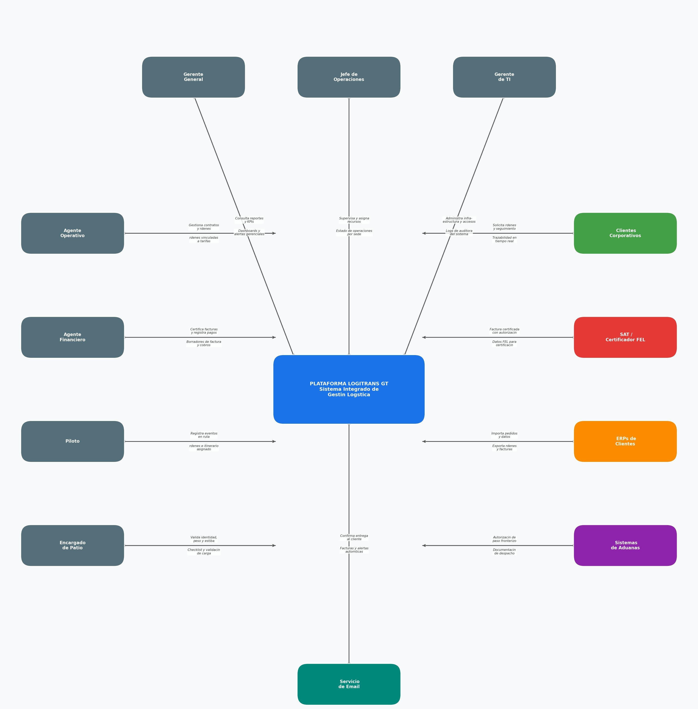

# Diagrama de Contexto

## Sistema Central

**PLATAFORMA LOGITRANS GT — Sistema Integrado de Gestión Logística**

Es el núcleo del diagrama. Representa toda la solución tecnológica propuesta para
LogiTrans Guatemala, S.A., que centraliza los procesos de:

- Gestión de clientes y contratos
- Registro y seguimiento de órdenes de servicio
- Facturación electrónica (FEL)
- Reportes operativos y gerenciales

---

## Actores Internos (Usuarios del Sistema)

Son los colaboradores de LogiTrans que interactúan directamente con la plataforma
en sus actividades diarias. Se identifican 7 actores internos:

### 1. Gerente General

- **Envía al sistema:** Consultas de reportes y KPIs estratégicos
- **Recibe del sistema:** Dashboards ejecutivos y alertas gerenciales
- **Rol en el sistema:** Toma decisiones estratégicas basadas en la información consolidada de las tres sedes

### 2. Jefe de Operaciones

- **Envía al sistema:** Supervisión y asignación de recursos logísticos
- **Recibe del sistema:** Estado de operaciones en tiempo real por sede
- **Rol en el sistema:** Garantiza la eficiencia operativa en Ciudad de Guatemala, Quetzaltenango y Puerto Barrios

### 3. Gerente de TI

- **Envía al sistema:** Administración de infraestructura y control de accesos
- **Recibe del sistema:** Logs de auditoría y estado del sistema
- **Rol en el sistema:** Vela por la disponibilidad, seguridad y mantenibilidad de la plataforma

### 4. Agente Operativo

- **Envía al sistema:** Gestión de contratos, tarifas y órdenes de servicio
- **Recibe del sistema:** Órdenes vinculadas automáticamente a contratos y tarifas
- **Rol en el sistema:** Es el principal usuario del módulo de contratos y órdenes, elimina la necesidad de consultar hojas de cálculo

### 5. Agente Financiero

- **Envía al sistema:** Certificación de facturas y registro de pagos recibidos
- **Recibe del sistema:** Borradores automáticos de factura y estado de cobros
- **Rol en el sistema:** Gestiona el ciclo completo de facturación electrónica FEL y el módulo de pagos

### 6. Piloto

- **Envía al sistema:** Registro de eventos en ruta (salida, puntos de control, entrega)
- **Recibe del sistema:** Órdenes asignadas e itinerario de ruta
- **Rol en el sistema:** Sustituye las llamadas telefónicas constantes con una bitácora digital centralizada

### 7. Encargado de Patio

- **Envía al sistema:** Validación de identidad de la orden, peso real de la carga y confirmación de estiba
- **Recibe del sistema:** Checklist de seguridad y validación de peso permitido por tipo de vehículo
- **Rol en el sistema:** Formaliza el proceso de carga antes del despacho, cambiando el estado de la orden a "Listo para Despacho"

---

## Actores y Sistemas Externos

Son entidades fuera de LogiTrans que se comunican con la plataforma. Se identifican 5:

### 1. Clientes Corporativos (Verde)

- **Envían al sistema:** Solicitudes de órdenes de servicio y consultas de seguimiento
- **Reciben del sistema:** Trazabilidad en tiempo real de sus envíos
- **Importancia:** Son los usuarios externos cuya fidelidad depende de la disponibilidad y transparencia del sistema. Exigen visibilidad 24/7 sobre el estado de su carga

### 2. SAT / Certificador FEL (Rojo)

- **Envía al sistema:** Factura electrónica certificada con número de autorización oficial
- **Recibe del sistema:** Datos del borrador de factura para validación y certificación
- **Importancia:** Es un actor regulatorio obligatorio. Sin su intervención, las facturas emitidas no tienen validez legal ante la legislación tributaria de Guatemala

### 3. ERPs de Clientes (Naranja)

- **Envían al sistema:** Pedidos e información de clientes importadores/exportadores
- **Reciben del sistema:** Órdenes procesadas y facturas emitidas
- **Importancia:** Permiten la integración con los sistemas empresariales de los clientes corporativos, eliminando el intercambio manual de información por correo electrónico

### 4. Sistemas de Aduanas (Morado)

- **Envían al sistema:** Autorización de paso fronterizo para las unidades de transporte
- **Reciben del sistema:** Documentación de despacho para validación aduanera
- **Importancia:** Son críticos para la expansión regional hacia El Salvador y Honduras, agilizando el paso por fronteras y eliminando gestiones manuales en aduanas

### 5. Servicio de Email (Verde azulado)

- **Envía al sistema:** Confirmaciones de entrega de notificaciones al cliente registrado
- **Recibe del sistema:** Facturas certificadas y alertas automáticas para envío inmediato
- **Importancia:** Sustituye el envío físico de documentos y las llamadas de confirmación, permitiendo que el cliente reciba su factura en el mismo instante en que se entrega la carga

---

## Flujos de Información Clave

| Flujo                       | Descripción                                      | Módulo que lo soporta   |
| --------------------------- | ------------------------------------------------ | ----------------------- |
| Cliente → Sistema → Cliente | Solicitud de orden y trazabilidad en tiempo real | Órdenes de Servicio     |
| Sistema → SAT → Sistema     | Envío y certificación de facturas FEL            | Facturación Electrónica |
| Agente Financiero ↔ Sistema | Gestión del ciclo completo de cobro              | Facturación y Pagos     |
| Piloto ↔ Sistema            | Bitácora digital de eventos en ruta              | Seguimiento de Órdenes  |
| Sistema → Email → Cliente   | Notificación automática de factura emitida       | Facturación Electrónica |
| Sistema ↔ Aduanas           | Documentación para expansión regional            | Órdenes de Servicio     |

---
