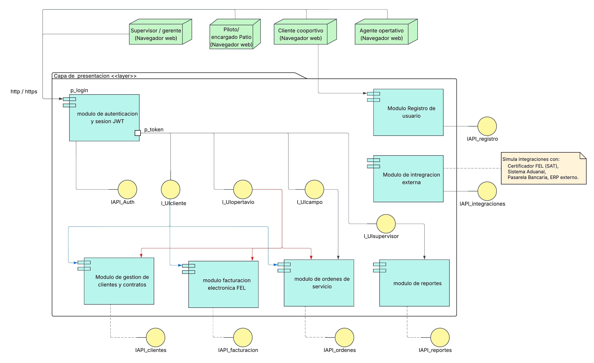
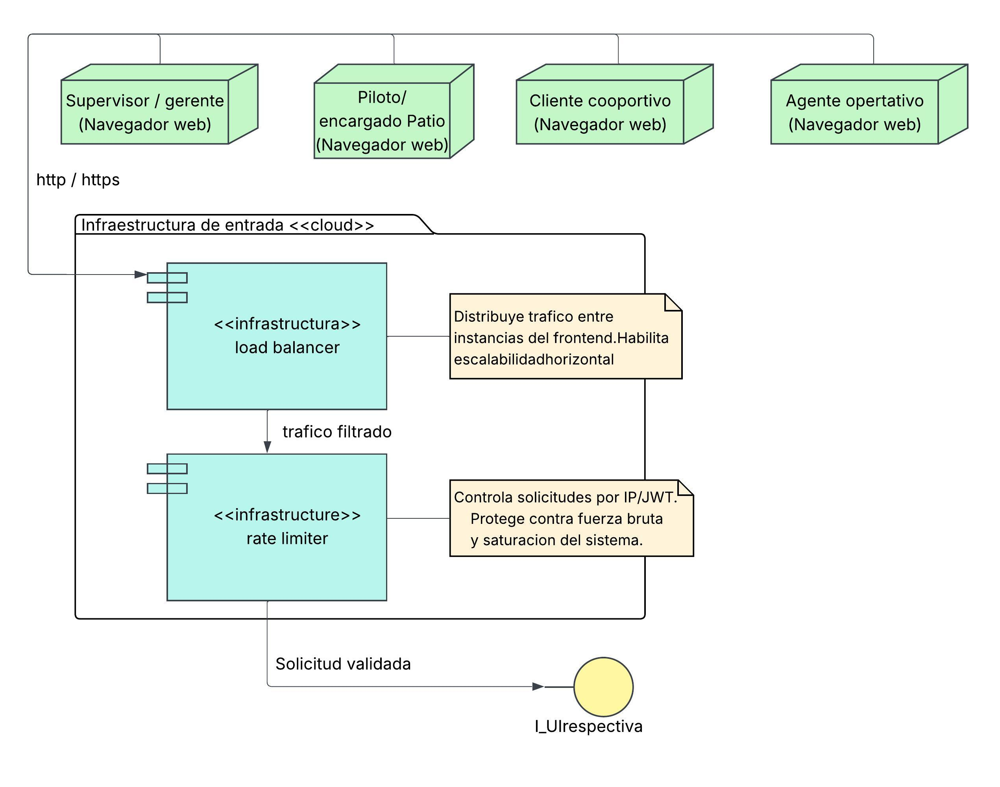
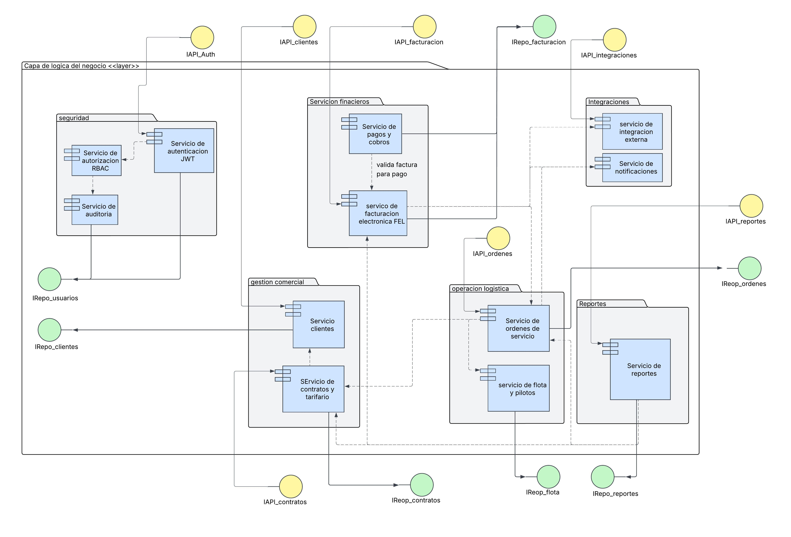
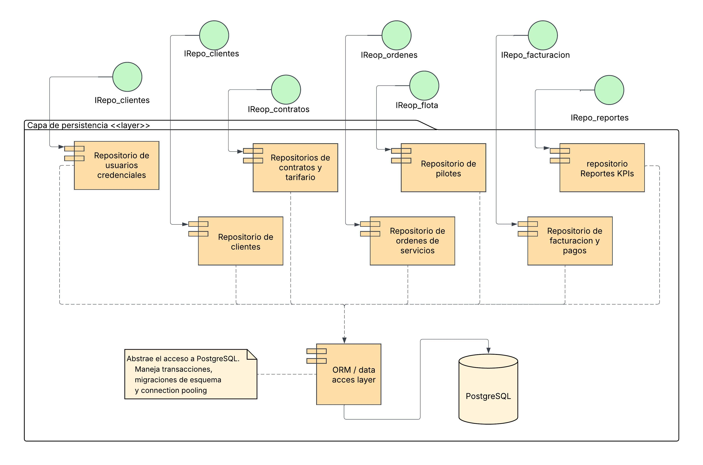

# LogiTrans Guatemala S.A.
## Diagrama de Componentes
### Arquitectura de Tres Capas

## 1. Introduccion General

El diagrama de componentes UML de LogiTrans Guatemala S.A. representa la arquitectura del sistema desde una perspectiva de alto nivel. El objetivo del diagrama no es mostrar clases, atributos ni metodos, sino reflejar los modulos funcionales del sistema, las responsabilidades que cada uno tiene, las interfaces a traves de las cuales se comunican y las dependencias que existen entre ellos.

La arquitectura esta organizada en tres capas horizontales. Cada capa tiene una responsabilidad claramente diferenciada, y la comunicacion entre capas ocurre unicamente a traves de interfaces definidas, lo que garantiza el desacoplamiento necesario para que el sistema sea mantenible, extensible y preparado para escalar.

Las tres capas son:

- **Capa de Presentacion**: es la que el usuario ve e interactua directamente. Contiene los modulos de la interfaz web.
- **Capa de Logica de Negocio**: Contiene los servicios que implementan las reglas de negocio de LogiTrans.
- **Capa de Persistencia**: es la que almacena y recupera los datos. Contiene los repositorios y la base de datos PostgreSQL.

---

## 2. Capa de Presentacion

### 2.1 Proposito

La capa de presentacion es la unica parte del sistema con la que los usuarios interactuan directamente. Su responsabilidad es recibir las acciones del usuario, enviarlas al backend a traves de interfaces bien definidas, y mostrar los resultados. Esta capa no contiene logica de negocio: no valida reglas comerciales, no calcula tarifas ni verifica contratos. Unicamente transforma la interaccion del usuario en una solicitud HTTP hacia el backend y muestra la respuesta recibida.

Esta construida como una aplicacion web de pagina unica (SPA) en React, lo que significa que el navegador del usuario descarga la aplicacion una vez y luego se comunica con el backend mediante solicitudes HTTP con tokens JWT.

### 2.2 Infraestructura de Entrada

Antes de que cualquier solicitud llegue a la capa de presentacion, pasa por dos componentes de infraestructura:

#### Load Balancer

El Load Balancer es el punto de entrada unico del sistema. Su funcion es recibir todo el trafico externo (de clientes corporativos, agentes operativos, supervisores y pilotos) y distribuirlo entre las instancias disponibles del frontend.

En la arquitectura actual se contemplan dos instancias del servidor frontend. El Load Balancer aplica un algoritmo de distribucion para decidir a cual instancia envia cada solicitud entrante. Esto tiene dos efectos directos sobre la arquitectura:

- Si una instancia del frontend falla, el Load Balancer deja de enviarle trafico y todas las solicitudes van a la instancia disponible. El usuario no percibe la falla.
- Si el volumen de trafico aumenta (por ejemplo, cuando la operacion crezca al triple), basta con agregar una tercera o cuarta instancia y registrarla en el Load Balancer, sin modificar ninguna otra parte del sistema.

El Load Balancer tambien es el nodo donde termina el cifrado TLS. Toda comunicacion desde el navegador del usuario hacia el sistema viaja cifrada con HTTPS. El Load Balancer descifra la solicitud y la envia al frontend por HTTP interno.

#### Rate Limiter

El Rate Limiter es un componente de control que limita la cantidad de solicitudes que un mismo origen (identificado por su IP o por su token JWT) puede hacer en un periodo de tiempo determinado. Por ejemplo, puede configurarse para permitir un maximo de 100 solicitudes por minuto por usuario.

Su utilidad principal es doble. Primero, protege el sistema contra ataques de fuerza bruta en el proceso de inicio de sesion, donde un atacante intenta multiples combinaciones de usuario y contrasena de forma automatizada. Segundo, protege la capacidad del servidor contra que un solo cliente consuma todos los recursos disponibles, garantizando que el servicio permanezca disponible para todos los usuarios.

En esta fase del proyecto, el Rate Limiter es un componente teorico: su diseno arquitectonico esta presente y su integracion no requiere cambios estructurales, pero su implementacion activa esta planificada para una etapa posterior. El Load Balancer si se implementara desde el inicio.

**Que ocurre si no existe ninguno de los dos:**

Sin Load Balancer, el sistema tiene un unico punto de falla. Si el servidor frontend cae, el sistema queda completamente inaccesible. Ademas, no es posible agregar instancias adicionales para absorber mas trafico, lo que hace imposible cumplir el requisito de triplicar la operacion sin degradar el servicio.

Sin Rate Limiter, el sistema queda expuesto a ataques de fuerza bruta contra el modulo de autenticacion, y un cliente que genere trafico excesivo (ya sea por error o de forma maliciosa) puede saturar el servidor y afectar a todos los demas usuarios.

### 2.3 Actores del Sistema

El diagrama identifica cuatro actores que interactuan con la capa de presentacion:

- **Cliente Corporativo**: empresa importadora, exportadora o comercio que contrata los servicios de LogiTrans. Accede a la plataforma para registrarse, gestionar sus datos, crear ordenes de servicio y dar seguimiento a sus envios.
- **Agente Operativo**: personal interno de LogiTrans. Gestiona clientes, contratos, ordenes y facturacion.
- **Supervisor / Gerente**: accede al dashboard de reportes y KPIs para la toma de decisiones.
- **Piloto / Encargado de Patio**: personal de campo que actualiza estados de ordenes, registra eventos de ruta y confirma entregas.

### 2.4 Modulos de la Capa de Presentacion

Cada modulo de esta capa es un conjunto de pantallas (vistas React) agrupadas por funcionalidad. Todos los modulos se comunican con el backend a traves de interfaces requeridas, que representan los endpoints de la API REST.

#### Modulo de Autenticacion y Sesion JWT

Es el punto de entrada al sistema para todos los usuarios ya registrados. Presenta la pantalla de inicio de sesion, envia las credenciales al backend, y si la respuesta es exitosa, almacena el token JWT recibido. Ese token se adjunta en el encabezado de cada solicitud posterior para que el backend pueda verificar la identidad y los permisos del usuario sin necesidad de consultar la base de datos en cada llamada.

Este modulo tambien gestiona el refresco del token cuando este esta proximo a vencer, y presenta la pantalla de recuperacion de credenciales en caso de que el usuario haya olvidado su contrasena.

Consume la interfaz `IAPI_Auth` del backend.

#### Modulo de Registro de Usuario

Es el unico modulo accesible sin estar autenticado, junto con el de autenticacion. Permite a un nuevo cliente corporativo crear su cuenta en la plataforma. Captura datos fiscales (NIT, razon social), contactos clave y las credenciales de acceso iniciales.

Este modulo es independiente del modulo de autenticacion porque su responsabilidad es distinta: no verifica identidad, sino que crea una nueva. El resultado de un registro exitoso es la creacion de un cliente en el backend.

Consume la interfaz `IAPI_Clientes` del backend.

#### Modulo de Gestion de Clientes y Contratos

Permite a los agentes operativos y a los propios clientes corporativos gestionar la informacion comercial. Incluye pantallas para ver y editar el perfil del cliente, visualizar y crear contratos, configurar tarifas y revisar el historial de desempeno.

Consume las interfaces `IAPI_Clientes` e `IAPI_Contratos` del backend.

#### Modulo de Ordenes de Servicio

Gestiona el ciclo de vida completo de una orden. Presenta pantallas para crear una orden nueva, ver el estado actual de ordenes en curso, registrar eventos de ruta (para pilotos y encargados de patio), adjuntar evidencias digitales de entrega y visualizar el historico de ordenes cerradas.

Consume la interfaz `IAPI_Ordenes` del backend.

#### Modulo de Facturacion y Pagos

Presenta las facturas generadas, permite a los agentes financieros revisar borradores, confirmar la certificacion FEL y registrar pagos recibidos. Muestra el estado de cuentas por cobrar y las fechas de vencimiento segun los terminos del contrato.

Consume la interfaz `IAPI_Facturacion` del backend.

#### Modulo de Reportes y Dashboard

Es el panel de control gerencial. Presenta graficas, tablas y KPIs que consolidan la actividad diaria del sistema. Es el unico modulo al que accede el rol de Supervisor / Gerente como funcion principal.

Consume la interfaz `IAPI_Reportes` del backend.

#### Modulo de Integraciones (simulado)

Presenta las interfaces de interaccion con sistemas externos: el certificador FEL de la SAT, el sistema aduanal, la pasarela bancaria y el ERP externo. En esta fase del proyecto, todas estas integraciones son simuladas: el modulo presenta la estructura y los flujos de interaccion, pero no se conecta a sistemas reales.

Consume la interfaz `IAPI_Integraciones` del backend.

### 2.5 Interfaces de Usuario y Rol

Las interfaces de usuario `IUI_Login`, `IUI_Registro`, `IUI_Cliente`, `IUI_Operativo`, `IUI_Supervisor` e `IUI_Campo` representan los puntos de acceso diferenciados por rol dentro de la aplicacion. Despues de autenticarse y recibir un token JWT que contiene el rol del usuario, la aplicacion React renderiza unicamente los modulos a los que ese rol tiene acceso, ocultando los demas. La validacion real del permiso ocurre en el backend; la restriccion en el frontend es unicamente de experiencia de usuario.

---

## 3. Capa de Logica de Negocio

### 3.1 Proposito

La capa de logica de negocio es el nucleo del sistema. Contiene todos los servicios que implementan las reglas de negocio de LogiTrans: la validacion de contratos, la vinculacion de tarifas, el ciclo de vida de las ordenes, la generacion de facturas y la produccion de reportes gerenciales.

Esta capa no interactua directamente con el usuario ni con la base de datos. Recibe solicitudes del frontend a traves de interfaces ofrecidas (la API REST), ejecuta la logica de negocio correspondiente, y solicita datos a la capa de persistencia a traves de interfaces requeridas (los repositorios). Es el intermediario que transforma datos crudos en acciones de negocio con sentido.

### 3.2 Organizacion por Dominios Funcionales

Los servicios de esta capa estan agrupados en dominios funcionales. Un dominio funcional es un conjunto de servicios que comparten una misma area de responsabilidad dentro del negocio. Esta agrupacion refleja la separacion de responsabilidades a nivel arquitectonico: un cambio en las reglas de facturacion no deberia afectar al dominio de operaciones, y agregar un nuevo modulo para Honduras no deberia modificar el dominio financiero.

Los dominios son los siguientes:

#### Dominio: Seguridad (transversal)

Este dominio es especial porque su responsabilidad no es una funcion de negocio especifica, sino una garantia que aplica a todas las demas funciones. Contiene tres servicios:

**Servicio de Autenticacion JWT**: recibe las credenciales del usuario (usuario y contrasena), las valida contra los datos almacenados en la base de datos, y si son correctas, genera un token JWT firmado. Ese token contiene el identificador del usuario y su rol. Tambien gestiona el refresco de tokens y el flujo de recuperacion de contrasena.

**Servicio de Autorizacion RBAC**: cada vez que un servicio del backend esta a punto de ejecutar una accion sensible, consulta este servicio para verificar si el rol contenido en el token JWT tiene permiso para realizar esa accion. RBAC (Role-Based Access Control) es el modelo de control de acceso basado en roles: cada rol tiene un conjunto de permisos definidos, y un usuario solo puede hacer lo que su rol permite. Esto garantiza, por ejemplo, que un piloto no pueda generar una factura, o que un cliente corporativo no pueda ver los contratos de otro cliente.

**Servicio de Auditoria**: registra en la base de datos cada accion sensible que ocurre en el sistema, con el identificador del usuario que la realizo, la fecha y hora, y el tipo de accion. Esto cumple el requerimiento explicito de la gerencia de tener trazabilidad total: saber quien hizo que y cuando.

#### Dominio: Gestion Comercial

Centraliza la relacion comercial con el cliente.

**Servicio de Clientes**: gestiona el ciclo de vida del cliente corporativo. Crea nuevos clientes, actualiza su informacion fiscal y de contacto, asigna y actualiza la categoria de riesgo (capacidad de pago, riesgo de mercancia, riesgo en aduanas, lavado de dinero), y mantiene el historial de desempeno (volumen de carga, puntualidad de pagos, siniestralidad).

**Servicio de Contratos y Tarifario**: gestiona los contratos digitales entre LogiTrans y cada cliente. Registra las rutas autorizadas y los tipos de carga permitidos. Parametriza el tarifario por tipo de unidad, con posibilidad de agregar descuentos especiales. Valida que el contrato este vigente y que el cliente no haya excedido su limite de credito ni tenga facturas vencidas. Si alguna de estas condiciones falla, activa el bloqueo automatico que impide nuevas ordenes.

#### Dominio: Operaciones logisticas

Gestiona el ciclo de vida operativo de cada servicio de transporte.

**Servicio de Ordenes de Servicio**: es el servicio mas complejo del sistema. Maneja las siguientes etapas del ciclo de vida de una orden:
- Generacion: crea la orden con datos de origen, destino, tipo de mercancia y peso, y la vincula automaticamente al contrato del cliente para asignar la tarifa correcta.
- Asignacion: coordina con el Servicio de Flota para asignar la unidad y el piloto disponibles.
- Carga: gestiona el proceso de carga antes del despacho (validacion de identidad por ID de orden, registro de pesaje inicial con validacion contra el rango del camion asignado, confirmacion de estiba y checklist de seguridad).
- Despacho y bitacora: permite al piloto registrar el inicio del viaje y los eventos de ruta (salida del predio, paso por puntos de control o aduanas).
- Entrega: registra la confirmacion de entrega con evidencia digital adjunta (fotos, firma del receptor), y dispara una notificacion al area de facturacion.
- Cierre: consolida tiempos reales contra tiempos planificados para alimentar los KPIs.

**Servicio de Flota y Pilotos**: gestiona el catalogo de unidades de transporte y pilotos. Verifica que la unidad cumpla con los requisitos tecnicos para cada carga (tonelaje, refrigeracion) y que el piloto tenga sus documentos vigentes para la ruta asignada, lo cual es especialmente critico para las futuras rutas internacionales a El Salvador y Honduras.

#### Dominio: Financiero

Transforma los servicios completados en documentos fiscales validos y gestiona el cobro.

**Servicio de Facturacion Electronica FEL**: cuando una orden pasa a estado "Entregada", este servicio genera automaticamente un borrador de factura con los datos de la orden. Valida que el NIT del cliente tenga 13 caracteres y que el formato cumpla con los requisitos de la SAT (fecha, moneda GTQ, descripcion del servicio, desglose correcto del IVA). Envia el borrador al certificador FEL (simulado en esta fase) y recibe el documento oficial con su numero de autorizacion. Una vez certificada, la factura se envia al correo electronico del cliente y se almacena en su expediente digital. Tambien actualiza el estado de cuenta del cliente con la fecha de vencimiento segun los terminos del contrato (15, 30 o 45 dias).

**Servicio de Pagos y Cobros**: permite a los agentes financieros registrar pagos sobre facturas emitidas. Valida que el monto del pago coincida exactamente con el monto de la factura. Para pagos en cheque o transferencia, registra los datos bancarios: banco de origen, numero de cuenta y numero de autorizacion generado por la entidad bancaria. Mantiene actualizado el registro de cuentas por cobrar.

#### Dominio: Reportes

**Servicio de Reportes y Dashboard**: consolida datos de todos los otros dominios para producir informacion gerencial. Genera el corte de operaciones diario agrupado por sede (Guatemala, Quetzaltenango, Puerto Barrios). Compara tiempos de entrega reales contra los prometidos en el contrato para calcular los KPIs de cumplimiento. Cruza ingresos por contrato contra gastos operativos para el analisis de rentabilidad. Detecta anomalias y genera alertas de desviacion. Proyecta la capacidad necesaria de flota para los proximos periodos.

#### Dominio: Integraciones

**Servicio de Integraciones Externas**: contiene los adaptadores de conexion hacia los sistemas externos. En esta fase todos son simulaciones. La arquitectura esta disenada para que, cuando se active la integracion real con el certificador FEL de la SAT, el sistema aduanal centroamericano, la pasarela bancaria o el ERP de algun cliente, el cambio se haga unicamente dentro de este servicio sin afectar a ninguno de los otros dominios.

**Servicio de Notificaciones**: gestiona el envio de notificaciones por correo electronico. Es utilizado por el Servicio de Ordenes (para notificar al area financiera cuando una entrega se confirma) y por el Servicio de Facturacion (para enviar la factura al cliente).

### 3.3 Dependencias entre Dominios

Las dependencias entre servicios reflejan las relaciones de negocio reales:

- El Servicio de Contratos depende del Servicio de Clientes para validar el limite de credito y el estado de bloqueo antes de permitir nuevas operaciones.
- El Servicio de Ordenes depende del Servicio de Contratos para obtener la tarifa correcta y del Servicio de Flota para asignar recursos.
- El Servicio de Facturacion depende del Servicio de Ordenes para obtener los datos de la orden entregada.
- El Servicio de Pagos depende del Servicio de Facturacion para validar que la factura existe y que el monto coincide.
- El Servicio de Reportes depende de Ordenes, Facturacion y Contratos para consolidar la informacion gerencial.
- La Seguridad es transversal: todos los servicios pasan por autorizacion antes de ejecutar acciones sensibles, y todas las acciones quedan registradas en auditoria.

---

## 4. Capa de Persistencia

### 4.1 Proposito

La capa de persistencia tiene una unica responsabilidad: almacenar y recuperar datos de forma confiable. No ejecuta logica de negocio, no valida reglas comerciales ni toma decisiones. Simplemente recibe instrucciones de la capa de logica de negocio y las traduce en operaciones sobre la base de datos PostgreSQL.

Esta capa esta compuesta por tres elementos: las interfaces ofrecidas (que reciben solicitudes del backend), los repositorios por dominio (que son los componentes que ejecutan las operaciones), y el ORM que abstrae la comunicacion directa con la base de datos.

### 4.2 Interfaces Ofrecidas

Las interfaces `IRepo_Usuarios`, `IRepo_Clientes`, `IRepo_Contratos`, `IRepo_Ordenes`, `IRepo_Flota`, `IRepo_Facturacion` e `IRepo_Reportes` son los puntos de conexion entre la capa de logica de negocio y la capa de persistencia. Cada servicio del backend que necesita leer o escribir datos se conecta a la interfaz correspondiente a su dominio. Esta separacion garantiza que un servicio de negocio no pueda acceder directamente a datos que no le corresponden: el Servicio de Ordenes solo habla con `IRepo_Ordenes`, y no tiene acceso directo a las tablas de facturacion.

### 4.3 Repositorios por Dominio

Un repositorio es un componente cuya unica funcion es encapsular todas las operaciones de base de datos relacionadas con un dominio especifico. Cada repositorio expone un conjunto de operaciones (crear, leer, actualizar, eliminar) que los servicios de negocio pueden invocar sin necesidad de escribir una sola linea de SQL.

El beneficio arquitectonico de los repositorios es doble. Primero, si la base de datos cambia (por ejemplo, se migra de PostgreSQL a otro motor), el cambio se realiza unicamente dentro de los repositorios, sin tocar los servicios de negocio. Segundo, los repositorios son la capa donde se aplica el principio de responsabilidad unica: cada repositorio solo conoce y opera sobre las tablas de su dominio.

Los repositorios del sistema son:

- **Repositorio de Usuarios y Credenciales**: opera sobre las tablas de usuarios, roles y permisos. Es utilizado por el Servicio de Autenticacion y el Servicio de Auditoria.
- **Repositorio de Clientes**: opera sobre la tabla de clientes con su informacion fiscal, categoria de riesgo e historial.
- **Repositorio de Contratos y Tarifario**: opera sobre las tablas de contratos y el catalogo de tarifas por tipo de unidad.
- **Repositorio de Ordenes de Servicio**: opera sobre la tabla de ordenes y la bitacora de ruta. Es el repositorio con mayor volumen de operaciones de escritura en el sistema.
- **Repositorio de Flota y Pilotos**: opera sobre el catalogo de unidades de transporte y pilotos.
- **Repositorio de Facturacion y Pagos**: opera sobre las tablas de facturas, pagos y cuentas por cobrar. Es compartido por el Servicio de Facturacion y el Servicio de Pagos.
- **Repositorio de Reportes y KPIs**: opera sobre las tablas de metricas consolidadas y reportes generados.

### 4.4 ORM / Data Access Layer

El ORM (Object-Relational Mapper) es la capa que se ubica entre los repositorios y la base de datos PostgreSQL. Su funcion es traducir las operaciones que los repositorios expresan como objetos de codigo en sentencias SQL que PostgreSQL puede ejecutar, y viceversa.

Ademas de la traduccion de datos, el ORM gestiona tres aspectos criticos de la interaccion con la base de datos:

**Transacciones**: cuando una operacion de negocio requiere multiples escrituras en la base de datos (por ejemplo, crear una orden y actualizar el estado de cuenta del cliente al mismo tiempo), el ORM garantiza que todas las escrituras ocurran o ninguna lo haga. Si ocurre un error a mitad del proceso, el ORM revierte todos los cambios parciales, evitando que la base de datos quede en un estado inconsistente.

**Migraciones de esquema**: cuando la estructura de la base de datos necesita cambiar (agregar una columna, crear una nueva tabla para Honduras), el ORM gestiona esos cambios de forma controlada y versionada, sin necesidad de ejecutar SQL manual sobre la base de datos de produccion.

**Connection pooling**: en lugar de abrir y cerrar una nueva conexion a PostgreSQL en cada solicitud, el ORM mantiene un conjunto de conexiones abiertas y reutilizables. Esto reduce drasticamente el tiempo de respuesta de las consultas y la carga sobre el servidor de base de datos, especialmente cuando el volumen de ordenes crece al triple.

### 4.5 Base de Datos PostgreSQL

La base de datos es el componente que almacena todos los datos del sistema de forma permanente. Utiliza PostgreSQL, un motor de base de datos relacional robusto, de codigo abierto y con soporte completo para transacciones ACID.

---

## 5. Flujo de Comunicacion entre Capas

Para ilustrar como las tres capas trabajan juntas, se describe el flujo completo de una accion tipica del sistema: un cliente corporativo crea una nueva orden de servicio.

1. El cliente accede desde su navegador al modulo de Ordenes de Servicio en la capa de presentacion. Su solicitud llega primero al Load Balancer, que la dirige a una instancia del frontend, pasando por el Rate Limiter.

2. El modulo de Ordenes del frontend prepara una solicitud HTTP POST con los datos de la orden (origen, destino, tipo de mercancia, peso) y el token JWT del cliente en el encabezado, y la envia al backend a traves de la interfaz requerida `IAPI_Ordenes`.

3. En la capa de logica de negocio, la solicitud llega a la interfaz ofrecida `IAPI_Ordenes`, que la entrega al Servicio de Ordenes de Servicio. Antes de procesar cualquier cosa, el Servicio consulta al Servicio de Autorizacion RBAC para verificar que el token JWT corresponde a un cliente corporativo con permiso de crear ordenes.

4. Una vez autorizado, el Servicio de Ordenes consulta al Servicio de Contratos para obtener el contrato vigente del cliente, verificar que no tenga bloqueos y obtener la tarifa correspondiente al tipo de unidad requerida.

5. El Servicio de Contratos consulta al Repositorio de Contratos a traves de la interfaz `IRepo_Contratos`. El repositorio le pide al ORM la informacion del contrato del cliente. El ORM genera la consulta SQL y la envia a PostgreSQL. PostgreSQL devuelve los datos del esquema comercial. El ORM los convierte en objetos y los entrega al repositorio, que los devuelve al Servicio de Contratos, que los devuelve al Servicio de Ordenes.

6. El Servicio de Ordenes crea la nueva orden con la tarifa asignada automaticamente y la guarda a traves del Repositorio de Ordenes.

7. El Servicio de Auditoria registra la creacion de la orden con el identificador del usuario, la fecha y hora.

8. El Servicio de Ordenes devuelve la respuesta al frontend (la orden creada con su ID unico y estado inicial).

9. El frontend presenta al cliente la confirmacion de la orden creada.

Este flujo muestra como cada capa cumple su responsabilidad sin invadir la del otro: la presentacion solo presenta, la logica de negocio solo aplica reglas, y la persistencia solo guarda y recupera datos.