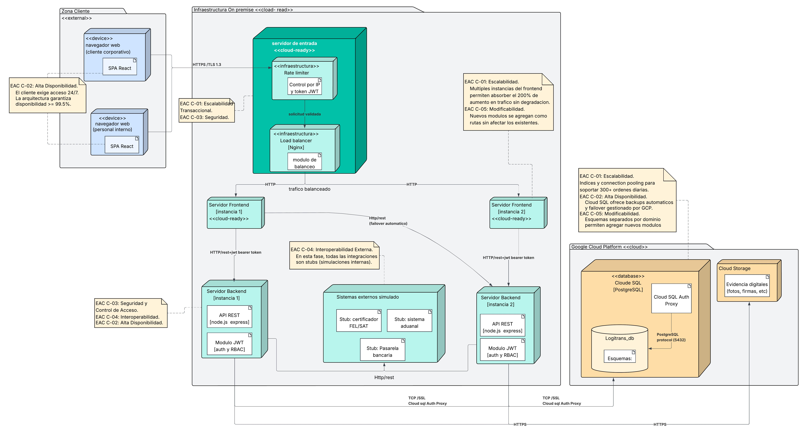

# LogiTrans Guatemala S.A.
## Diagrama de Despliegue
---

## 1. Introduccion y Proposito del Diagrama

El diagrama de despliegue UML de LogiTrans Guatemala S.A. representa la distribucion fisica y virtual de los componentes de software sobre la infraestructura que los ejecuta. A diferencia del diagrama de componentes, cuyo objetivo es mostrar la organizacion funcional del software, el diagrama de despliegue muestra donde vive cada pieza del sistema, en que tipo de nodo se ejecuta, y como se comunican esos nodos entre si.

El diagrama responde a un requerimiento estrategico explicito de la gerencia de LogiTrans: la arquitectura debe nacer lista para ser migrada a la nube, aunque el despliegue inicial sea en servidores fisicos propios (on-premise). Esto significa que cada decision de infraestructura fue tomada pensando en que el sistema pueda moverse a Google Cloud Platform sin necesidad de reescribir codigo ni redisenar la arquitectura.

El diagrama organiza la infraestructura en tres zonas claramente diferenciadas:

- **Zona Cliente**: los dispositivos de los usuarios (navegadores web).
- **Zona On-Premise (Cloud-Ready)**: los servidores fisicos de LogiTrans donde corren el frontend y el backend.
- **Zona GCP**: la nube de Google donde vive la base de datos PostgreSQL desde el inicio.

---

## 2. Descripcion de Zonas de Infraestructura

La separacion en zonas no es solo una convencion visual. Cada zona tiene implicaciones tecnicas y operativas distintas:

La **Zona Cliente** representa dispositivos que LogiTrans no controla. El sistema no puede asumir nada sobre el hardware ni el software del navegador del usuario, por lo que toda la logica critica debe vivir en el servidor, nunca en el cliente.

La **Zona On-Premise** representa la infraestructura que LogiTrans controla hoy. Es donde se realiza la inversion inicial, y esta disenada para que cada componente pueda trasladarse a GCP sin friccion tecnica cuando el presupuesto y la decision estrategica lo permitan.

La **Zona GCP** representa los servicios gestionados que Google Cloud proporciona. La base de datos vive aqui desde el inicio porque Cloud SQL ofrece disponibilidad, backups automaticos y failover gestionado que seria muy costoso y complejo de replicar con servidores fisicos propios.

---

## 3. Zona Cliente

### 3.1 Descripcion

Los usuarios del sistema acceden a traves de un navegador web estandar, sin necesidad de instalar ningun software adicional. Esto incluye a los clientes corporativos (desde sus oficinas), a los agentes operativos y financieros (desde las tres sedes de LogiTrans), y a los pilotos y encargados de patio (desde dispositivos moviles o computadoras en el campo).

El navegador descarga la aplicacion React una sola vez desde el servidor frontend. A partir de ese momento, la aplicacion se ejecuta localmente en el navegador y se comunica con el backend mediante solicitudes HTTP, adjuntando el token JWT en cada llamada.

### 3.2 Implicaciones de este modelo

Al ser una aplicacion web (no una aplicacion de escritorio ni movil nativa), LogiTrans no tiene que gestionar la distribucion ni la actualizacion del software en los dispositivos de sus usuarios. Cuando se lanza una nueva version del sistema, el servidor frontend sirve el nuevo build y todos los usuarios lo reciben automaticamente en su siguiente acceso.

---

## 4. Infraestructura On-Premise (Cloud-Ready)

### 4.2 Servidor de Entrada: Load Balancer y Rate Limiter

El servidor de entrada es el primer nodo que recibe todo el trafico externo. Contiene dos componentes:

**Load Balancer (Nginx)**: recibe las solicitudes HTTPS de los usuarios y las distribuye entre las instancias disponibles del servidor frontend. Opera con un algoritmo round-robin por defecto: la primera solicitud va a la Instancia 1, la segunda a la Instancia 2, la tercera de nuevo a la Instancia 1, y asi sucesivamente. Si una instancia deja de responder, el Load Balancer la detecta y deja de enviarle trafico automaticamente, enviando todas las solicitudes a las instancias que siguen activas.

El Load Balancer tambien es el punto donde termina TLS: toda comunicacion desde el navegador del usuario viaja cifrada con HTTPS (TLS 1.3). El Load Balancer descifra la solicitud y la envia al frontend por HTTP interno, lo que simplifica la configuracion de certificados SSL: solo se gestiona en un punto, no en cada instancia.

**Rate Limiter (teorico en esta fase)**: este componente esta presente en el diagrama como parte del diseno arquitectonico, pero su implementacion activa esta planificada para una etapa posterior. Su funcion es limitar el numero de solicitudes que un mismo origen (identificado por IP o por token JWT) puede hacer en un periodo de tiempo definido. Esto protege el sistema contra dos tipos de amenazas: ataques de fuerza bruta en el proceso de autenticacion, y clientes que generan trafico excesivo que podria saturar los servidores. El hecho de que este disenado arquitectonicamente desde el inicio significa que activarlo en el futuro no requiere cambios estructurales.

### 4.3 Servidores Frontend (Dos Instancias)

Se contemplan dos instancias desde el inicio por dos razones. La primera es la disponibilidad: si la Instancia 1 falla (por un error de software, una actualizacion o un reinicio), la Instancia 2 continua sirviendo la aplicacion sin interrupcion percibida por el usuario. La segunda es la escalabilidad: si el volumen de usuarios concurrentes aumenta, basta con agregar una tercera instancia y registrarla en el Load Balancer, sin ningun otro cambio.

### 4.4 Servidores Backend (Dos Instancias)

**API REST (Node.js + Express)**: el servidor de aplicaciones que recibe las solicitudes HTTP del frontend, ejecuta la logica de negocio (contratos, ordenes, facturacion, reportes) y devuelve las respuestas.

**Modulo JWT (Autenticacion y Autorizacion RBAC)**: el modulo que valida el token JWT en cada solicitud entrante y verifica que el rol del usuario tenga permiso para la accion solicitada. Este modulo corre dentro del mismo proceso de Node.js.

**Modulo de Auditoria**: el modulo que registra las acciones sensibles del sistema. Tambien corre dentro del mismo proceso.

Al igual que con el frontend, dos instancias garantizan disponibilidad ante fallas y permiten escalar horizontalmente ante mayor carga. El Load Balancer distribuye el trafico entre ambas instancias del backend.

Adicionalmente, el frontend puede comunicarse con cualquier instancia del backend (FE1 puede hablar con BE1 o BE2), lo que proporciona redundancia adicional en caso de que una instancia del backend este saturada o inactiva.

### 4.5 Sistemas Externos Simulados

Este nodo agrupa los stubs (simulaciones) de los cuatro sistemas externos con los que LogiTrans se integrara en el futuro: el Certificador FEL de la SAT, el Sistema Aduanal centroamericano, la Pasarela Bancaria y el ERP externo de algunos clientes.

En esta fase no hay conexion real a ninguno de estos sistemas. Los stubs son implementaciones simplificadas que reciben las solicitudes del backend y devuelven respuestas simuladas con el formato que el sistema real devolveria. Esto permite que el resto del sistema (facturacion, aduanas, pagos) funcione de forma completa durante el desarrollo y las pruebas, sin depender de la disponibilidad de sistemas externos.

La arquitectura esta preparada para que, cuando se active cada integracion real, el cambio se haga unicamente dentro del Servicio de Integraciones del backend, sin afectar a ningun otro componente.

---

## 5. Google Cloud Platform (GCP)

### 5.1 Cloud SQL (PostgreSQL)

La base de datos PostgreSQL se despliega en Cloud SQL, el servicio de base de datos gestionado de Google Cloud. Este es el unico componente que vive en la nube desde el inicio del proyecto.

**Cloud SQL Auth Proxy**: la conexion desde los servidores on-premise hacia Cloud SQL no se realiza directamente por el puerto 5432 de PostgreSQL. Se utiliza el Cloud SQL Auth Proxy, que es un proceso que corre en los servidores backend y establece un tunel SSL cifrado y autenticado hacia Cloud SQL. Esto significa que el puerto de PostgreSQL nunca queda expuesto a internet, eliminando un vector de ataque critico.

La base de datos esta organizada en cinco esquemas (seguridad, comercial, operativo, financiero, analytics), cada uno conteniendo las tablas de su dominio funcional.

### 5.2 Cloud Storage

Google Cloud Storage almacena los archivos binarios que el sistema necesita guardar: las fotografias y firmas digitales que los pilotos adjuntan al confirmar una entrega. Estos archivos no se guardan en PostgreSQL (que esta optimizado para datos relacionales, no para archivos grandes) sino en un servicio de almacenamiento de objetos. El backend sube los archivos directamente a Cloud Storage a traves de HTTPS y guarda en PostgreSQL unicamente la URL de referencia.

---

## 6. Conexiones de Red y Protocolos

Todas las conexiones del diagrama estan etiquetadas con el protocolo que utilizan:

- **HTTPS / TLS 1.3** (navegador -> Load Balancer): toda comunicacion externa viaja cifrada. TLS 1.3 es la version mas reciente y segura del protocolo de cifrado.
- **HTTP interno** (Load Balancer -> Frontend): comunicacion interna en la red privada, sin overhead de cifrado.
- **HTTP/REST + JWT Bearer Token** (Frontend -> Backend): el frontend envia solicitudes REST al backend, adjuntando el token JWT en el encabezado `Authorization: Bearer <token>`.
- **TCP / SSL con Cloud SQL Auth Proxy** (Backend -> PostgreSQL): conexion cifrada y autenticada al servidor de base de datos.
- **PostgreSQL Protocol (puerto 5432)** (Auth Proxy -> DB): protocolo nativo de PostgreSQL dentro del tunel seguro.
- **HTTPS** (Backend -> Cloud Storage): protocolo estandar para subir y descargar archivos a Google Cloud Storage.
- **HTTP/REST stubs** (Backend -> Sistemas Externos Simulados): solicitudes a los stubs de integraciones.

---

## 7. Justificacion de Decisiones Arquitectonicas

### JDA-01: Contenedorizacion con Docker para toda la infraestructura on-premise

**Decision**: todos los componentes de la zona on-premise se ejecutan en contenedores Docker.

**Justificacion**: la restriccion mas importante del proyecto es que la arquitectura debe nacer lista para migrar a la nube. Un contenedor Docker es la unica tecnologia que garantiza que el software se comportara de forma identica en un servidor fisico de LogiTrans y en GCP Cloud Run o GKE. Sin Docker, migrar el sistema a la nube requeriria reconfiguracion de servidores, posibles cambios en dependencias y un proceso de pruebas completo en el nuevo entorno. Con Docker, la migracion es equivalente a mover los contenedores de un entorno a otro. Esta decision tambien satisface la preocupacion del Area Financiera de aprovechar la infraestructura existente: los servidores actuales de LogiTrans pueden ejecutar Docker y alojar los contenedores sin inversion en hardware nuevo.

**Impacto**: cumple el requerimiento de cloud-ready (C-05, C-01). Reduce el riesgo tecnico de la migracion futura. Compatible con el presupuesto ajustado.

---

### JDA-02: Base de datos en Google Cloud Platform desde el inicio

**Decision**: PostgreSQL se despliega en Cloud SQL (GCP) y no en los servidores on-premise de LogiTrans.

**Justificacion**: la base de datos es el componente mas critico del sistema desde el punto de vista de la disponibilidad y la durabilidad de los datos. Replicar en servidores fisicos propios el nivel de disponibilidad que Cloud SQL ofrece (backups automaticos, failover gestionado, replicacion, actualizaciones de seguridad automaticas) requeriria una inversion en infraestructura y personal especializado que esta fuera del presupuesto ajustado del proyecto. Cloud SQL de GCP ofrece un SLA de disponibilidad del 99.95%, que supera ampliamente el 99.5% exigido por los stakeholders. Esta decision tambien es la primera fase real de la migracion a la nube: cuando LogiTrans decida mover el frontend y el backend a GCP, la base de datos ya estara alli.

**Impacto**: cumple directamente los EAC C-01 y C-02. Reduce la complejidad operativa de administrar backups y failover. Genera un costo mensual en GCP, pero inferior al costo de replicar esa infraestructura on-premise.

**Trade-off reconocido**: la latencia de red entre los servidores on-premise y Cloud SQL puede ser mayor que si la base de datos estuviera en la misma red local. Este riesgo se mitiga con el connection pooling del ORM y con Cloud SQL Auth Proxy, que optimiza la conexion. Cuando el backend migre a GCP, la latencia desaparecera porque ambos estaran en la misma red de Google.

---

### JDA-03: Dos instancias activas de frontend y backend

**Decision**: se despliegan dos instancias simultaneas de cada capa de aplicacion (dos servidores frontend y dos servidores backend).

**Justificacion**: el requerimiento de disponibilidad del 99.5% y recuperacion en menos de 10 minutos no puede satisfacerse con una sola instancia de cada componente. Con una sola instancia, cualquier falla (reinicio de contenedor, error de software, actualizacion) deja el sistema inaccesible hasta que se recupere. Con dos instancias y un Load Balancer, la falla de una instancia es invisible para el usuario: el Load Balancer detecta la falla y redirige el trafico a la instancia activa en cuestion de segundos, sin necesidad de intervencion manual. La recuperacion ocurre en segundo plano mientras el servicio continua disponible.

**Impacto**: cumple directamente el EAC C-02. Proporciona la base para escalar horizontalmente (agregar mas instancias) cuando el volumen de transacciones crezca.

**Trade-off reconocido**: mantener dos instancias implica el doble del costo de infraestructura comparado con una sola instancia. Este costo es justificado por el impacto operativo que representa un minuto de sistema caido (un camion detenido, un cliente insatisfecho).

---

### JDA-04: Autenticacion con JWT (stateless)

**Decision**: la autenticacion del sistema se implementa con JSON Web Tokens (JWT) en lugar de sesiones almacenadas en el servidor.

**Justificacion**: en una arquitectura con multiples instancias del backend, las sesiones almacenadas en el servidor crean un problema: si el usuario se autentico en la Instancia 1 y su siguiente solicitud va a la Instancia 2, esta no tiene la sesion y el usuario parece no estar autenticado. Resolver esto con sesiones requiere una memoria compartida entre instancias (como Redis), lo que agrega un componente adicional de infraestructura. Con JWT, el token contiene toda la informacion necesaria (identidad del usuario y su rol) y el servidor no necesita almacenar nada: cualquier instancia del backend puede verificar la firma del token de forma independiente. Esto hace que la arquitectura sea naturalmente stateless y lista para escalar sin modificaciones.

**Impacto**: simplifica la arquitectura de multiples instancias. Elimina la necesidad de sesiones compartidas. Compatible con escalabilidad horizontal (C-01).

---

### JDA-05: Separacion de sistemas externos en stubs simulados

**Decision**: las integraciones con el Certificador FEL, el Sistema Aduanal, la Pasarela Bancaria y el ERP externo se implementan como stubs (simulaciones) en esta fase, agrupadas en un nodo independiente.

**Justificacion**: las integraciones con sistemas externos son el mayor riesgo tecnico del proyecto. Depender de la disponibilidad de un sistema de la SAT o de una pasarela bancaria para que el ambiente de desarrollo y pruebas funcione es una fuente de bloqueos frecuentes y dificiles de controlar. Al implementar stubs desde el inicio, el equipo de desarrollo puede completar y probar el ciclo completo de facturacion y operaciones sin depender de ningun sistema externo. La arquitectura del Servicio de Integraciones esta disenada para que activar la integracion real sea un cambio localizado unicamente en ese servicio, sin afectar al resto del sistema.

**Impacto**: reduce el riesgo tecnico del proyecto. Permite completar el desarrollo en el plazo de 4 semanas. Prepara la arquitectura para la integracion real en la expansion regional (C-04, C-05).

---

### JDA-06: Cloud Storage para evidencias digitales

**Decision**: las fotografias y firmas de entrega se almacenan en Google Cloud Storage y no en PostgreSQL.

**Justificacion**: almacenar archivos binarios grandes (imagenes) en una base de datos relacional es una mala practica arquitectonica por dos razones. Primero, degrada el rendimiento de la base de datos: las consultas sobre tablas con columnas de datos binarios grandes son significativamente mas lentas, y las copias de seguridad se vuelven mas pesadas y lentas. Segundo, el costo por gigabyte de almacenamiento en un servicio de base de datos relacional es mucho mayor que en un servicio de almacenamiento de objetos como Cloud Storage. La decision correcta es guardar los archivos en Cloud Storage y almacenar en PostgreSQL unicamente la URL de referencia, que es un dato de texto pequeno.

**Impacto**: mantiene el rendimiento de PostgreSQL optimo. Reduce el costo de almacenamiento. Cloud Storage escala automaticamente sin limite de capacidad.

---

## 8. Validacion de la Arquitectura mediante EAC

Los Escenarios de Atributos de Calidad (EAC) son una herramienta para someter una arquitectura propuesta a pruebas de estrés teorico. Cada EAC define una situacion concreta de exigencia sobre el sistema, y la arquitectura debe demostrar como responde a esa exigencia. A continuacion se valida cada EAC contra la arquitectura desplegada.

---

### EAC C-01: Escalabilidad Transaccional

**Escenario**: si el volumen de ordenes aumenta en un 200% (de 100 a 300 ordenes diarias), el sistema debe mantener tiempos de respuesta menores a 3 segundos por operacion sin degradacion del servicio.

**Respuesta de la arquitectura**:

El Load Balancer en el servidor de entrada distribuye el trafico entre multiples instancias. Cuando el volumen crece, se agregan instancias adicionales del backend (y opcionalmente del frontend) sin ningun cambio de codigo ni de arquitectura. Esto es lo que se llama escalabilidad horizontal: el sistema crece agregando copias, no mejorando el hardware existente.

En la capa de persistencia, Cloud SQL escala verticalmente bajo demanda: si el servidor de base de datos necesita mas CPU o mas RAM para manejar el volumen de consultas, se cambia a un tier superior en GCP sin tiempo de inactividad. El ORM en el backend mantiene un pool de conexiones reutilizables hacia la base de datos, lo que reduce el tiempo de apertura de conexiones y maximiza el uso de las conexiones disponibles.

El esquema analytics en PostgreSQL contiene datos precalculados para los reportes gerenciales. Esto evita que las consultas del dashboard ejecuten agregaciones costosas sobre millones de filas en tiempo real, lo que podria degradar el rendimiento durante horas pico.

**Nivel de mitigacion**: alto. La arquitectura proporciona los mecanismos necesarios para absorber el crecimiento del 200% sin cambios estructurales.

---

### EAC C-02: Alta Disponibilidad Operativa

**Escenario**: si ocurre una falla del servidor principal, el sistema debe restaurar el servicio en menos de 10 minutos, con disponibilidad anual mayor o igual al 99.5%.

**Respuesta de la arquitectura**:

Las dos instancias activas del frontend y del backend garantizan que la falla de cualquier nodo individual no interrumpa el servicio. El Load Balancer detecta la falla en cuestión de segundos (mediante health checks periodicos) y deja de enviar trafico al nodo fallido. El servicio continua en la instancia activa sin que el usuario perciba interrupcion.

Para la base de datos, Cloud SQL proporciona replicacion automatica y failover gestionado. Si el nodo primario de PostgreSQL falla, Cloud SQL promueve automaticamente una replica como nuevo primario en un tiempo tipico de menos de 2 minutos, muy por debajo del umbral de 10 minutos exigido.

El SLA de Google Cloud para Cloud SQL es del 99.95%, que supera el 99.5% requerido. Para los servidores on-premise, la disponibilidad depende de la infraestructura fisica de LogiTrans, pero la arquitectura de multiples instancias garantiza que una sola falla de hardware no derribe el servicio completo.

**Nivel de mitigacion**: alto para el componente de base de datos (gestionado por Google con SLA garantizado). Medio-alto para los servidores on-premise (dependiente de la infraestructura fisica de LogiTrans, mitigado por redundancia de instancias).

---

### EAC C-03: Seguridad y Control de Acceso

**Escenario**: si un usuario intenta acceder a informacion fuera de su rol, el sistema debe bloquear el acceso y registrar el intento. El 100% de las acciones sensibles deben quedar registradas en auditoria.

**Respuesta de la arquitectura**:

Toda comunicacion externa viaja cifrada con HTTPS/TLS 1.3, lo que impide la interceptacion de tokens JWT y datos en transito.

El modulo JWT en cada instancia del backend valida la firma y la vigencia del token en cada solicitud. Un token expirado o manipulado es rechazado inmediatamente. El modulo RBAC verifica que el rol contenido en el token tenga permiso para la accion especifica solicitada antes de ejecutarla.

El Rate Limiter (cuando se active) bloqueara los intentos de fuerza bruta en el proceso de autenticacion, limitando la capacidad de un atacante para probar multiples combinaciones de credenciales.

El Servicio de Auditoria registra en `TBL_auditoria` cada accion sensible con el identificador del usuario, la marca de tiempo y el tipo de accion. Este registro es inmutable desde la perspectiva de los servicios de negocio: ningun servicio puede modificar ni eliminar registros de auditoria, solo agregar nuevos.

La conexion a la base de datos utiliza Cloud SQL Auth Proxy, que autentica la conexion con credenciales de GCP y cifra el tunel de red, eliminando la exposicion del puerto 5432 a internet.

**Nivel de mitigacion**: alto. Cada vector de amenaza identificado (interceptacion de trafico, tokens manipulados, fuerza bruta, acceso no autorizado a datos, conexion no cifrada a base de datos) tiene un mecanismo de mitigacion especifico en la arquitectura.

---

### EAC C-04: Interoperabilidad Externa

**Escenario**: cuando el sistema envia una factura al certificador FEL, debe recibir confirmacion en tiempo real en menos de 5 segundos.

**Respuesta de la arquitectura**:

En la fase actual, las integraciones son stubs que responden de forma sincrona e inmediata, garantizando que el flujo de facturacion funcione correctamente en el ambiente de desarrollo y pruebas.

El diseno del Servicio de Integraciones Externas en el backend esta estructurado como un conjunto de adaptadores independientes por sistema externo (un adaptador para FEL, uno para aduanas, uno para la pasarela bancaria, uno para ERP). Cada adaptador implementa la misma interfaz interna, lo que significa que el Servicio de Facturacion no sabe si esta hablando con un stub o con el sistema real de la SAT: siempre invoca la misma interfaz.

Cuando se active la integracion real con el certificador FEL, el adaptador correspondiente pasara de devolver una respuesta simulada a realizar una solicitud HTTP real al endpoint de la SAT. El resto del sistema no cambia. El umbral de 5 segundos dependera de la latencia del servicio externo, pero la arquitectura no agrega latencia innecesaria: la comunicacion es directa desde el backend hacia el servicio externo, sin intermediarios adicionales.

**Nivel de mitigacion**: medio en esta fase (la integracion real no existe aun, por decision del proyecto). La arquitectura esta correctamente preparada para activarla sin cambios estructurales, lo que cumple el requerimiento de tener la arquitectura lista.

---

### EAC C-05: Modificabilidad y Evolucion Regional

**Escenario**: si se requiere agregar un modulo para operar en Honduras o El Salvador, debe poder integrarse sin afectar modulos existentes y con downtime no mayor a 5 minutos.

**Respuesta de la arquitectura**:

La separacion en dominios funcionales tanto en el backend (Gestion Comercial, Operaciones, Financiero, Reportes, Integraciones) como en los esquemas de la base de datos garantiza que agregar funcionalidad para una nueva region sea un cambio localizado. Por ejemplo, agregar reglas fiscales especificas de Honduras requiere modificar el Servicio de Integraciones (para el sistema aduanal hondureno) y posiblemente el Servicio de Contratos (para nuevas reglas de tarifario), sin tocar el Servicio de Ordenes ni el de Reportes.

La contenedorizacion con Docker permite desplegar una nueva version del backend sin tiempo de inactividad: mientras la nueva version se despliega en una instancia, la otra sigue sirviendo solicitudes. Una vez que la nueva version esta disponible en ambas instancias, el despliegue esta completo. Este proceso, conocido como rolling deployment, tipicamente tarda menos de 2 minutos y es invisible para el usuario.

Los esquemas separados en PostgreSQL (comercial, operativo, financiero, analytics) permiten agregar tablas para nuevas funcionalidades sin modificar las tablas existentes, eliminando el riesgo de regresiones en los modulos actuales.

**Nivel de mitigacion**: alto. La arquitectura modular y la contenedorizacion proporcionan los mecanismos necesarios para crecer regionalmente de forma incremental y sin interrupciones de servicio mayores.

---

### Resumen de Cobertura EAC

| EAC | Categoria | Nivel de Mitigacion | Mecanismos Arquitectonicos |
|-----|-----------|---------------------|---------------------------|
| C-01 | Escalabilidad | Alto | Load Balancer, multiples instancias, Cloud SQL escalable, ORM con connection pooling |
| C-02 | Disponibilidad | Alto (GCP) / Medio-Alto (on-premise) | Dos instancias activas, failover automatico de Cloud SQL, SLA GCP 99.95% |
| C-03 | Seguridad | Alto | HTTPS/TLS 1.3, JWT, RBAC, Auditoria, Cloud SQL Auth Proxy, Rate Limiter (futuro) |
| C-04 | Interoperabilidad | Medio (stubs en fase actual) | Adaptadores por sistema externo, interfaz interna unificada, activacion sin cambio estructural |
| C-05 | Modificabilidad | Alto | Dominios funcionales separados, Docker rolling deployment, esquemas independientes en PostgreSQL |