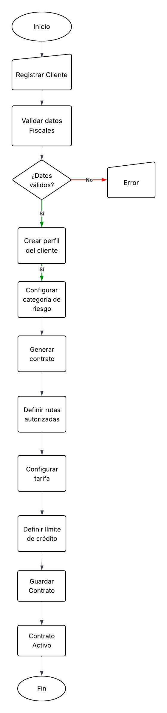
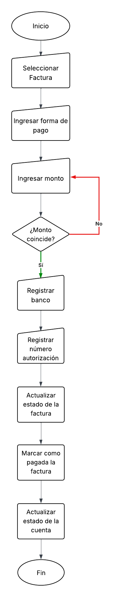
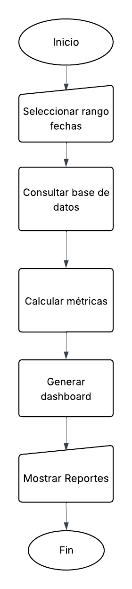
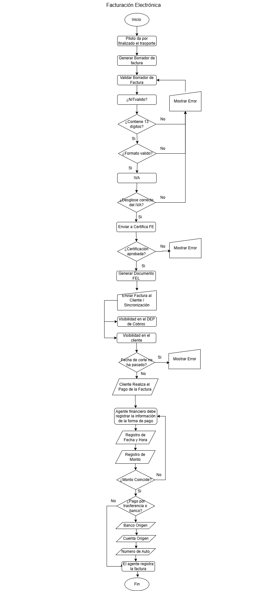
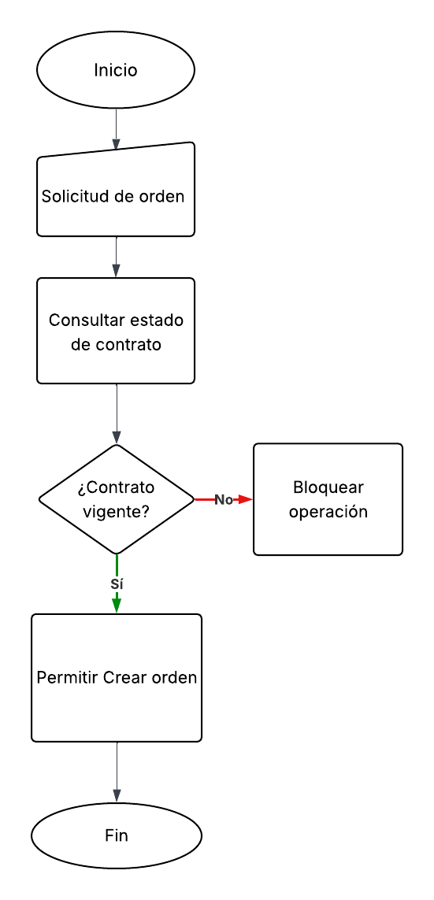
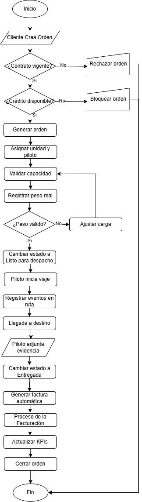

# Prototipo Arquitectónico

## 1. Mockups

1. Login del sistema

2. Apartado de registro

3. Panel de cliente

4. Panel de agente

5. Panel de administrador

6. Panel de piloto

7. Panel de Contabilidad

8. Panel de gerencia

9. Panel de Supervisor Operativo

### Módulo: Gestión de Clientes y Contratos

10. Dashboard General
    ](<mockups_gestion de usuarios y contratos/Dashboard Principal.png>)

11. Listado de Clientes
    ](<mockups_gestion de usuarios y contratos/Listado de Clientes.png>)

12. Registro y Perfil del Cliente
    ](<mockups_gestion de usuarios y contratos/Registro y Perfil del Cliente.png>)

13. Historial y Desempeño del Cliente
    ](<mockups_gestion de usuarios y contratos/Detalle del Cliente – Historial y Desempeño.png>)

14. Creación de Contrato
    ](<mockups_gestion de usuarios y contratos/Generado por agente operativo · Tarifario configurado por contabilidad · Descuentos especiales permitidos.png>)

15. Gestión de Tarifarios (Contabilidad)
    ](<mockups_gestion de usuarios y contratos/Gestión de Tarifarios – Área de Contabilidad.png>)

16. Bloqueo Automático para Cliente Coorporativo
    
](<mockups_gestion de usuarios y contratos/Validación de Crédito y Bloqueo Automático.png>)

17. Portal del cliente Coorporativo
    

### Modulo Registro y Seguimiento de Órdenes de servicio

18. Generarción de la orden de servicio

19. Planificación y asignación de recursos

20. Proceso de carga de mercancía al vehículo

21. Despacho y monitoreo en Ruta

22. Documentacion y confirmacion de entrega

23. Cierre y Evaluación de Servicio

### Modulo Facturación Electronica

24. Dashboard Financiero

25. Certificar Facturas

26. Registro Pagos

27. Estado de Cuenta de Clientes

28. Reportes

29. Pago de Clientes

30. Visualización del departamento de Cobros

## 2. Diagramas de Flujo

### 2.1 Diagrama General del flujo del sistema

### 2.2 Diagrama de Gestion de usuarios y contratos

### 2.3 Diagrama de Registro de pagos

### 2.4 Diagrama de Reportes

### 2.5 Diagrama de Facturacion electronica

### 2.6 Diagrama de validacion de credito

### 2.7 Diagrama de ordenes de servicio

