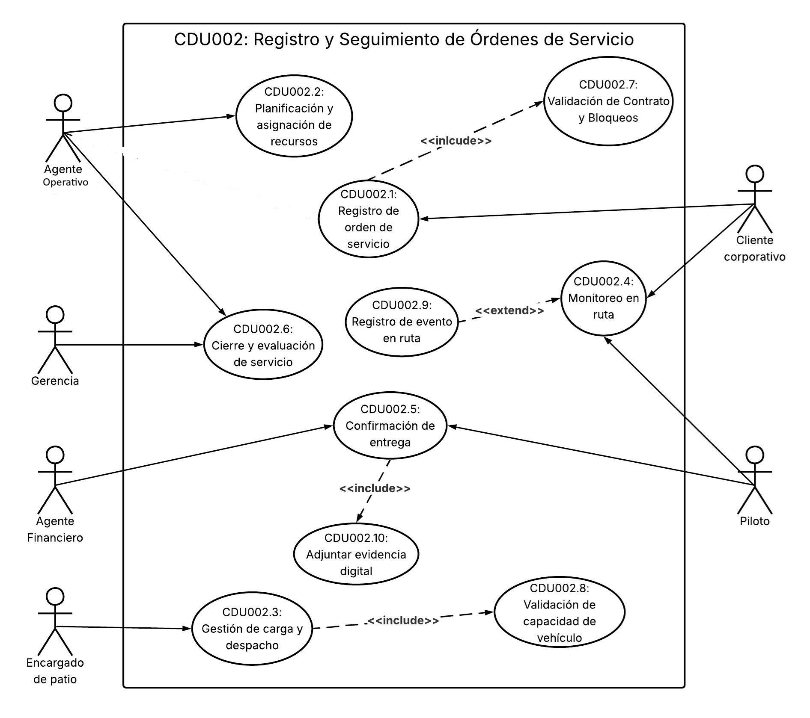

# Casos de Uso — LogiTrans Guatemala, S.A.

1. ACTORES DEL SISTEMA

Analizando el flujo completo (desde que se genera la orden hasta su cierre administrativo), los actores que interactúan con el sistema son:

|     |              **Representación**              |       **Actor**        | **Descripción**                                                                                                                                  |
| :-: | :------------------------------------------: | :--------------------: | :----------------------------------------------------------------------------------------------------------------------------------------------- |
|  1  |  |  Cliente Corporativo   | Empresa que contrata servicios de transporte y gestiona su información dentro de la plataforma.                                                  |
|  2  |  |    Agente Operativo    | Colaborador encargado de formalizar contratos comerciales y definir condiciones operativas.                                                      |
|  3  |  |     Área Contable      | Departamento responsable de parametrizar tarifas, límites de crédito, condiciones financieras y validar aspectos económicos del contrato.        |
|  4  |  |    Agente Logístico    | Colaborador interno de LogiTrans responsable de la planificación operativa de cada orden de transporte.                                          |
|  5  |  |   Encargado de Patio   | Colaborador interno que opera físicamente en las instalaciones de carga y es responsable de formalizar la salida de la unidad.                   |
|  6  |  |         Piloto         | Conductor asignado a la unidad de transporte responsable del traslado de la mercancía de origen a destino y de registrar la entrega de la carga. |
|  7  |  |   Agente Financiero    | Colaborador del área financiera responsable de procesar la facturación a partir de las órdenes completadas y validar las facturas generadas.     |
|  8  |  | Departamento de Cobros | Área encargada de verificar el estado de pago de las facturas y gestionar el seguimiento de los cobros a los clientes.                           |
|  9  |  |  Supervisor Operativo  | Responsable de monitorear el rendimiento diario de las operaciones logísticas en las distintas sedes.                                            |
| 10  |  |        Gerencia        | Usuario estratégico que consulta información consolidada sobre historial, rentabilidad y desempeño de los contratos para la toma de decisiones.  |

2. CASOS DE USO DE ALTO NIVEL

---

3. PRIMERA DESCOMPOSICIÓN

## CDU001 — Gestión de Usuarios y Contratos

**Gestión de Usuarios:**

- CDU001.1 – Registrar Usuario
- CDU001.2 – Consultar Usuario
- CDU001.3 – Modificar Usuario
- CDU001.4 – Gestionar Credenciales
- CDU001.5 – Bloquear / Desactivar Usuario

**Gestión de Contratos:**

- CDU001.6 – Crear Contrato
- CDU001.7 – Modificar Contrato
- CDU001.8 – Consultar Contrato
- CDU001.9 – Parametrizar Tarifario
- CDU001.10 – Aplicar Descuento Especial
- CDU001.11 – Validar Vigencia y Capacidad
- CDU001.12 – Vinculación Operativa Automática
- CDU001.13 – Actualizar Historial y Desempeño

## CDU002 — Registro y Seguimiento de Órdenes de Servicio

- CDU002.1 – Registro de Orden de Servicio
- CDU002.2 – Planificación y Asignación de Recursos
- CDU002.3 – Gestión de Carga y Despacho
- CDU002.4 – Monitoreo en Ruta
- CDU002.5 – Confirmación de Entrega
- CDU002.6 – Cierre y Evaluación de Servicio
- CDU002.7 – Validación de Contrato y Bloqueos
- CDU002.8 – Validación de Capacidad de Vehículo
- CDU002.9 – Registro de Evento en Ruta
- CDU002.10 – Adjuntar Evidencia Digital

## CDU003 — Facturación Electrónica

- CDU003.1 – Generación del Borrador de Factura
- CDU003.2 – Validación
- CDU003.3 – Certificación (FEL)
- CDU003.4 – Notificación Automática de Emisión
- CDU003.5 – Sincronización Contable y de Cobro
- CDU003.6 – Pagos
- CDU003.7 – Consultar Facturas
- CDU003.8 – Visibilidad Cobros
- CDU003.9 – Pago de Facturas

## CDU004 — Reportes Operativos y Gerenciales

- CDU004.1 – Corte de Operación Diario
- CDU004.2 – Medición de Cumplimiento (KPIs)
- CDU004.3 – Análisis de Rentabilidad
- CDU004.4 – Alertas de Desviaciones
- CDU004.5 – Planificación de Capacidad

---

4. SEGUNDA DESCOMPOSICIÓN (CASOS EXPANDIDOS)

---

## CDU001 — Gestión de Usuarios y Contratos

### CDU001.1 – Registrar Usuario

| **Campo**         | **Detalle**                                                                                                                                                                                                                                                                                                                                                                                                                                                                                                                                                                                                                                                                                                                                   |
| ----------------- | --------------------------------------------------------------------------------------------------------------------------------------------------------------------------------------------------------------------------------------------------------------------------------------------------------------------------------------------------------------------------------------------------------------------------------------------------------------------------------------------------------------------------------------------------------------------------------------------------------------------------------------------------------------------------------------------------------------------------------------------- |
| Nombre            | Registrar Usuario                                                                                                                                                                                                                                                                                                                                                                                                                                                                                                                                                                                                                                                                                                                             |
| Código            | CDU001.1                                                                                                                                                                                                                                                                                                                                                                                                                                                                                                                                                                                                                                                                                                                                      |
| Actores           | Agente Operativo                                                                                                                                                                                                                                                                                                                                                                                                                                                                                                                                                                                                                                                                                                                              |
| Descripción       | Permite registrar en el sistema a cualquier usuario de la plataforma, ya sea un cliente corporativo (importadora, exportadora o comercio) o un usuario interno. Para clientes corporativos incluye la captura de datos fiscales, contactos clave y categoría de riesgo.                                                                                                                                                                                                                                                                                                                                                                                                                                                                       |
| Precondiciones    | El usuario no debe estar previamente registrado en el sistema. El Agente Operativo debe haber iniciado sesión.                                                                                                                                                                                                                                                                                                                                                                                                                                                                                                                                                                                                                                |
| Post Condiciones  | Usuario registrado correctamente en el sistema, o proceso cancelado sin modificaciones.                                                                                                                                                                                                                                                                                                                                                                                                                                                                                                                                                                                                                                                       |
| Flujo principal   | 1. El Agente Operativo accede al módulo de registro de usuarios. 2. Selecciona el tipo de usuario a registrar. 3. Ingresa el NIT o identificador único del usuario. 4. Registra los datos generales (nombre, contactos clave, rol). 5. Para clientes corporativos, asigna la categoría de riesgo. 6. El sistema valida que todos los campos obligatorios estén completos. 7. El Agente Operativo confirma el registro presionando "Guardar". 8. El sistema almacena los datos y muestra confirmación de registro exitoso.                                                                                                                                                                                                |
| Flujos alternos   | FA1: El identificador ingresado ya existe en el sistema. FA1.1 El sistema muestra mensaje: "El usuario ya se encuentra registrado". FA1.2 El Agente Operativo verifica o corrige el identificador. FA1.3 Si corrige, se continúa con el flujo principal (4).  FA2: El Agente Operativo no ingresa el identificador único. FA2.1 El sistema muestra notificación de campo obligatorio. FA2.2 El Agente Operativo ingresa el identificador y continúa en el flujo principal (4).  FA3: La categoría de riesgo no fue asignada para un cliente corporativo. FA3.1 El sistema muestra notificación de campo obligatorio. FA3.2 El Agente Operativo selecciona la categoría y continúa en el flujo principal (6). |
| Reglas de negocio | El identificador de usuario debe ser único en el sistema. La categoría de riesgo es obligatoria únicamente para clientes corporativos. El rol del usuario debe definirse al momento del registro.                                                                                                                                                                                                                                                                                                                                                                                                                                                                                                                                       |
| Reglas de calidad | El sistema debe validar los campos en tiempo real conforme el usuario los ingresa. El tiempo de respuesta al guardar no debe exceder 3 segundos.                                                                                                                                                                                                                                                                                                                                                                                                                                                                                                                                                                                           |

---

### CDU001.2 – Consultar Usuario

| **Campo**         | **Detalle**                                                                                                                                                                                                                                                                                                                                                                                |
| ----------------- | ------------------------------------------------------------------------------------------------------------------------------------------------------------------------------------------------------------------------------------------------------------------------------------------------------------------------------------------------------------------------------------------ |
| Nombre            | Consultar Usuario                                                                                                                                                                                                                                                                                                                                                                          |
| Código            | CDU001.2                                                                                                                                                                                                                                                                                                                                                                                   |
| Actores           | Agente Operativo, Cliente Corporativo, Área Contable, Gerencia                                                                                                                                                                                                                                                                                                                             |
| Descripción       | Permite visualizar la información registrada de cualquier usuario del sistema, incluyendo datos generales, rol asignado, categoría de riesgo y estado de cuenta para clientes corporativos. Cada actor accede únicamente a la información que su rol le permite visualizar.                                                                                                                |
| Precondiciones    | El usuario debe estar previamente registrado en el sistema. El actor debe haber iniciado sesión con credenciales válidas.                                                                                                                                                                                                                                                                  |
| Post Condiciones  | Información del usuario mostrada correctamente al actor solicitante.                                                                                                                                                                                                                                                                                                                       |
| Flujo principal   | 1. El actor accede al módulo de consulta de usuarios. 2. Ingresa el criterio de búsqueda (nombre, NIT u otro identificador). 3. El sistema realiza la consulta en la base de datos. 4. El sistema muestra la información del usuario según los permisos del actor. 5. El actor visualiza la información y finaliza la consulta.                                                |
| Flujos alternos   | FA1: El usuario no es encontrado. FA1.1 El sistema muestra: "No se encontraron resultados". FA1.2 El actor corrige el criterio y continúa en el flujo principal (3).  FA2: El actor no tiene permisos para visualizar la información. FA2.1 El sistema muestra: "Acceso denegado. Permisos insuficientes". FA2.2 El actor cierra el mensaje y regresa al menú principal. |
| Reglas de negocio | Solo usuarios autorizados con el rol correspondiente pueden consultar la información. La información financiera solo puede ser visualizada por el Área Contable y Gerencia.                                                                                                                                                                                                             |
| Reglas de calidad | El tiempo de respuesta de la consulta no debe exceder 2 segundos. Todo acceso a información de usuarios debe quedar registrado en la bitácora de auditoría.                                                                                                                                                                                                                             |

---

### CDU001.3 – Modificar Usuario

| **Campo**         | **Detalle**                                                                                                                                                                                                                                                                                                                                                                                                                                          |
| ----------------- | ---------------------------------------------------------------------------------------------------------------------------------------------------------------------------------------------------------------------------------------------------------------------------------------------------------------------------------------------------------------------------------------------------------------------------------------------------- |
| Nombre            | Modificar Usuario                                                                                                                                                                                                                                                                                                                                                                                                                                    |
| Código            | CDU001.3                                                                                                                                                                                                                                                                                                                                                                                                                                             |
| Actores           | Agente Operativo                                                                                                                                                                                                                                                                                                                                                                                                                                     |
| Descripción       | Permite actualizar los datos generales, contactos clave, rol o categoría de riesgo de cualquier usuario previamente registrado en el sistema.                                                                                                                                                                                                                                                                                                        |
| Precondiciones    | El usuario debe estar registrado en el sistema. El Agente Operativo debe haber iniciado sesión.                                                                                                                                                                                                                                                                                                                                                      |
| Post Condiciones  | Información del usuario actualizada correctamente, o proceso cancelado sin cambios.                                                                                                                                                                                                                                                                                                                                                                  |
| Flujo principal   | 1. El Agente Operativo consulta al usuario (CDU001.2). 2. Selecciona la opción "Editar" sobre el registro del usuario. 3. Modifica los campos necesarios. 4. El sistema valida los cambios ingresados. 5. El Agente Operativo confirma los cambios presionando "Guardar". 6. El sistema almacena las modificaciones y registra el evento en auditoría. 7. El sistema muestra confirmación de actualización exitosa.                |
| Flujos alternos   | FA1: Los datos ingresados no son válidos. FA1.1 El sistema notifica el campo con error. FA1.2 El Agente Operativo corrige y continúa en el flujo principal (4).  FA2: El Agente Operativo intenta modificar el identificador único con historial asociado. FA2.1 El sistema muestra: "El identificador no puede modificarse porque tiene historial asociado". FA2.2 El Agente Operativo cancela la modificación del identificador. |
| Reglas de negocio | No se permite modificar el identificador único si el usuario ya tiene contratos u órdenes asociadas. Toda modificación debe quedar registrada en la bitácora de auditoría con fecha, hora y usuario.                                                                                                                                                                                                                                              |
| Reglas de calidad | El sistema debe registrar auditoría de cada modificación realizada. El tiempo de confirmación de cambios no debe exceder 3 segundos.                                                                                                                                                                                                                                                                                                              |

---

### CDU001.4 – Gestionar Credenciales

| **Campo**         | **Detalle**                                                                                                                                                                                                                                                                                                                                                                                                                                                                                                                                               |
| ----------------- | --------------------------------------------------------------------------------------------------------------------------------------------------------------------------------------------------------------------------------------------------------------------------------------------------------------------------------------------------------------------------------------------------------------------------------------------------------------------------------------------------------------------------------------------------------- |
| Nombre            | Gestionar Credenciales                                                                                                                                                                                                                                                                                                                                                                                                                                                                                                                                    |
| Código            | CDU001.4                                                                                                                                                                                                                                                                                                                                                                                                                                                                                                                                                  |
| Actores           | Cliente Corporativo, Agente Operativo                                                                                                                                                                                                                                                                                                                                                                                                                                                                                                                     |
| Descripción       | Permite generar, actualizar o recuperar las credenciales de acceso a la plataforma de cualquier usuario del sistema, aplicando estrategias de protección y recuperación en caso de extravío o hurto.                                                                                                                                                                                                                                                                                                                                                      |
| Precondiciones    | El usuario debe estar registrado y activo en el sistema.                                                                                                                                                                                                                                                                                                                                                                                                                                                                                                  |
| Post Condiciones  | Credenciales generadas, actualizadas o recuperadas correctamente, o proceso cancelado.                                                                                                                                                                                                                                                                                                                                                                                                                                                                    |
| Flujo principal   | 1. El actor accede al módulo de gestión de credenciales. 2. Selecciona la operación deseada (crear, actualizar o recuperar credenciales). 3. El sistema solicita validación de identidad del usuario. 4. El actor proporciona los datos de validación requeridos. 5. El sistema verifica la identidad del solicitante. 6. El sistema genera o actualiza las credenciales según la operación seleccionada. 7. El sistema notifica al usuario mediante correo electrónico registrado. 8. El proceso finaliza con confirmación exitosa. |
| Flujos alternos   | FA1: La validación de identidad falla. FA1.1 El sistema muestra: "No fue posible verificar su identidad". FA1.2 Si falla tres veces, el sistema bloquea el proceso y notifica al Agente Operativo.  FA2: La nueva contraseña no cumple la política de seguridad. FA2.1 El sistema muestra los requisitos de seguridad que no se cumplen. FA2.2 El actor ingresa una contraseña válida y continúa en el flujo principal (6).                                                                                                             |
| Reglas de negocio | La contraseña debe cumplir la política de seguridad definida (mínimo 8 caracteres, letras, números y caracteres especiales). Las credenciales solo pueden ser gestionadas por el titular o un Agente Operativo autorizado.                                                                                                                                                                                                                                                                                                                             |
| Reglas de calidad | Las credenciales deben almacenarse cifradas en la base de datos. El envío de notificaciones de credenciales no debe exceder 30 segundos.                                                                                                                                                                                                                                                                                                                                                                                                               |

---

### CDU001.5 – Bloquear / Desactivar Usuario

| **Campo**         | **Detalle**                                                                                                                                                                                                                                                                                                                                                                                            |
| ----------------- | ------------------------------------------------------------------------------------------------------------------------------------------------------------------------------------------------------------------------------------------------------------------------------------------------------------------------------------------------------------------------------------------------------ |
| Nombre            | Bloquear o Desactivar Usuario                                                                                                                                                                                                                                                                                                                                                                          |
| Código            | CDU001.5                                                                                                                                                                                                                                                                                                                                                                                               |
| Actores           | Área Contable                                                                                                                                                                                                                                                                                                                                                                                          |
| Descripción       | Permite al Área Contable desactivar manualmente a un usuario del sistema por incumplimiento financiero o decisión administrativa. Para clientes corporativos, el bloqueo automático por facturas vencidas o límite de crédito excedido es el último paso del proceso de validación financiera (CDU001.11).                                                                                             |
| Precondiciones    | El usuario debe estar registrado y activo en el sistema. El Área Contable debe haber iniciado sesión con permisos de gestión de usuarios.                                                                                                                                                                                                                                                              |
| Post Condiciones  | Usuario desactivado o bloqueado sin posibilidad de operar en el sistema, o usuario reactivado si regulariza su situación.                                                                                                                                                                                                                                                                              |
| Flujo principal   | 1. El Área Contable accede al módulo de gestión de usuarios. 2. Localiza al usuario mediante consulta (CDU001.2). 3. Selecciona la opción "Bloquear" o "Desactivar". 4. El sistema solicita confirmación de la acción. 5. El Área Contable confirma la acción. 6. El sistema cambia el estado del usuario a "Bloqueado" o "Inactivo". 7. El sistema registra el evento en auditoría. |
| Flujos alternos   | FA1: El usuario ya está bloqueado. FA1.1 El sistema informa que el usuario ya se encuentra bloqueado. FA1.2 El Área Contable puede optar por reactivarlo si la situación fue resuelta.                                                                                                                                                                                                           |
| Reglas de negocio | Un usuario bloqueado no puede generar nuevas órdenes de servicio. Solo el Área Contable puede reactivar a un usuario bloqueado por causas financieras.                                                                                                                                                                                                                                              |
| Reglas de calidad | El cambio de estado debe ejecutarse en menos de 3 segundos. Toda acción de bloqueo o reactivación debe quedar registrada en auditoría.                                                                                                                                                                                                                                                              |

---

### CDU001.6 – Crear Contrato

| **Campo**         | **Detalle**                                                                                                                                                                                                                                                                                                                                                                                                                                                                                                                                                                                                                        |
| ----------------- | ---------------------------------------------------------------------------------------------------------------------------------------------------------------------------------------------------------------------------------------------------------------------------------------------------------------------------------------------------------------------------------------------------------------------------------------------------------------------------------------------------------------------------------------------------------------------------------------------------------------------------------- |
| Nombre            | Crear Contrato Comercial                                                                                                                                                                                                                                                                                                                                                                                                                                                                                                                                                                                                           |
| Código            | CDU001.6                                                                                                                                                                                                                                                                                                                                                                                                                                                                                                                                                                                                                           |
| Actores           | Agente Operativo, Área Contable                                                                                                                                                                                                                                                                                                                                                                                                                                                                                                                                                                                                    |
| Descripción       | Permite generar un contrato digital para un cliente corporativo donde se definen las reglas de operación y condiciones financieras: límite de crédito, plazos de pago, rutas autorizadas, tipos de carga permitidos y tarifario asociado.                                                                                                                                                                                                                                                                                                                                                                                          |
| Precondiciones    | El cliente corporativo debe estar registrado y activo en el sistema. El tarifario base debe estar previamente parametrizado por el Área Contable.                                                                                                                                                                                                                                                                                                                                                                                                                                                                                  |
| Post Condiciones  | Contrato registrado en el sistema con estado "Activo". Vinculado al cliente corporativo y listo para la generación de órdenes.                                                                                                                                                                                                                                                                                                                                                                                                                                                                                                     |
| Flujo principal   | 1. El Agente Operativo accede al módulo de contratos. 2. Selecciona el cliente corporativo al que se le creará el contrato. 3. Ingresa las condiciones del contrato (rutas autorizadas, tipos de carga, fechas de vigencia). 4. Ingresa las condiciones financieras (límite de crédito, plazo de pago). 5. El sistema vincula automáticamente el tarifario parametrizado (CDU001.9). 6. El sistema valida la vigencia y capacidad del contrato (CDU001.11). 7. El Agente Operativo confirma la creación presionando "Guardar". 8. El sistema almacena el contrato y muestra confirmación de creación exitosa. |
| Flujos alternos   | FA1: El cliente ya tiene un contrato activo. FA1.1 El sistema notifica que existe un contrato vigente para ese cliente. FA1.2 El Agente Operativo puede optar por modificar el existente (CDU001.7) o cancelar.  FA2: Los campos obligatorios no están completos. FA2.1 El sistema muestra los campos faltantes. FA2.2 El Agente Operativo completa los campos y continúa en el flujo principal (6).                                                                                                                                                                                                             |
| Reglas de negocio | Solo puede existir un contrato activo por cliente a la vez. Los plazos de pago aceptados son 15, 30 o 45 días. El tarifario debe estar previamente configurado para poder crear el contrato.                                                                                                                                                                                                                                                                                                                                                                                                                                 |
| Reglas de calidad | La confirmación de creación no debe exceder 5 segundos. Todo contrato creado debe quedar registrado en auditoría con fecha y usuario responsable.                                                                                                                                                                                                                                                                                                                                                                                                                                                                               |

---

### CDU001.7 – Modificar Contrato

| **Campo**         | **Detalle**                                                                                                                                                                                                                                                                                                                                                                                                                             |
| ----------------- | --------------------------------------------------------------------------------------------------------------------------------------------------------------------------------------------------------------------------------------------------------------------------------------------------------------------------------------------------------------------------------------------------------------------------------------- |
| Nombre            | Modificar Contrato Comercial                                                                                                                                                                                                                                                                                                                                                                                                            |
| Código            | CDU001.7                                                                                                                                                                                                                                                                                                                                                                                                                                |
| Actores           | Agente Operativo, Área Contable                                                                                                                                                                                                                                                                                                                                                                                                         |
| Descripción       | Permite actualizar las condiciones de un contrato activo, incluyendo rutas autorizadas, tipos de carga, condiciones financieras y descuentos especiales.                                                                                                                                                                                                                                                                                |
| Precondiciones    | El contrato debe estar registrado y activo en el sistema. El actor debe haber iniciado sesión con los permisos correspondientes.                                                                                                                                                                                                                                                                                                        |
| Post Condiciones  | Contrato actualizado con los nuevos términos, o proceso cancelado sin cambios.                                                                                                                                                                                                                                                                                                                                                          |
| Flujo principal   | 1. El actor consulta el contrato a modificar (CDU001.8). 2. Selecciona la opción "Editar". 3. Modifica los campos necesarios (rutas, tipos de carga, condiciones financieras). 4. El sistema valida los datos modificados. 5. El actor confirma los cambios presionando "Guardar". 6. El sistema almacena los cambios y registra el evento en auditoría. 7. El sistema muestra confirmación de actualización exitosa. |
| Flujos alternos   | FA1: El contrato no es encontrado. FA1.1 El sistema muestra: "No se encontró el contrato buscado". FA1.2 El actor corrige el criterio de búsqueda y continúa en el flujo principal (1).  FA2: Los datos modificados no son válidos. FA2.1 El sistema indica el campo con error. FA2.2 El actor corrige el dato y continúa en el flujo principal (4).                                                                  |
| Reglas de negocio | Solo se pueden modificar contratos activos. Las condiciones financieras deben cumplir las políticas internas de la empresa.                                                                                                                                                                                                                                                                                                          |
| Reglas de calidad | El sistema debe registrar historial de cambios en auditoría con fecha, hora y usuario. La confirmación de actualización no debe exceder 5 segundos.                                                                                                                                                                                                                                                                                  |

---

### CDU001.8 – Consultar Contrato

| **Campo**         | **Detalle**                                                                                                                                                                                                                                                                                                                                                                                                            |
| ----------------- | ---------------------------------------------------------------------------------------------------------------------------------------------------------------------------------------------------------------------------------------------------------------------------------------------------------------------------------------------------------------------------------------------------------------------- |
| Nombre            | Consultar Contrato Comercial                                                                                                                                                                                                                                                                                                                                                                                           |
| Código            | CDU001.8                                                                                                                                                                                                                                                                                                                                                                                                               |
| Actores           | Agente Operativo, Área Contable, Gerencia                                                                                                                                                                                                                                                                                                                                                                              |
| Descripción       | Permite visualizar la información de un contrato previamente registrado, incluyendo condiciones financieras, límites de crédito, rutas autorizadas, tipos de carga y parámetros tarifarios asociados al cliente.                                                                                                                                                                                                       |
| Precondiciones    | El contrato debe estar previamente registrado en el sistema. El actor debe haber iniciado sesión con credenciales válidas.                                                                                                                                                                                                                                                                                             |
| Post Condiciones  | Información del contrato mostrada correctamente al actor solicitante.                                                                                                                                                                                                                                                                                                                                                  |
| Flujo principal   | 1. El actor accede al módulo de consulta de contratos. 2. Ingresa los criterios de búsqueda (NIT del cliente, número de contrato u otro). 3. El sistema localiza el contrato en la base de datos. 4. El sistema muestra la información detallada del contrato según los permisos del actor. 5. El actor visualiza la información y finaliza la consulta.                                                   |
| Flujos alternos   | FA1: El contrato no es encontrado. FA1.1 El sistema muestra: "No se encontraron contratos con los criterios indicados". FA1.2 El actor corrige el criterio y continúa en el flujo principal (3).  FA2: El actor no tiene permisos para visualizar la información. FA2.1 El sistema muestra: "Acceso denegado. Permisos insuficientes". FA2.2 El actor cierra el mensaje y regresa al menú principal. |
| Reglas de negocio | Solo usuarios autorizados con el rol correspondiente pueden consultar los contratos. La información financiera solo puede ser visualizada por el Área Contable y Gerencia.                                                                                                                                                                                                                                          |
| Reglas de calidad | La consulta no debe exceder 3 segundos de tiempo de respuesta. Todo acceso a contratos debe registrarse en la bitácora de auditoría.                                                                                                                                                                                                                                                                                |

---

### CDU001.9 – Parametrizar Tarifario

| **Campo**         | **Detalle**                                                                                                                                                                                                                                                                                                                                                                                                                                                                                                                                                                                                       |
| ----------------- | ----------------------------------------------------------------------------------------------------------------------------------------------------------------------------------------------------------------------------------------------------------------------------------------------------------------------------------------------------------------------------------------------------------------------------------------------------------------------------------------------------------------------------------------------------------------------------------------------------------------- |
| Nombre            | Parametrizar Tarifario                                                                                                                                                                                                                                                                                                                                                                                                                                                                                                                                                                                            |
| Código            | CDU001.9                                                                                                                                                                                                                                                                                                                                                                                                                                                                                                                                                                                                          |
| Actores           | Área Contable                                                                                                                                                                                                                                                                                                                                                                                                                                                                                                                                                                                                     |
| Descripción       | Permite al Área Contable configurar y actualizar los parámetros del tarifario del sistema, incluyendo los límites de peso (tonelaje) y los montos de cobro por kilómetro para cada tipo de unidad de transporte.                                                                                                                                                                                                                                                                                                                                                                                                  |
| Precondiciones    | El usuario del Área Contable debe haber iniciado sesión con permisos de configuración de tarifas.                                                                                                                                                                                                                                                                                                                                                                                                                                                                                                                 |
| Post Condiciones  | Tarifario actualizado correctamente en el sistema, o proceso cancelado sin cambios.                                                                                                                                                                                                                                                                                                                                                                                                                                                                                                                               |
| Flujo principal   | 1. El Área Contable accede al módulo de parametrización de tarifas. 2. Selecciona el tipo de unidad a configurar (Unidad Ligera, Camión Pesado o Cabezal/Tráiler). 3. Ingresa o actualiza el límite de peso (tonelaje) permitido. 4. Ingresa o actualiza el monto base de cobro por kilómetro. 5. El sistema valida que los valores estén dentro de los rangos permitidos. 6. El Área Contable confirma los cambios presionando "Guardar". 7. El sistema almacena el tarifario actualizado y registra el evento en auditoría. 8. El sistema muestra confirmación de parametrización exitosa. |
| Flujos alternos   | FA1: Los valores ingresados están fuera del rango permitido. FA1.1 El sistema muestra el rango válido. FA1.2 El Área Contable corrige el valor y continúa en el flujo principal (5).  FA2: Se intenta guardar sin completar todos los campos obligatorios. FA2.1 El sistema muestra el campo obligatorio pendiente. FA2.2 El Área Contable lo completa y continúa en el flujo principal (5).                                                                                                                                                                                                    |
| Reglas de negocio | Referencias base: Unidad Ligera hasta 3.5 Ton a Q8.00/km; Camión Pesado entre 10–12 Ton a Q12.50/km; Cabezal/Tráiler desde 22 Ton a Q18.00/km. Solo el Área Contable tiene permisos para modificar el tarifario. Cualquier cambio en el tarifario afecta únicamente los contratos nuevos o modificados.                                                                                                                                                                                                                                                                                                     |
| Reglas de calidad | El sistema debe registrar en auditoría cada cambio al tarifario con fecha, hora y usuario. La confirmación de cambios no debe exceder 3 segundos.                                                                                                                                                                                                                                                                                                                                                                                                                                                              |

---

### CDU001.10 – Aplicar Descuento Especial

| **Campo**         | **Detalle**                                                                                                                                                                                                                                                                                                                                                                                                                                                                                                     |
| ----------------- | --------------------------------------------------------------------------------------------------------------------------------------------------------------------------------------------------------------------------------------------------------------------------------------------------------------------------------------------------------------------------------------------------------------------------------------------------------------------------------------------------------------- |
| Nombre            | Aplicar Descuento Especial                                                                                                                                                                                                                                                                                                                                                                                                                                                                                      |
| Código            | CDU001.10                                                                                                                                                                                                                                                                                                                                                                                                                                                                                                       |
| Actores           | Agente Operativo, Área Contable                                                                                                                                                                                                                                                                                                                                                                                                                                                                                 |
| Descripción       | Permite registrar un descuento especial negociado con el cliente durante la creación o modificación de un contrato comercial. Este descuento se aplica sobre la tarifa base del servicio y queda vinculado al contrato.                                                                                                                                                                                                                                                                                         |
| Precondiciones    | Debe existir un contrato en proceso de creación o modificación activa. El tarifario debe estar previamente parametrizado.                                                                                                                                                                                                                                                                                                                                                                                       |
| Post Condiciones  | Descuento especial registrado y asociado al contrato del cliente, o proceso cancelado sin cambios.                                                                                                                                                                                                                                                                                                                                                                                                              |
| Flujo principal   | 1. El Agente Operativo selecciona la opción "Aplicar Descuento Especial". 2. El sistema muestra la tarifa base actual del contrato. 3. El Agente Operativo ingresa el porcentaje o monto del descuento negociado. 4. El sistema calcula la tarifa resultante con el descuento aplicado. 5. El Agente Operativo revisa el resultado y confirma el descuento. 6. El sistema registra el descuento vinculado al contrato. 7. El sistema muestra confirmación de descuento aplicado exitosamente. |
| Flujos alternos   | FA1: El descuento supera el porcentaje máximo permitido. FA1.1 El sistema muestra: "El descuento ingresado supera el límite permitido". FA1.2 El Agente Operativo solicita autorización al Área Contable. FA1.3 Si es aprobado, continúa en el flujo principal (5). Si es rechazado, se cancela el descuento.  FA2: Se ingresa un valor de descuento inválido. FA2.1 El sistema notifica valor inválido. FA2.2 El Agente Operativo corrige el valor y continúa en el flujo principal (4).  |
| Reglas de negocio | El descuento especial debe ser autorizado por el Área Contable si supera el porcentaje máximo definido. El descuento debe quedar registrado explícitamente en el contrato como condición financiera acordada.                                                                                                                                                                                                                                                                                                |
| Reglas de calidad | El sistema debe calcular y mostrar automáticamente la tarifa resultante al ingresar el descuento. El registro del descuento debe quedar en auditoría con fecha, hora y usuario responsable.                                                                                                                                                                                                                                                                                                                  |

---

### CDU001.11 – Validar Vigencia y Capacidad

| **Campo**         | **Detalle**                                                                                                                                                                                                                                                                                                                                                                                                                                                                                              |
| ----------------- | -------------------------------------------------------------------------------------------------------------------------------------------------------------------------------------------------------------------------------------------------------------------------------------------------------------------------------------------------------------------------------------------------------------------------------------------------------------------------------------------------------- |
| Nombre            | Validar Vigencia y Capacidad del Contrato                                                                                                                                                                                                                                                                                                                                                                                                                                                                |
| Código            | CDU001.11                                                                                                                                                                                                                                                                                                                                                                                                                                                                                                |
| Actores           | Área Contable                                                                                                                                                                                                                                                                                                                                                                                                                                                                                            |
| Descripción       | Permite verificar de forma activa que el contrato de un cliente se encuentre vigente y que las condiciones de crédito estén al día antes de autorizar cualquier operación. Si se detecta incumplimiento financiero o vencimiento del contrato, el sistema ejecuta automáticamente el bloqueo del cliente.                                                                                                                                                                                                |
| Precondiciones    | El cliente debe tener un contrato registrado en el sistema. Debe existir una solicitud de operación pendiente de autorización.                                                                                                                                                                                                                                                                                                                                                                           |
| Post Condiciones  | Operación autorizada si el contrato está vigente y el cliente cumple las condiciones de crédito, o cliente bloqueado automáticamente si presenta incumplimiento.                                                                                                                                                                                                                                                                                                                                         |
| Flujo principal   | 1. El Área Contable recibe una solicitud de autorización de operación. 2. El sistema verifica que el contrato del cliente esté vigente (fecha de inicio y fin). 3. El sistema verifica que el cliente no haya excedido su límite de crédito. 4. El sistema verifica que los plazos de pago del cliente estén al día. 5. Si todas las validaciones son exitosas, la operación es autorizada. 6. El sistema registra la validación en auditoría.                                            |
| Flujos alternos   | FA1: El contrato del cliente está vencido. FA1.1 El sistema bloquea la operación y notifica al Área Contable y al cliente. FA1.2 El Área Contable gestiona la renovación del contrato (CDU001.7).  FA2: El cliente ha excedido su límite de crédito o tiene facturas vencidas. FA2.1 El sistema bloquea la operación. FA2.2 El sistema notifica al Área Contable y al cliente sobre el incumplimiento. FA2.3 El sistema cambia el estado del cliente a "Bloqueado" automáticamente. |
| Reglas de negocio | No se puede autorizar una orden si el contrato está vencido. No se puede autorizar una orden si el cliente excedió su límite de crédito o tiene facturas vencidas. Los plazos de pago aceptados son 15, 30 o 45 días según lo acordado en el contrato.                                                                                                                                                                                                                                             |
| Reglas de calidad | La validación debe ejecutarse automáticamente en menos de 2 segundos. Todo resultado de validación debe registrarse en la bitácora de auditoría.                                                                                                                                                                                                                                                                                                                                                      |

---

### CDU001.12 – Vinculación Operativa Automática

| **Campo**         | **Detalle**                                                                                                                                                                                                                                                                                                                                                                                                                                                                                                                               |
| ----------------- | ----------------------------------------------------------------------------------------------------------------------------------------------------------------------------------------------------------------------------------------------------------------------------------------------------------------------------------------------------------------------------------------------------------------------------------------------------------------------------------------------------------------------------------------- |
| Nombre            | Vinculación Operativa Automática                                                                                                                                                                                                                                                                                                                                                                                                                                                                                                          |
| Código            | CDU001.12                                                                                                                                                                                                                                                                                                                                                                                                                                                                                                                                 |
| Actores           | Cliente Corporativo                                                                                                                                                                                                                                                                                                                                                                                                                                                                                                                       |
| Descripción       | Al momento de que el Cliente Corporativo genera una solicitud de carga, el sistema vincula automáticamente la orden de servicio con el contrato correspondiente, asignando el precio del servicio y los requisitos de transporte de forma automática.                                                                                                                                                                                                                                                                                     |
| Precondiciones    | El cliente debe tener un contrato vigente y activo. La validación de vigencia y capacidad (CDU001.11) debe haber sido exitosa.                                                                                                                                                                                                                                                                                                                                                                                                            |
| Post Condiciones  | Orden de servicio vinculada al contrato correspondiente con tarifa y requisitos asignados automáticamente.                                                                                                                                                                                                                                                                                                                                                                                                                                |
| Flujo principal   | 1. El Cliente Corporativo genera una solicitud de orden de servicio. 2. El sistema identifica el contrato vigente asociado al cliente. 3. El sistema verifica que la ruta solicitada esté autorizada en el contrato. 4. El sistema verifica que el tipo de carga esté dentro de los permitidos. 5. El sistema asigna automáticamente la tarifa correspondiente. 6. El sistema vincula la orden al contrato y confirma la asignación. 7. La orden queda lista para el proceso de planificación y asignación de recursos. |
| Flujos alternos   | FA1: La ruta solicitada no está autorizada en el contrato. FA1.1 El sistema muestra: "La ruta solicitada no está incluida en su contrato vigente". FA1.2 El cliente contacta al Agente Operativo para gestionar la modificación del contrato.  FA2: El tipo de carga solicitado no está permitido en el contrato. FA2.1 El sistema muestra: "El tipo de carga no está autorizado en su contrato". FA2.2 El cliente contacta al Agente Operativo para gestionar la ampliación del contrato.                              |
| Reglas de negocio | Solo se pueden procesar órdenes para rutas y tipos de carga autorizados en el contrato vigente. La tarifa asignada debe corresponder al tarifario parametrizado, incluyendo descuentos especiales.                                                                                                                                                                                                                                                                                                                                     |
| Reglas de calidad | La vinculación automática debe ejecutarse en menos de 3 segundos. El sistema no debe requerir intervención manual para asignar tarifas en operaciones estándar.                                                                                                                                                                                                                                                                                                                                                                        |

---

### CDU001.13 – Actualizar Historial y Desempeño

| **Campo**         | **Detalle**                                                                                                                                                                                                                                                                                                                                                                                                                                                                                                                                     |
| ----------------- | ----------------------------------------------------------------------------------------------------------------------------------------------------------------------------------------------------------------------------------------------------------------------------------------------------------------------------------------------------------------------------------------------------------------------------------------------------------------------------------------------------------------------------------------------- |
| Nombre            | Actualizar Historial y Desempeño del Cliente                                                                                                                                                                                                                                                                                                                                                                                                                                                                                                    |
| Código            | CDU001.13                                                                                                                                                                                                                                                                                                                                                                                                                                                                                                                                       |
| Actores           | Gerencia                                                                                                                                                                                                                                                                                                                                                                                                                                                                                                                                        |
| Descripción       | Al cierre de cada servicio de transporte, el sistema actualiza automáticamente el historial del cliente registrando el volumen de carga movida, puntualidad en pagos y siniestralidad. Esta información proporciona a la Gerencia un tablero de control real para identificar contratos rentables.                                                                                                                                                                                                                                              |
| Precondiciones    | La orden de servicio debe haber sido completada y cerrada administrativamente.                                                                                                                                                                                                                                                                                                                                                                                                                                                                  |
| Post Condiciones  | Historial del cliente actualizado con los indicadores del servicio finalizado y disponible para consulta gerencial.                                                                                                                                                                                                                                                                                                                                                                                                                             |
| Flujo principal   | 1. La Gerencia accede al tablero de control del sistema. 2. El sistema muestra los indicadores actualizados por cliente (volumen de carga, puntualidad de pagos, siniestralidad). 3. La Gerencia consulta el historial de desempeño de un cliente específico. 4. El sistema presenta el detalle consolidado de servicios completados. 5. La Gerencia utiliza la información para la toma de decisiones estratégicas. 6. Al cierre de cada orden de servicio, el sistema actualiza automáticamente los indicadores del historial. |
| Flujos alternos   | FA1: La orden cerrada presenta datos incompletos para el historial. FA1.1 El sistema marca los campos incompletos y notifica al Agente Operativo. FA1.2 El Agente Operativo completa la información faltante. FA1.3 El sistema actualiza el historial con los datos completos.                                                                                                                                                                                                                                                         |
| Reglas de negocio | El historial se actualiza automáticamente al cierre de cada orden sin intervención manual. Los datos de historial son de solo lectura para la Gerencia.                                                                                                                                                                                                                                                                                                                                                                                      |
| Reglas de calidad | La actualización del historial debe completarse en menos de 5 segundos tras el cierre de la orden. Los indicadores del tablero deben reflejar los datos actualizados en tiempo real.                                                                                                                                                                                                                                                                                                                                                         |

---

## CDU002 — Registro y Seguimiento de Órdenes de Servicio

### CDU002.1 – Registro de Orden de Servicio

| **CAMPO**         | **DETALLE**                                                                                                                                                                                                                                                                                                                                                                                                                                                                                                                                                                                                                                    |
| ----------------- | ---------------------------------------------------------------------------------------------------------------------------------------------------------------------------------------------------------------------------------------------------------------------------------------------------------------------------------------------------------------------------------------------------------------------------------------------------------------------------------------------------------------------------------------------------------------------------------------------------------------------------------------------- |
| Nombre            | Registro de Orden de Servicio                                                                                                                                                                                                                                                                                                                                                                                                                                                                                                                                                                                                                  |
| Código            | CDU002.1                                                                                                                                                                                                                                                                                                                                                                                                                                                                                                                                                                                                                                       |
| Actores           | Cliente Corporativo                                                                                                                                                                                                                                                                                                                                                                                                                                                                                                                                                                                                                            |
| Descripción       | El cliente corporativ genera una nueva solicitud de transporte dentro de la plataforma, ingresando los datos fundamentales del envío: origen, destino, tipo de mercancía y peso estimado. El sistema vincula automáticamente la orden con el contrato activo del cliente para asignar la tarifa correspondiente.                                                                                                                                                                                                                                                                                                                               |
| Precondiciones    | El cliente debe tener una sesión activa en la plataforma. El cliente debe tener al menos un contrato registrado en el sistema.                                                                                                                                                                                                                                                                                                                                                                                                                                                                                                                 |
| Post Condiciones  | Orden de servicio creada con estado "Pendiente de Planificación". Tarifa asignada automáticamente según el contrato vinculado. Orden disponible para que el agente Operativo inicie la planificación.                                                                                                                                                                                                                                                                                                                                                                                                                                          |
| Flujo principal   | 1. El cliente corporativo accede al módulo de órdenes de servicio. 2. El cliente selecciona la opción "Nueva Orden". 3. El cliente ingresa el lugar de origen del envío. 4. El cliente ingresa el lugar de destino. 5. El cliente selecciona el tipo de mercancía. 6. El cliente ingresa el peso estimado de la carga. 7. El sistema ejecuta CDU002.7 (Validación de Contrato y Bloqueos). 8. El sistema vincula la orden con el contrato activo y asigna la tarifa. 9. El sistema genera el número único de orden. 10. La orden queda registrada con estado "Pendiente de Planificación".                          |
| Flujos alternos   | FA1: El cliente no completa todos los campos obligatorios. FA1.1 El sistema notifica los campos faltantes. FA1.2 El cliente los completa y continúa en el flujo principal (7).  FA2: El cliente tiene un bloqueo administrativo activo (resultado de CDU002.7). FA2.1 El sistema muestra el motivo del bloqueo (límite de crédito o facturas vencidas). FA2.2 La orden no se genera hasta que el bloqueo sea resuelto.  FA3: El agente Operativo registra la orden en nombre del cliente. FA3.1 El agente Operativo selecciona el cliente corporativo correspondiente. FA3.2 Continúa en el flujo principal (3). |
| Reglas de negocio | Solo se puede crear una orden si el cliente tiene contrato vigente. El peso ingresado debe ser un valor numérico positivo mayor a cero. La tarifa se asigna automáticamente según el tipo de vehículo requerido y el contrato activo. Un cliente con facturas vencidas o límite de crédito excedido no puede generar nuevas órdenes.                                                                                                                                                                                                                                                                                                  |
| Reglas de calidad | El formulario de registro no debe exceder 3 pasos para completarse. El sistema debe responder la validación del contrato de forma eficaz. El número de orden generado debe ser único, irrepetible y visible al cliente de forma inmediata.                                                                                                                                                                                                                                                                                                                                                                                               |

---

### CDU002.2 – Planificación y Asignación de Recursos

| **CAMPO**         | **DETALLE**                                                                                                                                                                                                                                                                                                                                                                                                                                                                                                                                                                                                                                                                                                                                        |
| ----------------- | -------------------------------------------------------------------------------------------------------------------------------------------------------------------------------------------------------------------------------------------------------------------------------------------------------------------------------------------------------------------------------------------------------------------------------------------------------------------------------------------------------------------------------------------------------------------------------------------------------------------------------------------------------------------------------------------------------------------------------------------------- |
| Nombre            | Planificación y Asignación de Recursos                                                                                                                                                                                                                                                                                                                                                                                                                                                                                                                                                                                                                                                                                                             |
| Código            | CDU002.2                                                                                                                                                                                                                                                                                                                                                                                                                                                                                                                                                                                                                                                                                                                                           |
| Actores           | Agente Operativo                                                                                                                                                                                                                                                                                                                                                                                                                                                                                                                                                                                                                                                                                                                                   |
| Descripción       | El agente Operativo revisa la orden registrada y asigna la unidad de transporte más adecuada según el tipo y peso de la carga, junto con el piloto disponible. Verifica que el vehículo cumpla los requisitos técnicos del envío y que el piloto tenga toda su documentación vigente.                                                                                                                                                                                                                                                                                                                                                                                                                                                              |
| Precondiciones    | La orden debe existir con estado "Pendiente de Planificación". Debe haber al menos una unidad de transporte y un piloto con documentación vigente disponibles.                                                                                                                                                                                                                                                                                                                                                                                                                                                                                                                                                                                     |
| Post Condiciones  | Unidad de transporte y piloto asignados a la orden. Estado de la orden actualizado a "Planificada".                                                                                                                                                                                                                                                                                                                                                                                                                                                                                                                                                                                                                                                |
| Flujo principal   | 1. El agente Operativo accede a la lista de órdenes con estado "Pendiente de Planificación". 2. El agente selecciona la orden a planificar. 3. El agente revisa el tipo de carga, peso y ruta de la orden. 4. El agente consulta el listado de unidades disponibles compatibles con la carga. 5. El agente selecciona la unidad de transporte. 6. El sistema verifica que la unidad cumple los requisitos técnicos de la carga. 7. El agente consulta el listado de pilotos disponibles. 8. El agente selecciona el piloto. 9. El sistema verifica que el piloto tiene licencia y documentos vigentes para la ruta asignada. 10. El agente confirma la asignación. 11. El estado de la orden cambia a "Planificada". |
| Flujos alternos   | FA1: No hay unidades disponibles compatibles con la carga. FA1.1 El sistema notifica al agente que no hay unidades disponibles. FA1.2 El agente puede reprogramar la orden para una fecha posterior.  FA2: El vehículo seleccionado no cumple los requisitos técnicos. FA2.1 El sistema muestra una advertencia indicando el requisito incumplido. FA2.2 El agente selecciona una unidad diferente y continúa en el flujo principal (6).  FA3: El piloto seleccionado tiene documentos vencidos para la ruta. FA3.1 El sistema notifica al agente el documento vencido. FA3.2 El agente selecciona un piloto alternativo y continúa en el flujo principal (9).                                                       |
| Reglas de negocio | Un piloto no puede ser asignado a dos órdenes activas simultáneamente. Una unidad de transporte no puede ser asignada a dos órdenes activas simultáneamente. Para rutas internacionales el piloto debe tener pasaporte vigente y permisos de tránsito internacional activos.                                                                                                                                                                                                                                                                                                                                                                                                                                                                 |
| Reglas de calidad | El sistema debe mostrar únicamente los vehículos compatibles con la carga al momento de la selección. La verificación de documentos del piloto debe ejecutarse en tiempo real. El agente Operativo debe poder completar la planificación en no más de 10 minutos.                                                                                                                                                                                                                                                                                                                                                                                                                                                                            |

---

### CDU002.3 – Gestión de Carga y Despacho

| **CAMPO**         | **DETALLE**                                                                                                                                                                                                                                                                                                                                                                                                                                                                                                                                                                                                                                                                                                                                                                                   |
| ----------------- | --------------------------------------------------------------------------------------------------------------------------------------------------------------------------------------------------------------------------------------------------------------------------------------------------------------------------------------------------------------------------------------------------------------------------------------------------------------------------------------------------------------------------------------------------------------------------------------------------------------------------------------------------------------------------------------------------------------------------------------------------------------------------------------------- |
| Nombre            | Gestión de Carga y Despacho                                                                                                                                                                                                                                                                                                                                                                                                                                                                                                                                                                                                                                                                                                                                                                   |
| Código            | CDU002.3                                                                                                                                                                                                                                                                                                                                                                                                                                                                                                                                                                                                                                                                                                                                                                                      |
| Actores           | Encargado de Patio                                                                                                                                                                                                                                                                                                                                                                                                                                                                                                                                                                                                                                                                                                                                                                            |
| Descripción       | Antes de que la unidad abandone las instalaciones, el encargado de patio formaliza el proceso físico de carga a través de la plataforma: validación de identidad de la orden, registro del peso real cargado, confirmación de estiba y checklist de seguridad. Al finalizar, el estado de la orden cambia a "Listo para Despacho".                                                                                                                                                                                                                                                                                                                                                                                                                                                            |
| Precondiciones    | La orden debe estar en estado "Planificada". La unidad de transporte asignada debe estar físicamente presente en el patio. El encargado de patio debe tener sesión activa en la plataforma.                                                                                                                                                                                                                                                                                                                                                                                                                                                                                                                                                                                                   |
| Post Condiciones  | Peso real de la carga registrado. Estiba y checklist de seguridad confirmados. Estado de la orden actualizado a "Listo para Despacho".                                                                                                                                                                                                                                                                                                                                                                                                                                                                                                                                                                                                                                                        |
| Flujo principal   | 1. El encargado de patio accede al módulo de despacho en la plataforma. 2. El encargado escanea o ingresa manualmente el ID de la orden de servicio. 3. El sistema muestra los datos de la orden y confirma que la unidad presentada corresponde a la asignada. 4. El encargado ingresa el peso real cargado en la unidad. 5. El sistema ejecuta CDU002.8 (Validación de Capacidad de Vehículo). 6. El encargado confirma que la mercancía ha sido asegurada y estibada correctamente. 7. El encargado completa el checklist de seguridad (sello de unidad, cierre de puertas, estado de la carga). 8. El sistema actualiza el estado de la orden a "Listo para Despacho". 9. El sistema registra la hora oficial de despacho.                                        |
| Flujos alternos   | FA1: El ID de la orden ingresado no corresponde al vehículo presente. FA1.1 El sistema muestra una alerta de identidad incorrecta. FA1.2 El encargado verifica físicamente el vehículo y corrige el ID, continúa en el flujo principal (3).  FA2: El peso real excede la capacidad del vehículo (resultado de CDU002.8). FA2.1 El sistema bloquea el avance y notifica el exceso de peso. FA2.2 El encargado coordina la descarga del excedente e ingresa el nuevo peso real, continúa en el flujo principal (5).  FA3: El checklist de seguridad tiene ítems no completados. FA3.1 El sistema no permite cambiar el estado de la orden hasta completar todos los ítems. FA3.2 El encargado resuelve los ítems pendientes y continúa en el flujo principal (7). |
| Reglas de negocio | El peso real no puede exceder el límite de capacidad parametrizado del vehículo asignado. Todos los ítems del checklist de seguridad son obligatorios. El estado solo puede cambiar a "Listo para Despacho" cuando los cuatro pasos del proceso estén completados.                                                                                                                                                                                                                                                                                                                                                                                                                                                                                                                      |
| Reglas de calidad | El sistema debe validar el peso en tiempo real al momento de ingresarlo. El checklist debe presentarse como una lista de verificación interactiva. El registro de la hora de despacho debe ser automático y no editable manualmente.                                                                                                                                                                                                                                                                                                                                                                                                                                                                                                                                                    |

---

### CDU002.4 – Monitoreo en Ruta

| **CAMPO**         | **DETALLE**                                                                                                                                                                                                                                                                                                                                                                                                                                                                                                                                                                                                                                                                                                                                                              |
| ----------------- | ------------------------------------------------------------------------------------------------------------------------------------------------------------------------------------------------------------------------------------------------------------------------------------------------------------------------------------------------------------------------------------------------------------------------------------------------------------------------------------------------------------------------------------------------------------------------------------------------------------------------------------------------------------------------------------------------------------------------------------------------------------------------ |
| Nombre            | Monitoreo en Ruta                                                                                                                                                                                                                                                                                                                                                                                                                                                                                                                                                                                                                                                                                                                                                        |
| Código            | CDU002.4                                                                                                                                                                                                                                                                                                                                                                                                                                                                                                                                                                                                                                                                                                                                                                 |
| Actores           | Piloto, Cliente Corporativo                                                                                                                                                                                                                                                                                                                                                                                                                                                                                                                                                                                                                                                                                                                                              |
| Descripción       | Una vez que la unidad ha salido de las instalaciones, el piloto cambia el estado de la orden a "En Tránsito" e ingresa los eventos clave del trayecto mediante una bitácora digital. El cliente corporativo puede consultar en tiempo real el estado actualizado de su carga.                                                                                                                                                                                                                                                                                                                                                                                                                                                                                            |
| Precondiciones    | La orden debe estar en estado "Listo para Despacho". El piloto debe tener sesión activa en la plataforma desde su dispositivo móvil.                                                                                                                                                                                                                                                                                                                                                                                                                                                                                                                                                                                                                                     |
| Post Condiciones  | Estado de la orden actualizado a "En Tránsito". Bitácora de eventos del viaje iniciada y disponible para consulta. Cliente corporativo con acceso visible al estado actualizado de su orden.                                                                                                                                                                                                                                                                                                                                                                                                                                                                                                                                                                             |
| Flujo principal   | 1. El piloto accede a la plataforma desde su dispositivo. 2. El piloto selecciona la orden asignada. 3. El piloto cambia el estado a "En Tránsito" al salir del predio. 4. El sistema registra la hora oficial de inicio del viaje. 5. Durante el trayecto, el piloto registra los eventos clave en la bitácora (salida del predio, llegada a puntos de control, paso por aduanas). 6. El cliente corporativo consulta el estado actualizado de la orden desde su vista en la plataforma. 7. El proceso se mantiene activo hasta que el piloto confirme la llegada al destino en CDU002.5.                                                                                                                                                             |
| Flujos alternos   | FA1: El piloto no puede cambiar el estado a "En Tránsito" por fallo de conectividad. FA1.1 El sistema almacena el cambio pendiente de forma local en el dispositivo. FA1.2 Al recuperar la conexión, el sistema sincroniza el estado automáticamente.  FA2: El cliente consulta la orden y el estado no ha sido actualizado por el piloto. FA2.1 El sistema muestra el último estado registrado con su hora. FA2.2 El cliente puede notificar a LogiTrans si detecta un tiempo excesivo sin actualización.  FA3: El piloto detecta un evento extraordinario durante el trayecto. FA3.1 El sistema habilita la opción de ejecutar CDU002.9 (Registro de Evento en Ruta). FA3.2 El piloto registra el evento y continúa el monitoreo normal. |
| Reglas de negocio | Solo el piloto asignado a la orden puede cambiar el estado a "En Tránsito". El cliente corporativo solo puede consultar, no modificar, el estado de su orden durante el tránsito. Los eventos registrados en la bitácora son permanentes y no pueden eliminarse, solo añadirse.                                                                                                                                                                                                                                                                                                                                                                                                                                                                                    |
| Reglas de calidad | La vista del cliente debe mostrar el estado actualizado. La bitácora debe mostrar cada evento con fecha, hora y descripción del punto registrado. El acceso del piloto a la plataforma debe estar optimizado para dispositivos móviles.                                                                                                                                                                                                                                                                                                                                                                                                                                                                                                                            |

---

### CDU002.5 – Confirmación de Entrega

| **CAMPO**         | **DETALLE**                                                                                                                                                                                                                                                                                                                                                                                                                                                                                                                                                                                                                                           |
| ----------------- | ----------------------------------------------------------------------------------------------------------------------------------------------------------------------------------------------------------------------------------------------------------------------------------------------------------------------------------------------------------------------------------------------------------------------------------------------------------------------------------------------------------------------------------------------------------------------------------------------------------------------------------------------------- |
| Nombre            | Confirmación de Entrega                                                                                                                                                                                                                                                                                                                                                                                                                                                                                                                                                                                                                               |
| Código            | CDU002.5                                                                                                                                                                                                                                                                                                                                                                                                                                                                                                                                                                                                                                              |
| Actores           | Piloto, Agente Financiero                                                                                                                                                                                                                                                                                                                                                                                                                                                                                                                                                                                                                             |
| Descripción       | Al llegar al destino, el piloto registra la finalización del servicio en la plataforma y adjunta la evidencia digital del recibo de mercancía. Esta acción cierra operativamente el transporte, actualiza el estado de la orden y genera la notificación al agente financiero para que inicie el proceso de facturación.                                                                                                                                                                                                                                                                                                                              |
| Precondiciones    | La orden debe estar en estado "En Tránsito". El piloto debe estar físicamente en el destino registrado en la orden. El receptor de la mercancía debe estar presente.                                                                                                                                                                                                                                                                                                                                                                                                                                                                                  |
| Post Condiciones  | Estado de la orden actualizado a "Entregada". Evidencia digital de entrega adjunta a la orden. Agente financiero notificado para iniciar el proceso de facturación (CDU003). Hora oficial de entrega registrada en el sistema.                                                                                                                                                                                                                                                                                                                                                                                                                        |
| Flujo principal   | 1. El piloto accede a la orden activa desde su dispositivo. 2. El piloto selecciona la opción "Confirmar Entrega". 3. El sistema solicita la ejecución de CDU002.10 (Adjuntar Evidencia Digital). 4. El piloto adjunta la evidencia digital (fotografía de la mercancía entregada o firma digital del receptor). 5. El piloto confirma el registro de entrega. 6. El sistema actualiza el estado de la orden a "Entregada". 7. El sistema registra la hora oficial de entrega. 8. El sistema notifica al agente financiero que la orden está lista para facturación.                                                             |
| Flujos alternos   | FA1: El piloto no puede adjuntar evidencia digital por fallo técnico del dispositivo. FA1.1 El sistema no permite confirmar la entrega sin evidencia adjunta. FA1.2 Si persiste el fallo, el piloto contacta al agente Operativo. FA1.3 El agente Operativo puede habilitar una excepción documentada para confirmar la entrega manualmente.  FA2: El receptor rechaza recibir la mercancía. FA2.1 El piloto registra el rechazo en la bitácora con el motivo indicado por el receptor. FA2.2 El piloto notifica al agente Operativo a través de CDU002.9. FA2.3 La orden permanece en estado "En Tránsito" hasta resolución. |
| Reglas de negocio | No se puede confirmar la entrega sin adjuntar al menos un elemento de evidencia digital. Solo el piloto asignado a la orden puede confirmar la entrega. La hora de entrega registrada es automática y no puede ser modificada manualmente por el piloto.                                                                                                                                                                                                                                                                                                                                                                                        |
| Reglas de calidad | La evidencia digital debe admitir formatos JPG, PNG. El tamaño máximo de la evidencia adjunta no debe superar 10 MB por archivo. La notificación al agente financiero debe enviarse tras la confirmación del piloto.                                                                                                                                                                                                                                                                                                                                                                                                                            |

---

### CDU002.6 – Cierre y Evaluación de Servicio

| **CAMPO**         | **DETALLE**                                                                                                                                                                                                                                                                                                                                                                                                                                                                                                                                                                                                                                                                  |
| ----------------- | ---------------------------------------------------------------------------------------------------------------------------------------------------------------------------------------------------------------------------------------------------------------------------------------------------------------------------------------------------------------------------------------------------------------------------------------------------------------------------------------------------------------------------------------------------------------------------------------------------------------------------------------------------------------------------- |
| Nombre            | Cierre y Evaluación de Servicio                                                                                                                                                                                                                                                                                                                                                                                                                                                                                                                                                                                                                                              |
| Código            | CDU002.6                                                                                                                                                                                                                                                                                                                                                                                                                                                                                                                                                                                                                                                                     |
| Actores           | Gerencia, Agente Operativo                                                                                                                                                                                                                                                                                                                                                                                                                                                                                                                                                                                                                                                   |
| Descripción       | Una vez confirmada la entrega, se ejecuta el cierre administrativo de la orden consolidando los tiempos reales de entrega frente a los planificados. Los datos generados alimentan los indicadores de rendimiento (KPIs) del sistema, permitiendo a la gerencia identificar cuellos de botella en las rutas.                                                                                                                                                                                                                                                                                                                                                                 |
| Precondiciones    | La orden debe estar en estado "Entregada". La confirmación de entrega con evidencia digital debe estar registrada (CDU002.5 completado).                                                                                                                                                                                                                                                                                                                                                                                                                                                                                                                                     |
| Post Condiciones  | Orden con estado final "Cerrada". KPIs actualizados con los datos del servicio completado. Datos disponibles para consulta gerencial en el tablero de control.                                                                                                                                                                                                                                                                                                                                                                                                                                                                                                               |
| Flujo principal   | 1. El sistema detecta que la orden ha cambiado a estado "Entregada". 2. El sistema calcula la diferencia entre el tiempo de entrega planificado y el tiempo real registrado. 3. El sistema consolida los datos del servicio: ruta, piloto, unidad, tiempo de tránsito, peso transportado. 4. El sistema actualiza los KPIs operativos del módulo de reportes. 5. El agente Operativo revisa el resumen de cierre de la orden. 6. El agente Operativo confirma el cierre administrativo de la orden. 7. El sistema actualiza el estado de la orden a "Cerrada". 8. La gerencia accede al tablero de control para consultar los indicadores actualizados. |
| Flujos alternos   | FA1: El agente Operativo detecta una inconsistencia en los datos de cierre. FA1.1 El agente abre una observación sobre la orden antes de cerrarla. FA1.2 El agente coordina con el área correspondiente la corrección. FA1.3 Una vez resuelta, continúa en el flujo principal (paso 6).  FA2: La gerencia consulta un indicador y detecta anomalías. FA2.1 La gerencia puede generar una solicitud de revisión sobre la orden específica. FA2.2 El proceso de cierre queda en revisión hasta resolver la observación.                                                                                                                                   |
| Reglas de negocio | Una orden solo puede cerrarse si la confirmación de entrega con evidencia digital está registrada. El cierre de la orden es obligatorio para que sus datos sean incluidos en los KPIs. Una orden cerrada no puede reabrirse.                                                                                                                                                                                                                                                                                                                                                                                                                                           |
| Reglas de calidad | El cálculo de KPIs debe ejecutarse automáticamente al momento del cierre, sin intervención manual. El tablero gerencial debe reflejar los nuevos indicadores tras el cierre de la orden.                                                                                                                                                                                                                                                                                                                                                                                                                                                                                  |

---

### CDU002.7 – Validación de Contrato y Bloqueos

| **CAMPO**         | **DETALLE**                                                                                                                                                                                                                                                                                                                                                                                                                                                                                                                      |
| ----------------- | -------------------------------------------------------------------------------------------------------------------------------------------------------------------------------------------------------------------------------------------------------------------------------------------------------------------------------------------------------------------------------------------------------------------------------------------------------------------------------------------------------------------------------- |
| Nombre            | Validación de Contrato y Bloqueos                                                                                                                                                                                                                                                                                                                                                                                                                                                                                                |
| Código            | CDU002.7                                                                                                                                                                                                                                                                                                                                                                                                                                                                                                                         |
| Actores           | No aplica (invocado automáticamente por CDU002.1)                                                                                                                                                                                                                                                                                                                                                                                                                                                                                |
| Descripción       | El sistema verifica de forma automática que el cliente que intenta registrar una orden de servicio tenga un contrato vigente, no haya excedido su límite de crédito aprobado y no tenga facturas con plazo de pago vencido. Si alguna condición falla, la creación de la orden queda bloqueada.                                                                                                                                                                                                                                  |
| Precondiciones    | El cliente debe estar autenticado en la plataforma. Debe existir al menos un contrato registrado para el cliente en el sistema.                                                                                                                                                                                                                                                                                                                                                                                                  |
| Post Condiciones  | Resultado aprobado: el flujo de CDU002.1 continúa normalmente. Resultado bloqueado: se interrumpe la creación de la orden y se notifica al cliente el motivo del bloqueo.                                                                                                                                                                                                                                                                                                                                                        |
| Flujo principal   | 1. El sistema recibe el identificador del cliente desde CDU002.1. 2. El sistema consulta el contrato activo del cliente. 3. El sistema verifica que la fecha actual esté dentro del período de vigencia del contrato. 4. El sistema verifica que el cliente no haya excedido su límite de crédito. 5. El sistema verifica que no existan facturas con plazo de pago vencido. 6. Todas las validaciones son exitosas. 7. El sistema retorna resultado "Aprobado" a CDU002.1.                                    |
| Flujos alternos   | FA1: El contrato del cliente está vencido o inactivo. FA1.1 El sistema retorna resultado "Bloqueado" con motivo: contrato inactivo. FA1.2 CDU002.1 muestra al cliente el motivo y detiene la creación de la orden.  FA2: El cliente ha excedido su límite de crédito. FA2.1 El sistema retorna resultado "Bloqueado" con motivo: límite de crédito excedido.  FA3: El cliente tiene facturas con plazo vencido. FA3.1 El sistema retorna resultado "Bloqueado" con motivo: facturas vencidas pendientes. |
| Reglas de negocio | Las tres condiciones (contrato vigente, crédito disponible, pagos al día) deben cumplirse simultáneamente para aprobar la operación. Si cualquiera de las tres falla, el bloqueo es automático e inmediato. El desbloqueo solo puede ser realizado por el área contable desde el módulo de contratos (CDU001).                                                                                                                                                                                                             |
| Reglas de calidad | La validación completa debe ejecutarse en un tiempo prudente. El mensaje de bloqueo mostrado al cliente debe especificar claramente el motivo. El resultado de cada validación debe quedar registrado en el log del sistema con fecha y hora.                                                                                                                                                                                                                                                                              |

---

### CDU002.8 – Validación de Capacidad de Vehículo

| **CAMPO**         | **DETALLE**                                                                                                                                                                                                                                                                                                                                                                                                                                                                                                                                                                                                                                                                   |
| ----------------- | ----------------------------------------------------------------------------------------------------------------------------------------------------------------------------------------------------------------------------------------------------------------------------------------------------------------------------------------------------------------------------------------------------------------------------------------------------------------------------------------------------------------------------------------------------------------------------------------------------------------------------------------------------------------------------- |
| Nombre            | Validación de Capacidad de Vehículo                                                                                                                                                                                                                                                                                                                                                                                                                                                                                                                                                                                                                                           |
| Código            | CDU002.8                                                                                                                                                                                                                                                                                                                                                                                                                                                                                                                                                                                                                                                                      |
| Actores           | No aplica (invocado automáticamente por CDU002.3)                                                                                                                                                                                                                                                                                                                                                                                                                                                                                                                                                                                                                             |
| Descripción       | El sistema verifica que el peso real ingresado por el encargado de patio no exceda la capacidad máxima parametrizada para el tipo de vehículo asignado a la orden. Los límites son configurados por el área contable: Ligera hasta 3.5 Ton, Pesado entre 10 y 12 Ton, Cabezal desde 22 Ton.                                                                                                                                                                                                                                                                                                                                                                                   |
| Precondiciones    | La orden debe tener un vehículo asignado con tipo y capacidad registrados. El encargado de patio debe haber ingresado el peso real en CDU002.3.                                                                                                                                                                                                                                                                                                                                                                                                                                                                                                                               |
| Post Condiciones  | Resultado aprobado: el flujo de CDU002.3 continúa y permite avanzar al checklist. Resultado rechazado: el sistema bloquea el avance y notifica el exceso de capacidad.                                                                                                                                                                                                                                                                                                                                                                                                                                                                                                        |
| Flujo principal   | 1. El sistema recibe el peso real ingresado y el identificador del vehículo desde CDU002.3. 2. El sistema consulta el tipo de vehículo asignado y su límite de capacidad parametrizado. 3. El sistema compara el peso real con el límite máximo permitido. 4. El peso real es menor o igual al límite máximo. 5. El sistema retorna resultado "Aprobado" a CDU002.3.                                                                                                                                                                                                                                                                                              |
| Flujos alternos   | FA1: El peso real excede el límite máximo del vehículo. FA1.1 El sistema retorna resultado "Rechazado" con el peso excedido y el límite del vehículo. FA1.2 CDU002.3 bloquea el avance al checklist. FA1.3 El encargado de patio coordina la descarga del excedente. FA1.4 El encargado ingresa el nuevo peso corregido. FA1.5 El sistema ejecuta nuevamente la validación desde el paso 3.  FA2: El tipo de vehículo no tiene capacidad parametrizada en el sistema. FA2.1 El sistema genera un log de error indicando que el parámetro no está configurado. FA2.2 Se notifica al agente Operativo para que revise la configuración del vehículo. |
| Reglas de negocio | Los límites de capacidad por tipo de vehículo son definidos exclusivamente por el área contable y no pueden ser modificados por el encargado de patio ni el agente Operativo. Si el parámetro de capacidad no está configurado para el vehículo, la operación debe suspenderse obligatoriamente.                                                                                                                                                                                                                                                                                                                                                                           |
| Reglas de calidad | La validación debe ejecutarse en tiempo real al momento de que el encargado ingresa el peso. El mensaje de error debe mostrar tanto el peso ingresado como el límite permitido. El historial de intentos de peso ingresados debe quedar registrado en el log de la orden.                                                                                                                                                                                                                                                                                                                                                                                               |

---

### CDU002.9 – Registro de Evento en Ruta

| **CAMPO**         | **DETALLE**                                                                                                                                                                                                                                                                                                                                                                                                                                                                                                                                                                           |
| ----------------- | ------------------------------------------------------------------------------------------------------------------------------------------------------------------------------------------------------------------------------------------------------------------------------------------------------------------------------------------------------------------------------------------------------------------------------------------------------------------------------------------------------------------------------------------------------------------------------------- |
| Nombre            | Registro de Evento en Ruta                                                                                                                                                                                                                                                                                                                                                                                                                                                                                                                                                            |
| Código            | CDU002.9                                                                                                                                                                                                                                                                                                                                                                                                                                                                                                                                                                              |
| Actores           | Piloto                                                                                                                                                                                                                                                                                                                                                                                                                                                                                                                                                                                |
| Descripción       | Durante el trayecto, el piloto puede registrar eventos extraordinarios que ocurran fuera del flujo normal del viaje, tales como incidentes de tráfico, retrasos en aduanas, accidentes o cualquier situación que afecte la ruta o el tiempo de entrega. Este caso de uso extiende CDU002.4.                                                                                                                                                                                                                                                                                           |
| Precondiciones    | La orden debe estar en estado "En Tránsito". El piloto debe tener sesión activa en la plataforma. Debe existir un evento real que justifique el registro.                                                                                                                                                                                                                                                                                                                                                                                                                             |
| Post Condiciones  | Evento registrado en la bitácora de la orden con fecha, hora y descripción. Registro visible para el agente Operativo y el cliente corporativo.                                                                                                                                                                                                                                                                                                                                                                                                                                       |
| Flujo principal   | 1. Durante CDU002.4, el piloto detecta un evento extraordinario. 2. El piloto accede a la opción "Registrar Evento" dentro de la orden activa. 3. El piloto selecciona el tipo de evento (incidente, retraso, accidente, problema con aduana, otro). 4. El piloto ingresa la descripción del evento. 5. El piloto indica si el evento genera un retraso estimado en la entrega. 6. El sistema registra el evento con la hora automática del sistema. 7. El sistema actualiza la bitácora de la orden. 8. El piloto continúa con el monitoreo normal en CDU002.4. |
| Flujos alternos   | FA1: El piloto no describe el evento con suficiente detalle. FA1.1 El sistema requiere un mínimo de caracteres en la descripción del evento. FA1.2 El piloto completa la descripción requerida y continúa en el flujo principal (6).  FA2: El evento implica que la orden no podrá completarse (ej. accidente grave). FA2.1 El piloto selecciona la opción "Evento Crítico". FA2.2 El sistema notifica inmediatamente al agente Operativo.                                                                                                                          |
| Reglas de negocio | Un evento registrado en la bitácora no puede eliminarse, únicamente complementarse con entradas posteriores. El piloto solo puede registrar eventos sobre la orden que tiene asignada y activa. Un evento crítico debe generar notificación inmediata al agente Operativo sin excepción.                                                                                                                                                                                                                                                                                        |
| Reglas de calidad | La descripción del evento debe tener un mínimo de 20 caracteres y un máximo de 500 caracteres. La hora del evento debe ser asignada automáticamente por el sistema y no debe ser editable por el piloto.                                                                                                                                                                                                                                                                                                                                                                           |

---

### CDU002.10 – Adjuntar Evidencia Digital

| **CAMPO**         | **DETALLE**                                                                                                                                                                                                                                                                                                                                                                                                                                                                                                                                                                                                                                                                                                                                                            |
| ----------------- | ---------------------------------------------------------------------------------------------------------------------------------------------------------------------------------------------------------------------------------------------------------------------------------------------------------------------------------------------------------------------------------------------------------------------------------------------------------------------------------------------------------------------------------------------------------------------------------------------------------------------------------------------------------------------------------------------------------------------------------------------------------------------- |
| Nombre            | Adjuntar Evidencia Digital                                                                                                                                                                                                                                                                                                                                                                                                                                                                                                                                                                                                                                                                                                                                             |
| Código            | CDU002.10                                                                                                                                                                                                                                                                                                                                                                                                                                                                                                                                                                                                                                                                                                                                                              |
| Actores           | Piloto                                                                                                                                                                                                                                                                                                                                                                                                                                                                                                                                                                                                                                                                                                                                                                 |
| Descripción       | Al momento de confirmar la entrega, el piloto debe adjuntar al menos un elemento de evidencia digital que respalde que la mercancía fue recibida en el destino. Esta evidencia puede ser una fotografía de la mercancía entregada o la firma digital del receptor. El caso de uso es invocado obligatoriamente como include desde CDU002.5.                                                                                                                                                                                                                                                                                                                                                                                                                            |
| Precondiciones    | La orden debe estar en estado "En Tránsito". El piloto debe estar físicamente en el destino. CDU002.5 debe haberse iniciado.                                                                                                                                                                                                                                                                                                                                                                                                                                                                                                                                                                                                                                           |
| Post Condiciones  | Al menos un archivo de evidencia digital adjunto a la orden. Evidencia almacenada de forma permanente en el expediente digital de la orden. CDU002.5 habilitado para continuar con la confirmación de entrega.                                                                                                                                                                                                                                                                                                                                                                                                                                                                                                                                                         |
| Flujo principal   | 1. El sistema solicita la evidencia digital como parte del flujo de CDU002.5. 2. El piloto selecciona el tipo de evidencia a adjuntar (fotografía o firma digital). 3. Si es fotografía: el piloto toma o selecciona la imagen desde su dispositivo. 4. Si es firma digital: el receptor firma directamente en la pantalla del dispositivo del piloto. 5. El piloto confirma la evidencia capturada. 6. El sistema valida el formato y tamaño del archivo. 7. El sistema almacena la evidencia vinculada a la orden. 8. El sistema retorna control a CDU002.5 para continuar con la confirmación.                                                                                                                                                 |
| Flujos alternos   | FA1: El archivo de evidencia supera el tamaño máximo permitido (10 MB). FA1.1 El sistema notifica que el archivo excede el límite. FA1.2 El piloto captura una nueva imagen con menor resolución y continúa en el flujo principal (6).  FA2: El formato del archivo no es compatible. FA2.1 El sistema notifica los formatos aceptados (JPG, PNG, firma vectorial). FA2.2 El piloto captura la evidencia nuevamente en el formato correcto y continúa en el flujo principal (6).  FA3: El dispositivo del piloto no tiene cámara funcional. FA3.1 El piloto solicita al receptor que firme digitalmente como evidencia alternativa. FA3.2 Si no es posible ninguna evidencia digital, el piloto reporta el problema al agente operativo. |
| Reglas de negocio | Es obligatorio adjuntar al menos una evidencia digital para confirmar la entrega. Los archivos de evidencia son de solo lectura una vez almacenados; no pueden modificarse ni eliminarse. La evidencia queda vinculada permanentemente al expediente digital de la orden.                                                                                                                                                                                                                                                                                                                                                                                                                                                                                        |
| Reglas de calidad | Los formatos aceptados son JPG, PNG para fotografías. El tamaño máximo por archivo es de 10 MB. El sistema debe comprimir automáticamente las imágenes que superen 5 MB manteniendo una resolución mínima.                                                                                                                                                                                                                                                                                                                                                                                                                                                                                                                                                       |

---

## CDU003 — Facturación Electrónica

### CDU003.1 – Generación del Borrador de Factura

| **CAMPO**         | **DETALLE**                                                                                                                                                                                                                                                                                                                                                                                                            |
| ----------------- | ---------------------------------------------------------------------------------------------------------------------------------------------------------------------------------------------------------------------------------------------------------------------------------------------------------------------------------------------------------------------------------------------------------------------- |
| Nombre            | Generación del Borrador de Factura                                                                                                                                                                                                                                                                                                                                                                                     |
| Código            | CDU003.1                                                                                                                                                                                                                                                                                                                                                                                                               |
| Actores           | Piloto                                                                                                                                                                                                                                                                                                                                                                                                                 |
| Descripción       | Se genera un borrador de la factura con datos capturados anteriormente en el proceso de entrega.                                                                                                                                                                                                                                                                                                                       |
| Precondiciones    | El piloto debe marcar la carga como "Entregada".                                                                                                                                                                                                                                                                                                                                                                       |
| Post Condiciones  | Se registra el borrador de la factura.                                                                                                                                                                                                                                                                                                                                                                                 |
| Flujo principal   | 1. El piloto marca como entregada la carga. 2. Se registra el borrador de la factura.                                                                                                                                                                                                                                                                                                                               |
| Flujos alternos   | FA1: El Piloto no marca como entregada la carga. FA1.1 Se contacta con el piloto para que actualice el estado de la carga. FA1.2 El piloto actualiza el estado. FA1.3 Vuelve al flujo principal.  FA2: No se genera el borrador de la factura. FA2.1 Se produce un log en el sistema para ver el motivo del error. FA2.2 Se registra manualmente el borrador. FA2.3 Vuelve al flujo principal. |
| Reglas de negocio | El piloto tiene un tiempo de espera razonable para la actualización del estado. El borrador debe de tener toda la información necesaria.                                                                                                                                                                                                                                                                            |
| Reglas de calidad | El borrador debe ser claro y conciso con la información. Debe tener todos los campos completos.                                                                                                                                                                                                                                                                                                                     |

---

### CDU003.2 – Validación

| **CAMPO**         | **DETALLE**                                                                                                                                                                                                                                                                                                                                                                             |
| ----------------- | --------------------------------------------------------------------------------------------------------------------------------------------------------------------------------------------------------------------------------------------------------------------------------------------------------------------------------------------------------------------------------------- |
| Nombre            | Validación                                                                                                                                                                                                                                                                                                                                                                              |
| Código            | CDU003.2                                                                                                                                                                                                                                                                                                                                                                                |
| Actores           | —                                                                                                                                                                                                                                                                                                                                                                                       |
| Descripción       | El sistema envía los datos del borrador para validar diferentes campos de la factura.                                                                                                                                                                                                                                                                                                   |
| Precondiciones    | Debe de existir un borrador de la factura.                                                                                                                                                                                                                                                                                                                                              |
| Post Condiciones  | Se validan campos que contiene el borrador según métricas de calidad.                                                                                                                                                                                                                                                                                                                   |
| Flujo principal   | 1. Se recibe el borrador. 2. Se valida el borrador: 2.1 Verificar que el NIT sea válido (13 caracteres). 2.2 Validar que no faltan campos obligatorios: Fecha, Moneda (GTQ), Descripción del servicio, Desglose correcto del IVA.                                                                                                                                              |
| Flujos alternos   | FA1: El NIT es inválido. FA1.1 Se notifica al departamento que el NIT es inválido. FA1.2 Se solicita el cambio de NIT a uno válido. FA1.3 Se vuelve a solicitar la validación. Vuelve al flujo principal.  FA2: Falta de campos. FA2.1 Se solicita rellenar campos faltantes en el borrador. FA2.2 Se vuelve a solicitar la validación. Vuelve al flujo principal. |
| Reglas de negocio | NIT válido (13 caracteres) y que el formato cumpla con las reglas de la SAT. Fecha válida. Moneda. Desglose correcto del IVA correspondiente a la legislación tributaria de Guatemala.                                                                                                                                                                                               |
| Reglas de calidad | Rápido para el análisis del borrador. Formato adecuado luego de la validación de los datos.                                                                                                                                                                                                                                                                                          |

---

### CDU003.3 – Certificación (FEL)

| **CAMPO**         | **DETALLE**                                                                                                                                                                                                           |
| ----------------- | --------------------------------------------------------------------------------------------------------------------------------------------------------------------------------------------------------------------- |
| Nombre            | Certificación (FEL)                                                                                                                                                                                                   |
| Código            | CDU003.3                                                                                                                                                                                                              |
| Actores           | Agente Financiero                                                                                                                                                                                                     |
| Descripción       | Proceso mediante el cual se certifica la factura, otorgándole validez legal inmediata.                                                                                                                                |
| Precondiciones    | La factura está validada por el proceso CDU003.2.                                                                                                                                                                     |
| Post Condiciones  | Dar validez legal inmediata, siendo la factura enviada y registrada.                                                                                                                                                  |
| Flujo principal   | 1. El agente financiero abre la factura ya validada. 2. El agente recibe el documento oficial (FEL) con su firma y número de autorización (se deben rellenar en un formulario). 3. Da validez legal inmediata.  |
| Flujos alternos   | FA1: El agente no rellena con su información para darle validez. FA1.1 Se le solicita que llene todos los campos obligatorios. FA1.2 El agente completa los entregables. FA1.3 Se vuelve al flujo principal. |
| Reglas de negocio | Toda factura debe ser certificada para tener validez legal.                                                                                                                                                           |
| Reglas de calidad | El formulario debe ser claro sobre qué se debe entregar. La respuesta de guardar la documentación no debe superar los 3 segundos.                                                                                  |

---

### CDU003.4 – Notificación Automática de Emisión

| **CAMPO**         | **DETALLE**                                                                                                                                                                                                                                                                                 |
| ----------------- | ------------------------------------------------------------------------------------------------------------------------------------------------------------------------------------------------------------------------------------------------------------------------------------------- |
| Nombre            | Notificación Automática de Emisión                                                                                                                                                                                                                                                          |
| Código            | CDU003.4                                                                                                                                                                                                                                                                                    |
| Actores           | Cliente                                                                                                                                                                                                                                                                                     |
| Descripción       | Al ser certificada la factura, se envía de forma automática al correo electrónico registrado del cliente y se almacena en su expediente digital.                                                                                                                                            |
| Precondiciones    | La factura ha sido certificada (CDU003.3).                                                                                                                                                                                                                                                  |
| Post Condiciones  | El cliente recibe su comprobante de factura en el mismo instante en que se entrega la carga.                                                                                                                                                                                                |
| Flujo principal   | 1. La factura es certificada por el agente financiero. 2. El sistema envía automáticamente la factura al correo electrónico registrado del cliente. 3. La factura se almacena en el expediente digital del cliente.                                                                   |
| Flujos alternos   | FA1: El correo electrónico del cliente no es válido o no está registrado. FA1.1 El sistema notifica al agente financiero que no fue posible enviar la factura. FA1.2 El agente financiero actualiza el correo del cliente. FA1.3 Se reintenta el envío. Vuelve al flujo principal. |
| Reglas de negocio | Toda factura certificada debe ser notificada automáticamente al cliente. El envío de la notificación es inmediato tras la certificación.                                                                                                                                                 |
| Reglas de calidad | La notificación debe enviarse dentro de los primeros 30 segundos después de la certificación. El expediente digital del cliente debe estar siempre actualizado con las facturas emitidas.                                                                                                |

---

### CDU003.5 – Sincronización Contable y de Cobro

| **CAMPO**         | **DETALLE**                                                                                                                                                                                                                                                                                                |
| ----------------- | ---------------------------------------------------------------------------------------------------------------------------------------------------------------------------------------------------------------------------------------------------------------------------------------------------------- |
| Nombre            | Sincronización Contable y de Cobro                                                                                                                                                                                                                                                                         |
| Código            | CDU003.5                                                                                                                                                                                                                                                                                                   |
| Actores           | Agente Financiero                                                                                                                                                                                                                                                                                          |
| Descripción       | Cada factura emitida actualiza automáticamente el estado de cuenta del cliente en el módulo financiero. El sistema programa las fechas de vencimiento según los términos del contrato (15, 30 o 45 días), permitiendo al departamento de cobros tener visibilidad clara de las cuentas por cobrar.         |
| Precondiciones    | La factura ha sido certificada (CDU003.3).                                                                                                                                                                                                                                                                 |
| Post Condiciones  | Estado de cuenta del cliente actualizado. Fechas de vencimiento de cobro programadas.                                                                                                                                                                                                                      |
| Flujo principal   | 1. La factura es certificada. 2. El sistema actualiza automáticamente el estado de cuenta del cliente en el módulo financiero. 3. El sistema programa la fecha de vencimiento según los términos del contrato. 4. El departamento de cobros puede visualizar las cuentas por cobrar actualizadas. |
| Flujos alternos   | FA1: No se puede actualizar el estado de cuenta por error del sistema. FA1.1 Se genera un log de error en el sistema. FA1.2 El agente financiero revisa y actualiza manualmente el estado de cuenta. FA1.3 Vuelve al flujo principal.                                                             |
| Reglas de negocio | La fecha de vencimiento de cobro debe programarse según los plazos acordados en el contrato (15, 30 o 45 días). Toda factura certificada debe quedar reflejada automáticamente en el módulo financiero.                                                                                                 |
| Reglas de calidad | La sincronización debe completarse en menos de 5 segundos tras la certificación de la factura. Los datos del módulo financiero deben estar siempre actualizados en tiempo real.                                                                                                                         |

---

### CDU003.6 – Pagos

| **CAMPO**         | **DETALLE**                                                                                                                                                                                                                                                                                                                                                                                                                                                         |
| ----------------- | ------------------------------------------------------------------------------------------------------------------------------------------------------------------------------------------------------------------------------------------------------------------------------------------------------------------------------------------------------------------------------------------------------------------------------------------------------------------- |
| Nombre            | Pagos                                                                                                                                                                                                                                                                                                                                                                                                                                                               |
| Código            | CDU003.6                                                                                                                                                                                                                                                                                                                                                                                                                                                            |
| Actores           | Agente Financiero                                                                                                                                                                                                                                                                                                                                                                                                                                                   |
| Descripción       | El agente debe registrar la información de la forma de pago utilizada por el cliente.                                                                                                                                                                                                                                                                                                                                                                               |
| Precondiciones    | El cliente realizó el pago de su factura.                                                                                                                                                                                                                                                                                                                                                                                                                           |
| Post Condiciones  | El agente registra el pago de la factura.                                                                                                                                                                                                                                                                                                                                                                                                                           |
| Flujo principal   | 1. El agente ingresa a su módulo de previsualización de facturas pagadas sin ser procesadas. 2. El agente visualiza la factura junto a su comprobante de pago. 3. El agente rellena los campos del formulario: Fecha y hora, Monto. Adicionalmente, si el pago se recibe como cheque o transferencia: banco origen, cuenta de la cual se obtuvieron los fondos, número de autorización generado por la entidad bancaria. 4. Se envía el registro del pago. |
| Flujos alternos   | FA1: No se rellenan todos los campos. FA1.1 Se indica qué campos son obligatorios. FA1.2 Se completan los campos faltantes. FA1.3 Vuelve al flujo normal.                                                                                                                                                                                                                                                                                                  |
| Reglas de negocio | Debe registrarse toda la información antes mencionada. El pago debe estar dentro del rango del contrato.                                                                                                                                                                                                                                                                                                                                                         |
| Reglas de calidad | Los datos deben ser verídicos.                                                                                                                                                                                                                                                                                                                                                                                                                                      |

---

### CDU003.7 – Consultar Facturas

| **CAMPO**         | **DETALLE**                                                                                                                                                                         |
| ----------------- | ----------------------------------------------------------------------------------------------------------------------------------------------------------------------------------- |
| Nombre            | Consultar Facturas                                                                                                                                                                  |
| Código            | CDU003.7                                                                                                                                                                            |
| Actores           | Cliente                                                                                                                                                                             |
| Descripción       | Permite al cliente visualizar todas sus facturas certificadas y su estado desde el módulo financiero.                                                                               |
| Precondiciones    | Las facturas ya se encuentran certificadas.                                                                                                                                         |
| Post Condiciones  | Se visualizan todas las facturas y sus estados al cliente.                                                                                                                          |
| Flujo principal   | 1. El cliente ingresa a su módulo financiero. 2. Se visualizan todas las facturas con sus estados. 3. Puede expandir la información de la factura mediante el archivo en PDF. |
| Flujos alternos   | FA1: El navegador no renderiza el contenido. FA1.1 El usuario recarga la pantalla. FA1.2 El contenido se visualiza.                                                           |
| Reglas de negocio | El contenido de las facturas debe ser correspondiente a la información ingresada.                                                                                                   |
| Reglas de calidad | El contenido que se muestra de las facturas es completo.                                                                                                                            |

---

### CDU003.8 – Visibilidad Cobros

| **CAMPO**         | **DETALLE**                                                                                                                                                                            |
| ----------------- | -------------------------------------------------------------------------------------------------------------------------------------------------------------------------------------- |
| Nombre            | Visibilidad Cobros                                                                                                                                                                     |
| Código            | CDU003.8                                                                                                                                                                               |
| Actores           | Departamento de Cobros                                                                                                                                                                 |
| Descripción       | Permite al departamento de cobros tener una visibilidad clara de las cuentas por cobrar.                                                                                               |
| Precondiciones    | Las facturas ya se encuentran certificadas.                                                                                                                                            |
| Post Condiciones  | Visibilidad de las facturas y sus estados al departamento de cobros.                                                                                                                   |
| Flujo principal   | 1. El encargado del departamento de cobros ingresa a su módulo. 2. Puede visualizar todas las facturas y su estado.                                                                 |
| Flujos alternos   | FA1: No puede visualizar el contenido. FA1.1 Tiene que reiniciar el navegador o volver a iniciar sesión. FA1.2 Se visualiza el contenido. FA1.3 Vuelve al flujo del programa. |
| Reglas de negocio | Se presenta un filtro para el departamento de cobros del estado de las facturas. La información es completa de cada factura.                                                        |
| Reglas de calidad | El contenido es claro y descriptivo.                                                                                                                                                   |

---

### CDU003.9 – Pago de Facturas

| **CAMPO**         | **DETALLE**                                                                                                                                                                                                                                                                                             |
| ----------------- | ------------------------------------------------------------------------------------------------------------------------------------------------------------------------------------------------------------------------------------------------------------------------------------------------------- |
| Nombre            | Pago de Facturas                                                                                                                                                                                                                                                                                        |
| Código            | CDU003.9                                                                                                                                                                                                                                                                                                |
| Actores           | Cliente                                                                                                                                                                                                                                                                                                 |
| Descripción       | El cliente tiene la opción de subir su comprobante de pago a su factura.                                                                                                                                                                                                                                |
| Precondiciones    | La factura ya debe encontrarse certificada.                                                                                                                                                                                                                                                             |
| Post Condiciones  | Se realiza el pago de la factura.                                                                                                                                                                                                                                                                       |
| Flujo principal   | 1. El cliente ingresa a su módulo financiero. 2. Selecciona la factura que desea pagar. 3. Sube su comprobante. 4. Se le solicita que confirme su envío. 5. Se envía la solicitud de pago de la factura.                                                                                    |
| Flujos alternos   | FA1: El cliente se equivocó al seleccionar su archivo. FA1.1 Da clic en el botón de editar comprobante en el formulario. FA1.2 Selecciona su nuevo comprobante. FA1.3 Da en aceptar. FA1.4 Vuelve al flujo normal.                                                                          |
| Reglas de negocio | El pago debe estar antes de la fecha de vencimiento según términos del contrato. La constancia debe contar con: Fecha y hora, Monto. Adicionalmente si es cheque o transferencia: banco origen, cuenta de la cual se obtuvieron los fondos, número de autorización generado por la entidad bancaria. |
| Reglas de calidad | El comprobante debe ser claro.                                                                                                                                                                                                                                                                          |

---

## CDU004 — Reportes Operativos y Gerenciales

### CDU004.1 – Corte de Operación Diario

| **CAMPO**         | **DETALLE**                                                                                                                                                                                                                                 |
| ----------------- | ------------------------------------------------------------------------------------------------------------------------------------------------------------------------------------------------------------------------------------------- |
| Nombre            | Corte de Operación Diario                                                                                                                                                                                                                   |
| Código            | CDU004.1                                                                                                                                                                                                                                    |
| Actores           | Supervisor Operativo                                                                                                                                                                                                                        |
| Descripción       | Permite consolidar todas las operaciones realizadas durante el día en las distintas sedes para obtener una visión general del rendimiento diario.                                                                                           |
| Precondiciones    | Deben existir órdenes de servicio finalizadas y facturas generadas durante el día.                                                                                                                                                          |
| Post Condiciones  | Se genera un reporte consolidado de operaciones diarias.                                                                                                                                                                                    |
| Flujo principal   | 1. El supervisor accede al módulo de reportes. 2. El sistema agrupa todas las operaciones del día. 3. Se muestran servicios completados, facturas emitidas e incidentes registrados.                                                  |
| Flujos alternos   | FA1: No existen operaciones registradas para el día consultado. FA1.1 El sistema notifica que no hay registros disponibles. FA1.2 El supervisor selecciona una fecha distinta o cierra el módulo. FA1.3 Vuelve al flujo principal. |
| Reglas de negocio | El reporte debe incluir todas las sedes operativas (Guatemala, Quetzaltenango y Puerto Barrios). Solo el Supervisor Operativo tiene acceso a la generación del corte diario.                                                             |
| Reglas de calidad | El reporte debe generarse en menos de 3 segundos. La información mostrada debe corresponder únicamente al día consultado.                                                                                                                |

---

### CDU004.2 – Medición de Cumplimiento (KPIs)

| **CAMPO**         | **DETALLE**                                                                                                                                                                                                                            |
| ----------------- | -------------------------------------------------------------------------------------------------------------------------------------------------------------------------------------------------------------------------------------- |
| Nombre            | Medición de Cumplimiento (KPIs)                                                                                                                                                                                                        |
| Código            | CDU004.2                                                                                                                                                                                                                               |
| Actores           | Supervisor Operativo                                                                                                                                                                                                                   |
| Descripción       | Permite analizar los indicadores clave de rendimiento comparando los tiempos reales de entrega con los tiempos prometidos al cliente en el contrato.                                                                                   |
| Precondiciones    | Deben existir registros de órdenes completadas con tiempos de entrega registrados.                                                                                                                                                     |
| Post Condiciones  | Se generan indicadores de rendimiento para análisis operativo.                                                                                                                                                                         |
| Flujo principal   | 1. El supervisor accede al panel de indicadores. 2. El sistema calcula los tiempos reales de entrega por orden. 3. Se comparan con los tiempos establecidos en los contratos. 4. Se presentan los KPIs en gráficos.           |
| Flujos alternos   | FA1: Existen órdenes con datos incompletos. FA1.1 El sistema muestra advertencia sobre la información faltante. FA1.2 El supervisor notifica al área operativa para completar los registros. FA1.3 Vuelve al flujo principal. |
| Reglas de negocio | Los indicadores deben calcularse usando información histórica validada. Se deben identificar rutas o aduanas con retrasos constantes.                                                                                               |
| Reglas de calidad | Los indicadores deben presentarse en gráficos claros y comprensibles. Los datos deben actualizarse en tiempo real conforme se cierren órdenes.                                                                                      |

---

### CDU004.3 – Análisis de Rentabilidad

| **CAMPO**         | **DETALLE**                                                                                                                                                                                                                                                   |
| ----------------- | ------------------------------------------------------------------------------------------------------------------------------------------------------------------------------------------------------------------------------------------------------------- |
| Nombre            | Análisis de Rentabilidad                                                                                                                                                                                                                                      |
| Código            | CDU004.3                                                                                                                                                                                                                                                      |
| Actores           | Gerencia                                                                                                                                                                                                                                                      |
| Descripción       | Permite evaluar la rentabilidad de cada cliente o contrato comparando los ingresos generados contra los costos operativos asociados (combustible, viáticos, mantenimiento).                                                                                   |
| Precondiciones    | Deben existir facturas registradas y costos operativos asociados a cada contrato.                                                                                                                                                                             |
| Post Condiciones  | Se genera un reporte financiero de rentabilidad por cliente o contrato.                                                                                                                                                                                       |
| Flujo principal   | 1. La gerencia accede al módulo de análisis de rentabilidad. 2. El sistema cruza ingresos con gastos operativos por contrato. 3. Se calculan los márgenes de beneficio. 4. Se presentan los resultados por cliente o contrato.                       |
| Flujos alternos   | FA1: No existen datos de costos operativos registrados. FA1.1 El sistema indica que no es posible generar el análisis completo. FA1.2 La gerencia solicita al área correspondiente el registro de costos faltantes. FA1.3 Vuelve al flujo principal. |
| Reglas de negocio | El análisis debe incluir todos los gastos operativos: combustible, mantenimiento y viáticos. Los resultados deben servir de base para decisiones de expansión regional.                                                                                    |
| Reglas de calidad | El reporte debe permitir exportación a formatos digitales. Los datos financieros deben presentarse de forma clara y desglosada por contrato.                                                                                                               |

---

### CDU004.4 – Alertas de Desviaciones

| **CAMPO**         | **DETALLE**                                                                                                                                                                                                              |
| ----------------- | ------------------------------------------------------------------------------------------------------------------------------------------------------------------------------------------------------------------------ |
| Nombre            | Alertas de Desviaciones                                                                                                                                                                                                  |
| Código            | CDU004.4                                                                                                                                                                                                                 |
| Actores           | Gerencia                                                                                                                                                                                                                 |
| Descripción       | Detecta anomalías en la operación, como retrasos constantes en rutas, exceso de consumo de combustible o reducción repentina en el volumen de carga de un cliente.                                                       |
| Precondiciones    | Deben existir datos históricos de operaciones y umbrales configurados en el sistema.                                                                                                                                     |
| Post Condiciones  | Se generan alertas automáticas para revisión gerencial.                                                                                                                                                                  |
| Flujo principal   | 1. El sistema analiza patrones operativos de forma automática. 2. Identifica desviaciones respecto a los umbrales configurados. 3. Genera alertas y las notifica a la gerencia en tiempo real.                     |
| Flujos alternos   | FA1: No se detectan desviaciones en el período analizado. FA1.1 El sistema indica que la operación se encuentra dentro de parámetros normales. FA1.2 La gerencia cierra el módulo de alertas sin acción requerida. |
| Reglas de negocio | Las alertas deben basarse en umbrales configurables por la gerencia. El sistema debe diferenciar entre alertas críticas y advertencias menores.                                                                       |
| Reglas de calidad | Las alertas deben notificarse en tiempo real. El historial de alertas debe quedar registrado para auditoría posterior.                                                                                                |

---

### CDU004.5 – Planificación de Capacidad

| **CAMPO**         | **DETALLE**                                                                                                                                                                                                                              |
| ----------------- | ---------------------------------------------------------------------------------------------------------------------------------------------------------------------------------------------------------------------------------------- |
| Nombre            | Planificación de Capacidad                                                                                                                                                                                                               |
| Código            | CDU004.5                                                                                                                                                                                                                                 |
| Actores           | Gerencia                                                                                                                                                                                                                                 |
| Descripción       | Permite proyectar la demanda futura de transporte con base en el volumen histórico, para planificar la adquisición de recursos como camiones y pilotos adicionales.                                                                      |
| Precondiciones    | Deben existir datos históricos suficientes de transporte y carga movida en los últimos meses.                                                                                                                                            |
| Post Condiciones  | Se genera una proyección de capacidad operativa para los próximos períodos.                                                                                                                                                              |
| Flujo principal   | 1. El gerente accede al módulo de planificación de capacidad. 2. El sistema analiza el volumen de carga histórico. 3. Se calculan proyecciones de demanda futura. 4. Se presentan los resultados mediante gráficos predictivos. |
| Flujos alternos   | FA1: Los datos históricos son insuficientes para generar una proyección confiable. FA1.1 El sistema notifica que se requiere mayor información histórica. FA1.2 El gerente ajusta el rango de fechas o cierra el módulo.           |
| Reglas de negocio | Las proyecciones deben considerar tendencias históricas y estacionalidad. Los resultados deben servir como base para el plan de inversión de los próximos dos años.                                                                   |
| Reglas de calidad | Los resultados deben presentarse mediante gráficos predictivos claros. Las proyecciones deben poder exportarse en formato digital para su análisis externo.                                                                           |

---

### CDU004.6 – Dashboard Visualización

| **CAMPO**         | **DETALLE**                                                                                                                                                                                                                                                          |
| ----------------- | -------------------------------------------------------------------------------------------------------------------------------------------------------------------------------------------------------------------------------------------------------------------- |
| Nombre            | Dashboard Visualización                                                                                                                                                                                                                                              |
| Código            | CDU004.6                                                                                                                                                                                                                                                             |
| Actores           | No aplica (Invocado por CDU004.1 y CDU004.2)                                                                                                                                                                                                                         |
| Descripción       | Interfaz gráfica interactiva que renderiza los datos operativos en tiempo real. Permite la visualización dinámica de métricas mediante gráficos de barras, indicadores de aguja (gauges) y mapas de calor para facilitar la interpretación del Supervisor Operativo. |
| Precondiciones    | El sistema debe haber procesado los datos del Corte Diario o el cálculo de KPIs.                                                                                                                                                                                     |
| Post Condiciones  | Representación visual de los datos desplegada en pantalla.                                                                                                                                                                                                           |
| Reglas de negocio | Los datos deben refrescarse automáticamente cada 5 minutos mientras la sesión esté activa. Solo se permite la visualización de datos correspondientes al rol del usuario.                                                                                            |
| Reglas de calidad | El tiempo de renderizado de los gráficos no debe exceder los 2 segundos tras la carga de datos.                                                                                                                                                                      |

---

### CDU004.7 – Datos Históricos

| **CAMPO**         | **DETALLE**                                                                                                                                                                                                                                                    |
| ----------------- | -------------------------------------------------------------------------------------------------------------------------------------------------------------------------------------------------------------------------------------------------------------- |
| Nombre            | Consulta de Datos Históricos                                                                                                                                                                                                                                   |
| Código            | CDU004.7                                                                                                                                                                                                                                                       |
| Actores           | No aplica (Invocado por CDU004.3, CDU004.4 y CDU004.5)                                                                                                                                                                                                         |
| Descripción       | Módulo de inteligencia de negocios encargado de extraer y procesar registros almacenados en la base de datos histórica (mínimo de 24 meses). Provee la materia prima para los análisis de rentabilidad, detección de desviaciones y proyecciones de capacidad. |
| Precondiciones    | Existencia de registros cerrados en el historial de órdenes y facturación.                                                                                                                                                                                     |
| Post Condiciones  | Conjunto de datos procesado y entregado al caso de uso solicitante.                                                                                                                                                                                            |
| Reglas de negocio | Para no afectar la operación en vivo, las consultas deben realizarse sobre una réplica de lectura de la base de datos. Se debe garantizar la integridad de los datos históricos (no modificables).                                                             |
| Reglas de calidad | El procesamiento de grandes volúmenes de datos para proyecciones no debe bloquear otras funciones del sistema.                                                                                                                                                 |

---

### CDU004.8 – Exportar Reporte

| **CAMPO**         | **DETALLE**                                                                                                                                                                                                                                                  |
| ----------------- | ------------------------------------------------------------------------------------------------------------------------------------------------------------------------------------------------------------------------------------------------------------ |
| Nombre            | Exportar Reporte                                                                                                                                                                                                                                             |
| Código            | CDU004.8                                                                                                                                                                                                                                                     |
| Actores           | No aplica (Invocado por CDU004.3 y CDU004.5)                                                                                                                                                                                                                 |
| Descripción       | Funcionalidad que permite convertir los resultados de los análisis gerenciales y proyecciones en archivos digitales descargables, facilitando su distribución fuera de la plataforma o para presentaciones de junta directiva.                               |
| Precondiciones    | El reporte o análisis debe estar generado y visualizado previamente en pantalla.                                                                                                                                                                             |
| Post Condiciones  | Archivo descargado en el dispositivo del usuario.                                                                                                                                                                                                            |
| Reglas de negocio | Los formatos de exportación permitidos son PDF (para reportes de solo lectura) y XLSX (para análisis de rentabilidad que requieran manipulación de celdas). Todo documento exportado debe incluir el logo de LogiTrans y un sello de agua de "Confidencial". |
| Reglas de calidad | El archivo generado debe mantener la fidelidad de los datos mostrados en la interfaz web.                                                                                                                                                                    |

5. MATRICES DE TRAZABILIDAD

---

## Matriz CDU001 — Gestión de Usuarios y Contratos

### Actores vs Casos de Uso de Primera Descomposición

|                         | **CDU001** |
| :---------------------- | :--------: |
| **Cliente Corporativo** |     X      |
| **Agente Operativo**    |     X      |
| **Área Contable**       |     X      |
| **Gerencia**            |     X      |

### Actores vs Casos Expandidos — Gestión de Usuarios

|                         | **CDU001.1** | **CDU001.2** | **CDU001.3** | **CDU001.4** | **CDU001.5** |
| :---------------------- | :----------: | :----------: | :----------: | :----------: | :----------: |
| **Agente Operativo**    |      X       |      X       |      X       |      X       |              |
| **Cliente Corporativo** |              |      X       |              |      X       |              |
| **Área Contable**       |              |              |              |              |      X       |
| **Gerencia**            |              |      X       |              |              |              |

### Actores vs Casos Expandidos — Gestión de Contratos

|                         | **CDU001.6** | **CDU001.7** | **CDU001.8** | **CDU001.9** | **CDU001.10** | **CDU001.11** | **CDU001.12** | **CDU001.13** |
| :---------------------- | :----------: | :----------: | :----------: | :----------: | :-----------: | :-----------: | :-----------: | :-----------: |
| **Agente Operativo**    |      X       |      X       |      X       |              |       X       |               |               |               |
| **Área Contable**       |              |              |      X       |      X       |       X       |       X       |               |               |
| **Gerencia**            |              |              |      X       |              |               |               |               |       X       |
| **Cliente Corporativo** |              |              |              |              |               |               |       X       |               |

---

## Matriz CDU002 — Registro y Seguimiento de Órdenes de Servicio

| **Actor**               | **CDU002.1** | **CDU002.2** | **CDU002.3** | **CDU002.4** | **CDU002.5** | **CDU002.6** | **CDU002.7** | **CDU002.8** | **CDU002.9** | **CDU002.10** |
| :---------------------- | :----------: | :----------: | :----------: | :----------: | :----------: | :----------: | :----------: | :----------: | :----------: | :-----------: |
| **Cliente Corporativo** |      X       |              |              |      X       |              |              |              |              |              |               |
| **Agente Operativo**    |      X       |      X       |              |              |              |      X       |              |              |              |               |
| **Encargado de Patio**  |              |              |      X       |              |              |              |              |      X       |              |               |
| **Piloto**              |              |              |              |      X       |      X       |              |              |              |      X       |       X       |
| **Agente Financiero**   |              |              |              |              |      X       |              |              |              |              |               |
| **Gerencia**            |              |              |              |              |              |      X       |              |              |              |               |

---

## Matriz CDU003 — Facturación Electrónica

| **Actor**                  | **CDU003.1** | **CDU003.2** | **CDU003.3** | **CDU003.4** | **CDU003.5** | **CDU003.6** | **CDU003.7** | **CDU003.8** | **CDU003.9** |
| :------------------------- | :----------: | :----------: | :----------: | :----------: | :----------: | :----------: | :----------: | :----------: | :----------: |
| **Piloto**                 |      X       |              |              |              |              |              |              |              |              |
| **Agente Financiero**      |              |              |      X       |              |      X       |      X       |              |              |              |
| **Cliente**                |              |              |              |      X       |              |              |      X       |              |      X       |
| **Departamento de Cobros** |              |              |              |              |              |              |              |      X       |              |

---

## Matriz CDU004 — Reportes Operativos y Gerenciales

| **Actor**                | **CDU004.1** | **CDU004.2** | **CDU004.3** | **CDU004.4** | **CDU004.5** |
| :----------------------- | :----------: | :----------: | :----------: | :----------: | :----------: |
| **Supervisor Operativo** |      X       |      X       |              |              |              |
| **Gerencia**             |              |              |      X       |      X       |      X       |

---

## Matriz Global — Todos los Actores vs Todos los Bloques de CDU

| **Actor**                  | **CDU001** | **CDU002** | **CDU003** | **CDU004** |
| :------------------------- | :--------: | :--------: | :--------: | :--------: |
| **Cliente Corporativo**    |     X      |     X      |     X      |            |
| **Agente Operativo**       |     X      |            |            |            |
| **Área Contable**          |     X      |            |            |            |
| **Agente Logístico**       |            |     X      |            |            |
| **Encargado de Patio**     |            |     X      |            |            |
| **Piloto**                 |            |     X      |     X      |            |
| **Agente Financiero**      |            |     X      |     X      |            |
| **Departamento de Cobros** |            |            |     X      |            |
| **Supervisor Operativo**   |            |            |            |     X      |
| **Gerencia**               |     X      |     X      |            |     X      |
