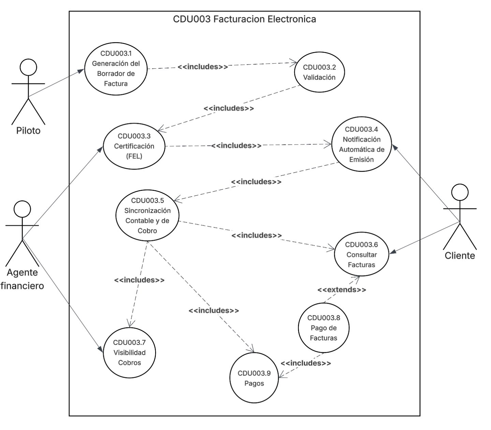

## CDU003 Facturación Electrónica

Sus expandidos serían:

- CDU003.1 Generación del Borrador de Factura
- CDU003.2 Validación
- CDU003.3 Certificación (FEL)
- CDU003.4 Notificación Automática de Emisión
- CDU003.5 Sincronización Contable y de Cobro
- CDU003.6 Consultar Facturas
- CDU003.7 Visibilidad Cobros
- CDU003.8 Pago de Facturas
- CDU003.9 Pagos

### Diagrama de expandidos

| **CAMPO**         | **DETALLE**                                                                                                                                                                                                                                                                                                                                                                                                        |
| ----------------- | ------------------------------------------------------------------------------------------------------------------------------------------------------------------------------------------------------------------------------------------------------------------------------------------------------------------------------------------------------------------------------------------------------------------ |
| Nombre            | Generación del Borrador de Factura                                                                                                                                                                                                                                                                                                                                                                                 |
| Código            | CDU003.1                                                                                                                                                                                                                                                                                                                                                                                                           |
| Actores           | Piloto                                                                                                                                                                                                                                                                                                                                                                                                             |
| Descripción       | Se genera un borrador de la factura con datos capturados anteriormente.                                                                                                                                                                                                                                                                                                                                            |
| Precondiciones    | El piloto debe marcar la carga como “Entregada”                                                                                                                                                                                                                                                                                                                                                                    |
| Post Condiciones  | Se registra la el borrador de la factura                                                                                                                                                                                                                                                                                                                                                                           |
| Flujo principal   | 1 El piloto marca como entregada la carga 2 Se registra el borrador de la factura                                                                                                                                                                                                                                                                                                                               |
| Flujos alternos   | FA1: El Piloto no marca como entregada la carga FA1.1 Se contacta con el piloto para que actualice el estado de la carga FA1.2 El piloto actualiza el estado FA1.3 Vuelve a el flujo principal  FA2: No se genera el borrador de la factura FA2.1 Se produce un log en el sistema para ver el motivo del error FA2.2 Se registra manualmente el borrador FA2.3 Vuelve a el flujo principal |
| Reglas de negocio | El piloto tiene un tiempo de espera razonable para la actualización del estado El borrador debe de tener toda la información necesaria                                                                                                                                                                                                                                                                          |
| Reglas de calidad | EL borrador debe de ser claro y conciso con la información Debe tener todos los campos completos                                                                                                                                                                                                                                                                                                                |

| **CAMPO**         | **DETALLE**                                                                                                                                                                                                                                                                                                                                                                                                 |
| ----------------- | ----------------------------------------------------------------------------------------------------------------------------------------------------------------------------------------------------------------------------------------------------------------------------------------------------------------------------------------------------------------------------------------------------------- |
| Nombre            | Validación                                                                                                                                                                                                                                                                                                                                                                                                  |
| Código            | CDU003.2                                                                                                                                                                                                                                                                                                                                                                                                    |
| Actores           | Agente financiero                                                                                                                                                                                                                                                                                                                                                                                                        |
| Descripción       | El sistema envía los datos del borrador para validar diferentes campos detallados mas adelante                                                                                                                                                                                                                                                                                                              |
| Precondiciones    | Debe de existir un borrador de la factura.                                                                                                                                                                                                                                                                                                                                                                  |
| Post Condiciones  | Se validan campos que contiene el borrador según métricas de calidad                                                                                                                                                                                                                                                                                                                                        |
| Flujo principal   | 1 Se recibe el borrador 2 Se valida el borrador 2.1 Verificar que el NIT sea válido (13 caracteres) 2.2 Validar que no faltan campos obligatorios 2.2.1 Fecha 2.2.2 Moneda (GTQ) 2.2.3 Descripción del servicio 2.2.4 Desglose correcto del IVA                                                                                                                                           |
| Flujos alternos   | FA1: El NIT es invalido  FA1.1 Se notifica a el departamento que el NIT es invalido FA1.2 Se solicita el cambio de NIT a uno valido FA1.3 Se vuelve a solicitar la validación FA1.2.4 Vuelve a el flujo principal.  FA2: Falta de campos FA2.1 Se solicita rellenar campos faltantes en el borrador FA2.2 Se vuelve a solicitar la validación  FA2.3 Vuelve a el flujo principal |
| Reglas de negocio | NIT sea válido (13 caracteres) y que el formato cumpla con las reglas de la SAT Fecha valida Moneda Desglose correcto del IVA correspondiente a la legislación tributaria de Guatemala                                                                                                                                                                                                             |
| Reglas de calidad | Rápido para el análisis del borrador Formato adecuado luego de la validación de los datos                                                                                                                                                                                                                                                                                                                |

| **CAMPO**         | **DETALLE**                                                                                                                                                                                                                         |
| ----------------- | ----------------------------------------------------------------------------------------------------------------------------------------------------------------------------------------------------------------------------------- |
| Nombre            | Certificación (FEL)                                                                                                                                                                                                                 |
| Código            | CDU003.3                                                                                                                                                                                                                            |
| Actores           | Agente Financiero                                                                                                                                                                                                                   |
| Descripción       | Proceso mediante el cual se certificar la factura                                                                                                                                                                                   |
| Precondiciones    | La factura el validada proceso CDU003.2                                                                                                                                                                                             |
| Post Condiciones  | Dar validez legal inmediata también siendo enviada y registrada.                                                                                                                                                                    |
| Flujo principal   | 1 El agente financiero abre la factura ya validada 2 El agente recibe el documento oficial (FEL) con su firma y número de autorización (Estos se deben de rellenar en uno a uno en un formulario) Da validez legal inmediata. |
| Flujos alternos   | FA1: El agente no rellena con su información para darle validez FA1.1 Se le solicita que llene todos los campos obligatorios FA1.2 el agente completa los entregables FA1.3 Se vuelve a el flujo                           |
| Reglas de negocio | Toda factura debe ser certificada para tener validez legal.                                                                                                                                                                         |
| Reglas de calidad | El formulario debe de ser claro de que se debe de entregar La respuesta de guardar la documentación no debe de superar los 3s                                                                                                    |

| **CAMPO**         | **DETALLE**                                                                                                                                                                                                                                                    |
| ----------------- | -------------------------------------------------------------------------------------------------------------------------------------------------------------------------------------------------------------------------------------------------------------- |
| Nombre            | Notificación Automática de Emisión                                                                                                                                                                                                                             |
| Código            | CDU003.4                                                                                                                                                                                                                                                       |
| Actores           | Cliente                                                                                                                                                                                                                                                        |
| Descripción       | Al ser certificada, la factura se envía de forma automática al correo electrónico registrado del cliente y se almacena en su expediente digital.                                                                                                               |
| Precondiciones    | La factura debe de estar Certificada                                                                                                                                                                                                                           |
| Post Condiciones  | Se envía de forma automática al correo electrónico la factura a el cliente Se almacena en su expediente digital del cliente                                                                                                                                 |
| Flujo principal   | 1 Después de certificar la factura 2 Se consulta el correo ligado a el cliente Se le envía el un correo con dicha factura Se registra en el espacio de expediente digital                                                                             |
| Flujos alternos   | FA1 El correo no es enviado FA1.1 Se vuelve a repetir la solicitud de envío de correo electrónico FA1.1.1 Si el correo se envía se sigue con el flujo normal FA1..1.2 Si no se logra enviar el correo se notifica para validar el correo del usuario. |
| Reglas de negocio | El correo debe de existir y estar vigente El registro debe ser publicado en nuestra Data Base para futuras consultas                                                                                                                                        |
| Reglas de calidad | La presentación del correo electrónico debe de ser atractivo Los datos deben de ser persistentes                                                                                                                                                            |

| **CAMPO**         | **DETALLE**                                                                                                                                                                                                                       |
| ----------------- | --------------------------------------------------------------------------------------------------------------------------------------------------------------------------------------------------------------------------------- |
| Nombre            | Sincronización Contable y de Cobro                                                                                                                                                                                                |
| Código            | CDU003.5                                                                                                                                                                                                                          |
| Actores           |                                                                                                                                                                                                                                   |
| Descripción       | Para tener una visibilidad clara para todos los involucrad del estado de un factura se necesita tener la posibilidad de que todos estos vean el mismo contenido de una factura.                                                   |
| Precondiciones    | Notificación enviada y registrada de facturas.                                                                                                                                                                                    |
| Post Condiciones  | Visualizar el estado de las facturas                                                                                                                                                                                              |
| Flujo principal   | 1 El sistema programa las fechas de vencimiento según términos de contrato 2 Se publica la información para que los que la necesiten la puedan visualiza 3 sincronización de las actualizaciones del estado de las facturas |
| Flujos alternos   | FA1 No se encuentra el plazo de la facturación FA1.1 Se le solicita a el departamento encargado de los contratos validar información FA1.2 Se revalúa el vencimiento la factura Se sigue con flujo noramal.              |
| Reglas de negocio | Debe de cumplir con el plazo del pago establecido por contrato Datos prexistentes Mismos estados de las facturas para todos.                                                                                                |
| Reglas de calidad | La información debe de ser clara                                                                                                                                                                                                  |

| **CAMPO**         | **DETALLE**                                                                                                                                                                                                                       |
| ----------------- | --------------------------------------------------------------------------------------------------------------------------------------------------------------------------------------------------------------------------------- |
| Nombre            | Sincronización Contable y de Cobro                                                                                                                                                                                                |
| Código            | CDU003.5                                                                                                                                                                                                                          |
| Actores           |                                                                                                                                                                                                                                   |
| Descripción       | Para tener una visibilidad clara para todos los involucrad del estado de un factura se necesita tener la posibilidad de que todos estos vean el mismo contenido de una factura.                                                   |
| Precondiciones    | Notificación enviada y registrada de facturas.                                                                                                                                                                                    |
| Post Condiciones  | Visualizar el estado de las facturas                                                                                                                                                                                              |
| Flujo principal   | 1 El sistema programa las fechas de vencimiento según términos de contrato 2 Se publica la información para que los que la necesiten la puedan visualiza 3 sincronización de las actualizaciones del estado de las facturas |
| Flujos alternos   | FA1 No se encuentra el plazo de la facturación FA1.1 Se le solicita a el departamento encargado de los contratos validar información FA1.2 Se revalúa el vencimiento la factura Se sigue con flujo noramal.              |
| Reglas de negocio | Debe de cumplir con el plazo del pago establecido por contrato Datos prexistentes Mismos estados de las facturas para todos.                                                                                                |
| Reglas de calidad | La información debe de ser clara                                                                                                                                                                                                  |

| **CAMPO**         | **DETALLE**                                                                                                                                                                      |
| ----------------- | -------------------------------------------------------------------------------------------------------------------------------------------------------------------------------- |
| Nombre            | Consultar Facturas                                                                                                                                                               |
| Código            | CDU003.6                                                                                                                                                                         |
| Actores           | Cliente                                                                                                                                                                          |
| Descripción       | Bajo el criterio de sincronización debemos de tener una vista para el usuario pueda revisar sus facturas en el estado que se encuentra etc.                                      |
| Precondiciones    | Las facturas ya se encuentran certificadas                                                                                                                                       |
| Post Condiciones  | Se visualizan todas las facturas y sus estados a el cliente                                                                                                                      |
| Flujo principal   | 1 El cliente ingresa a su módulo financiero** 2 Se visualizan todas las facturas con sus estados 3 Pude expandir la información de la factura mediante el archivo en pdf** |
| Flujos alternos   | FA1 El navegador no renderiza el contenido FA1.1 El usuario recarga la pantalla FA1.2 El contenido se visualiza                                                            |
| Reglas de negocio | El contenido de las facturas debe de ser correspondiente a la información ingresada                                                                                              |
| Reglas de calidad | El contenido que se muestran de las facturas es completo                                                                                                                         |

| **CAMPO**          | **DETALLE**                                                                                                                                                                         |
| ------------------ | ----------------------------------------------------------------------------------------------------------------------------------------------------------------------------------- |
| Nombre             | Visibilidad Cobros                                                                                                                                                                  |
| Código             | CDU003.7                                                                                                                                                                            |
| Actores            | Agente Finaciero                                                                                                                                                                 |
| Descripción        | Permite al departamento de cobros tener una visibilidad clara de las                                                                                                                |
| cuentas por cobrar |
| Precondiciones     | Las facturas ya se encuentran certificadas                                                                                                                                          |
| Post Condiciones   | Visibilidad de las facturas                                                                                                                                                         |
| Flujo principal    | 1 El encargado de departamento de cobros ingresa a su modulo de esto 2 Puede visualizar todas las facturas y su estado                                                           |
| Flujos alternos    | FA1 No puede visualizar el contenido FA1.1 Tiene que reiniciar el navegador o volver a iniciar sesión FA1.2 Se visualiza el contenido FA1.3 Vuelve a el flujo del programa |
| Reglas de negocio  | Se presenta un filtro para el departamento de cobros del estado de las facturas La información es completa de cada factura                                                       |
| Reglas de calidad  | El contenido es claro y descriptivo                                                                                                                                                 |

| **CAMPO**         | **DETALLE**                                                                                                                                                                                                                                                                                                                                                                                     |
| ----------------- | ----------------------------------------------------------------------------------------------------------------------------------------------------------------------------------------------------------------------------------------------------------------------------------------------------------------------------------------------------------------------------------------------- |
| Nombre            | Pago de Facturas                                                                                                                                                                                                                                                                                                                                                                                |
| Código            | CDU003.8                                                                                                                                                                                                                                                                                                                                                                                        |
| Actores           | Cliente                                                                                                                                                                                                                                                                                                                                                                                         |
| Descripción       | El cliente tiene la opción de subir a su comprobante de pago a su factura.                                                                                                                                                                                                                                                                                                                      |
| Precondiciones    | La factura ya sebe de encontrar certificada                                                                                                                                                                                                                                                                                                                                                     |
| Post Condiciones  | Se realiza el pago de la factura                                                                                                                                                                                                                                                                                                                                                                |
| Flujo principal   | 1 El cliente ingresa a su módulo financiero 2 Selecciona la factura que desea pagar 3 Sube su comprobante 4 Se le solicita que confirme su envió 5 Se envía la solicitud de pago de la factura                                                                                                                                                                                      |
| Flujos alternos   | FA1 El cliente se equivoco al seleccionar su archivo FA1.1 Da click a el botón en el formulario de editar comprobante FA1.2 Selecciona su nuevo comprobante FA1.3 Da en aceptar FA1.4 Vuelve a el flujo normal                                                                                                                                                                      |
| Reglas de negocio | El pago debe de estar antes de la fecha de vencimiento según términos del contrato La constancia debe de contar con parámetros específicos como: - Fecha y la hora  - El monto Adicionalmente, si el pago se recibe como cheque o transferencia, - banco origen - La cuenta de la cual se obtuvieron los fondos - Número de autorización generado por la entidad bancaria. |
| Reglas de calidad | El comprobante debe de ser claro                                                                                                                                                                                                                                                                                                                                                                |

| **CAMPO**         | **DETALLE**                                                                                                                                                                                                                                                                                                                                                                                                                                                                                    |
| ----------------- | ---------------------------------------------------------------------------------------------------------------------------------------------------------------------------------------------------------------------------------------------------------------------------------------------------------------------------------------------------------------------------------------------------------------------------------------------------------------------------------------------- |
| Nombre            | Pagos                                                                                                                                                                                                                                                                                                                                                                                                                                                                                          |
| Código            | CDU003.9                                                                                                                                                                                                                                                                                                                                                                                                                                                                                       |
| Actores           |                                                                                                                                                                                                                                                                                                                                                                                                                                                                           |
| Descripción       | Información auto generada deel pago realizado del cliente dependiendo del metodo de pago.                                                                                                                                                                                                                                                                                                                                                                                                                    |
| Precondiciones    | El cliente hizo el pago de su factura                                                                                                                                                                                                                                                                                                                                                                                                                                                          |
| Post Condiciones  | El agente registra la factura                                                                                                                                                                                                                                                                                                                                                                                                                                                                  |
| Flujo principal   | 1 El agente ingresa a su modulo de previsualización de facturas pagada sin ser procesada 2 El agente visualiza la factura junto a su comprobante de pago 3 El agente rellena los campos del formulario como:  Fecha y la hora  El monto Adicionalmente, si el pago se recibe como cheque o transferencia, - banco origen - La cuenta de la cual se obtuvieron los fondos - Número de autorización generado por la entidad bancaria. 4 Se envia el registro del pago |
| Flujos alternos   | FA1 No se rellenan todos los campos FA1.1 Se indica que campos son obligatorios FA1.2 Se completan los campos faltantes FA1.3 Vuelve a el flujo normal                                                                                                                                                                                                                                                                                                                                |
| Reglas de negocio | Debe de registrar toda la información antes mencionada El pago debe de estar dentro del rango del contrato                                                                                                                                                                                                                                                                                                                                                                                  |
| Reglas de calidad | Los datos deben de ser verídicos                                                                                                                                                                                                                                                                                                                                                                                                                                                               |

### Matrices de trazabilidad

|                     | CDU003.1 | CDU003.2 | CDU003.3 | CDU003.4 | CDU003.5 | CDU003.6 | CDU003.7 | CDU003.8 | CDU003.9 |
| ------------------- | -------- | -------- | -------- | -------- | -------- | -------- | -------- | -------- | -------- |
| Piloto              | X        |          |          |          |          |          |          |          |          |
| Cliente             |          |          |          | X        |          |          | X        |          |          |
| Agente financiero   |          |   x       | X        |          |          |         |   x       |          |          |

| Stakeholder         | Descripción                                                                                                               |
| ------------------- | ------------------------------------------------------------------------------------------------------------------------- |
| Piloto              | Es la persona que tiene la obligación de cuando es que entrega un carga                                                   |
| Cliente             | Su papel radica en que puda visualizar y pagar sus facturas verificadas y certificadas                                    |
| Agente financiero   | En cargado de dar fe a las facturas validadas, y tambien ecargado de verificar el pago de facturas que realiza el cliente |
| Departamento Cobros | Tiene la potestad de ver los estados de los pagos de las facturas                                                         |
