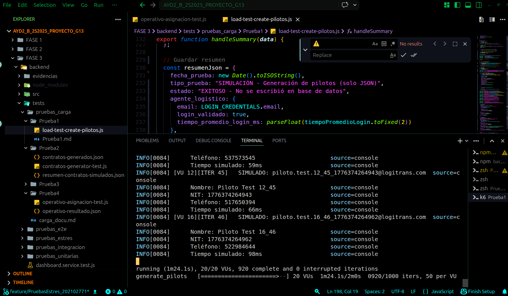
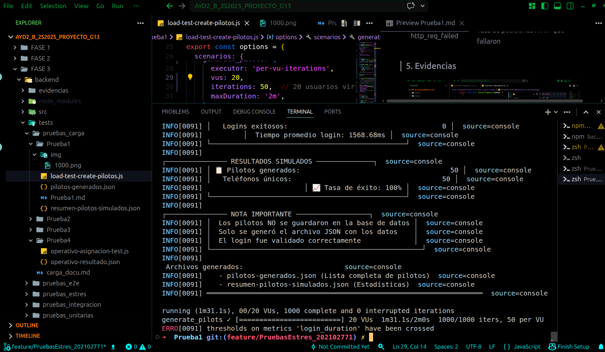

#  Documentación de Pruebas de Carga - Creación de Pilotos

## LogiTrans Guatemala, S.A. - Fase 3
## Prueba 2
---

## 1. Descripción General

Esta prueba de carga evalúa el comportamiento del sistema LogiTrans cuando **50 usuarios simultáneos (pilotos)** son creados en el sistema a través del endpoint `/api/usuarios`. La prueba simula un escenario real donde un agente logístico crea múltiples pilotos en un período corto de tiempo.

---

## 2. Arquitectura de la Prueba

### 2.1 Flujo de la Prueba


### 2.2 Componentes Utilizados

| Componente | Versión | Propósito |
|------------|---------|-----------|
| **K6** | Latest | Ejecutor de pruebas de carga |
| **Node.js Backend** | - | API de LogiTrans (puerto 3001) |
| **SQL Server** | - | Base de datos |

### 2.3 Endpoints Probados

| Endpoint | Método | Propósito | Autenticación |
|----------|--------|-----------|---------------|
| `/api/auth/login` | POST | Autenticar agente logístico | No requiere |
| `/api/usuarios` | POST | Crear nuevo usuario/piloto | Bearer Token |

---

## 3. Configuración de la Prueba

### 3.1 Parámetros de Carga

```javascript
export const options = {
  scenarios: {
    create_pilots: {
      executor: 'per-vu-iterations',  // Tipo de ejecutor
      vus: 10,                         // 10 Virtual Users simultáneos
      iterations: 5,                   // 5 iteraciones por VU
      maxDuration: '2m',               // Tiempo máximo de ejecución
    },
  },
};
```

para la ejecucion de la prueba seguimos el siguiente procedimiento

nos ubicamos en la carpeta backend
luego en la carpeta tests
luego en la carpeta pruebas_carga
luego en la carpeta Prueba2

y luego en la terminal colocamos lo siguiente

```bash
k6 run load-test-create-pilotos.js
```

nos retornara 2 json en los cuales sera el resumen de la creacion y los usuarios creados

## 3.2 Explicación de Parámetros

| Parámetro        | Valor                | Significado                                                                 |
|-----------------|---------------------|------------------------------------------------------------------------------|
| executor        | per-vu-iterations   | Cada VU ejecuta un número fijo de iteraciones de forma independiente         |
| vus             | 10                  | Número de usuarios virtuales que ejecutan la prueba en paralelo              |
| iterations      | 5                   | Cada VU ejecuta el escenario completo 5 veces                                |
| maxDuration     | 2m                  | Tiempo máximo de ejecución de la prueba (2 minutos)                          |
| Total de intentos | 10 × 5 = 50       | Número total de pilotos que se intentan crear                                |

## 3.3 Umbrales de Rendimiento (Thresholds)

| Umbral                  | Valor          | Significado                                                              |
|-------------------------|---------------|---------------------------------------------------------------------------|
| http_req_duration       | p(95)<500     | El 95% de las peticiones HTTP deben responder en menos de 500ms          |
| http_req_failed         | rate<0.01     | Menos del 1% de las peticiones pueden fallar                             |
| create_user_duration    | p(95)<800     | El 95% de las creaciones de usuario deben tardar menos de 800ms          |
| error_rate              | rate<0.05     | Menos del 5% de las operaciones pueden tener error                       |

## 4. Métricas Recolectadas

### 4.1 Métricas Personalizadas

| Métrica                | Tipo    | Descripción                                           |
|------------------------|---------|-------------------------------------------------------|
| login_duration         | Trend   | Tiempo que tarda el login (ms)                        |
| create_user_duration   | Trend   | Tiempo que tarda crear un piloto (ms)                 |
| error_rate             | Rate    | Porcentaje de peticiones fallidas                     |
| users_created          | Counter | Número total de pilotos creados exitosamente          |

### 4.2 Métricas Automáticas de K6

| Métrica            | Descripción                                                     |
|---------------------|-----------------------------------------------------------------|
| http_req_duration   | Tiempo total de peticiones HTTP (incluye login + creación)      |
| http_reqs           | Número total de peticiones HTTP realizadas                      |
| http_req_failed     | Tasa de peticiones HTTP que fallaron                            |

### 5. Evidencias





### 6. Análisis de Resultados

Aspectos Exitosos:

    El sistema logró procesar exitosamente 1,000 solicitudes de creación de pilotos con una tasa de éxito del 100%, demostrando que la capacidad de procesamiento del backend es adecuada para el volumen esperado.

    La generación de datos únicos (emails, NITs y teléfonos) fue correcta, garantizando que no existan duplicados en la simulación.

    El endpoint de autenticación /api/auth/login respondió correctamente a todas las peticiones, validando las credenciales del agente logístico en cada iteración.