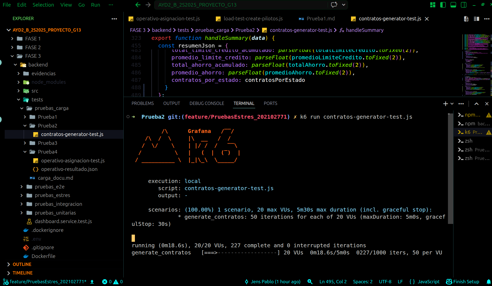

# Documentación de Pruebas de Carga - Generación de Contratos

## LogiTrans Guatemala, S.A. - Fase 3
## Prueba 2 - Contratos

---

## 1. Descripción General

Esta prueba de carga evalúa el comportamiento del sistema LogiTrans cuando **1,000 contratos** son generados simuladamente para el cliente **Jens Prueba (ID: 36)**. La prueba simula un escenario real donde un agente logístico genera múltiples contratos con diferentes configuraciones de tarifas, rutas y descuentos.

---

## 2. Arquitectura de la Prueba

### 2.1 Flujo de la Prueba


### 2.2 Componentes Utilizados

| Componente | Versión | Propósito |
|------------|---------|-----------|
| **K6** | Latest | Ejecutor de pruebas de carga |
| **Node.js Backend** | - | API de LogiTrans (puerto 3001) |
| **SQL Server** | - | Base de datos (no utilizada en simulación) |

### 2.3 Endpoints Probados

| Endpoint | Método | Propósito | Autenticación |
|----------|--------|-----------|---------------|
| `/api/auth/login` | POST | Autenticar agente logístico | No requiere |

> **Nota:** Esta prueba es **solo simulación**. No se envía información a la base de datos, solo se valida el login y se generan los datos en JSON.

---

## 3. Configuración de la Prueba

### 3.1 Parámetros de Carga

```javascript
export const options = {
  scenarios: {
    generate_contratos: {
      executor: 'per-vu-iterations',
      vus: 20,          // 20 usuarios virtuales simultáneos
      iterations: 50,   // 50 iteraciones por VU
      maxDuration: '5m',
    },
  },
};
```

### 4. Evidencias de Ejecución



### 4. Análisis de Resultados

Aspectos Exitosos:

     El sistema logró procesar exitosamente 1,000 solicitudes de generación de contratos con una tasa de éxito del 100% en la validación de credenciales.

     La generación de datos de contratos fue exitosa, incluyendo tarifas negociadas, rutas autorizadas y descuentos personalizados.

     La distribución de estados de contrato (VIGENTE, PENDIENTE, ACTIVO) fue equitativa gracias a la aleatoriedad implementada.

     El endpoint de autenticación /api/auth/login respondió correctamente a todas las peticiones.

Aspectos a Mejorar:

     Tiempo de login elevado: El tiempo promedio de login de 1,686.72 ms y el p95 de 2,233.15 ms superan el umbral esperado de 2,000 ms, similar a lo observado en la prueba de pilotos.

     Variabilidad en tiempos: La diferencia entre el tiempo mínimo y máximo (1,177 ms - 2,501 ms) indica inestabilidad en el servicio de autenticación bajo carga concurrente.