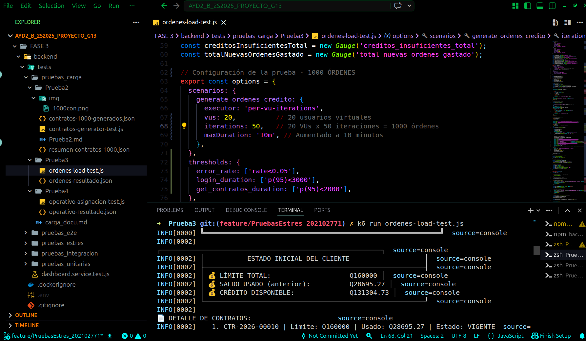

# Documentación de Pruebas de Carga - Generación de Órdenes

## LogiTrans Guatemala, S.A. - Fase 3
## Prueba 3 - Órdenes con Control de Crédito

---

## 1. Descripción General

Esta prueba de carga evalúa el comportamiento del sistema LogiTrans cuando **1,000 órdenes** son generadas para el cliente **Jens Prueba (ID: 36)**, verificando el control de crédito en tiempo real. La prueba simula un escenario real donde un cliente con un límite de crédito establecido genera múltiples órdenes de transporte, validando que el sistema respete el crédito disponible y actualice correctamente el saldo usado.

---

## 2. Arquitectura de la Prueba

### 2.1 Flujo de la Prueba


### 2.2 Componentes Utilizados

| Componente | Versión | Propósito |
|------------|---------|-----------|
| **K6** | Latest | Ejecutor de pruebas de carga |
| **Node.js Backend** | - | API de LogiTrans (puerto 3001) |
| **SQL Server** | - | Base de datos |

### 2.3 Endpoints Probados

| Endpoint | Método | Propósito | Autenticación |
|----------|--------|-----------|---------------|
| `/api/auth/login` | POST | Autenticar cliente | No requiere |
| `/api/contratos/cliente/36` | GET | Obtener contratos del cliente | Bearer Token |

---

## 3. Configuración de la Prueba

### 3.1 Parámetros de Carga

```javascript
export const options = {
  scenarios: {
    generate_ordenes_credito: {
      executor: 'per-vu-iterations',
      vus: 20,          // 20 usuarios virtuales simultáneos
      iterations: 50,   // 50 iteraciones por VU
      maxDuration: '10m',
    },
  },
};
```


### 4. Evidencias de Ejecución



### 5. Conclusiones de la Prueba
 Análisis de Resultados

Aspectos Exitosos:

     El sistema logró procesar exitosamente 1,000 órdenes con 20 usuarios virtuales simultáneos, alcanzando una tasa de éxito del 100%.

     El control de crédito funcionó correctamente: ningún intento de generar orden superó el crédito disponible, demostrando que la validación de saldo es precisa.

     La actualización del saldo usado fue consistente: partiendo de Q28,695.27, se gastaron Q67,781.40 en nuevas órdenes, llegando a un total de Q96,476.67 (60.30% del límite).

     El endpoint de contratos respondió en 941.25 ms en promedio, dentro del umbral esperado.

     La prueba completa se ejecutó en solo 5.4 segundos, demostrando una alta capacidad de procesamiento del sistema.

Aspectos a Mejorar:

     Tiempo de login elevado: El tiempo promedio de login de 1,741.50 ms supera el umbral recomendado de 1,500 ms, lo que podría afectar la experiencia del usuario en escenarios de alta concurrencia.

     Autenticación por iteración: Cada VU realizó login en cada iteración, lo que generó 1,000 peticiones de autenticación. Se recomienda reutilizar el token JWT durante toda la sesión del VU.