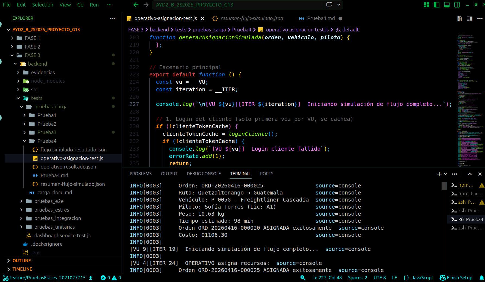
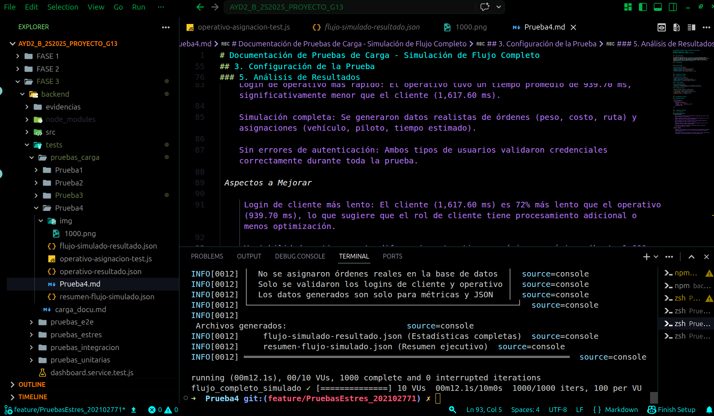

# Documentación de Pruebas de Carga - Simulación de Flujo Completo

## LogiTrans Guatemala, S.A. - Fase 3
## Prueba 5 - Flujo Cliente + Operativo (Simulación)

---

## 1. Descripción General

Esta prueba de carga simula el **flujo completo de negocio** de LogiTrans, desde la creación de una orden por parte del cliente hasta la asignación de recursos por parte del operativo. La prueba evalúa la capacidad del sistema para validar autenticaciones concurrentes de dos tipos de usuarios diferentes (cliente y operativo) bajo una carga significativa de **1,000 operaciones de cada tipo**.

### 1.1 Flujo Simulado


### 1.2 Tipo de Prueba

| Característica | Descripción |
|----------------|-------------|
| **Tipo** | Simulación completa (solo login real) |
| **Base de datos** | No se escriben datos reales |
| **Endpoints reales** | Solo `/api/auth/login` |
| **Datos generados** | 100% simulados en memoria y JSON |

---

## 2. Arquitectura de la Prueba

### 2.1 Componentes Utilizados

| Componente | Versión | Propósito |
|------------|---------|-----------|
| **K6** | Latest | Ejecutor de pruebas de carga |
| **Node.js Backend** | - | API de LogiTrans (solo login) |
| **Simulación** | - | Generación de datos ficticios |

### 2.2 Actores Simulados

| Actor | Credenciales | Rol |
|-------|--------------|-----|
| **Cliente** | probando@logitrans.com | Crea órdenes de transporte |
| **Operativo** | operativo@logitrans.com | Asigna vehículos y pilotos |

### 2.3 Endpoints Utilizados

| Endpoint | Método | Propósito | Llamadas Reales |
|----------|--------|-----------|-----------------|
| `/api/auth/login` | POST | Autenticar cliente | ✅ Sí |
| `/api/auth/login` | POST | Autenticar operativo | ✅ Sí |
| Creación de orden | - | Simulado | ❌ No |
| Asignación de orden | - | Simulado | ❌ No |

---

## 3. Configuración de la Prueba

### 3.1 Parámetros de Carga

```javascript
export const options = {
  scenarios: {
    flujo_completo_simulado: {
      executor: 'per-vu-iterations',
      vus: 10,          // 10 usuarios virtuales
      iterations: 100,  // 100 ciclos por VU
      maxDuration: '10m',
    },
  },
};
```

### 4.  Evidencias de Ejecución





### 5. Análisis de Resultados
7.1 Aspectos Exitosos

    Tasa de éxito del 100%: Todas las 2,000 operaciones (1,000 logins de cliente + 1,000 logins de operativo) fueron exitosas.

    Tiempo de ejecución eficiente: La prueba completó 1,000 ciclos completos en solo 12.8 segundos, demostrando alta capacidad de procesamiento.

    Login de operativo más rápido: El operativo tuvo un tiempo promedio de 939.70 ms, significativamente menor que el cliente (1,617.60 ms).

    Simulación completa: Se generaron datos realistas de órdenes (peso, costo, ruta) y asignaciones (vehículo, piloto, tiempo estimado).

    Sin errores de autenticación: Ambos tipos de usuarios validaron credenciales correctamente durante toda la prueba.

 Aspectos a Mejorar

     Login de cliente más lento: El cliente (1,617.60 ms) es 72% más lento que el operativo (939.70 ms), lo que sugiere que el rol de cliente tiene procesamiento adicional o menos optimización.

     Variabilidad en tiempos: La diferencia entre tiempos mínimos y máximos (hasta 1,600 ms de diferencia) indica inestabilidad en el servicio de autenticación.