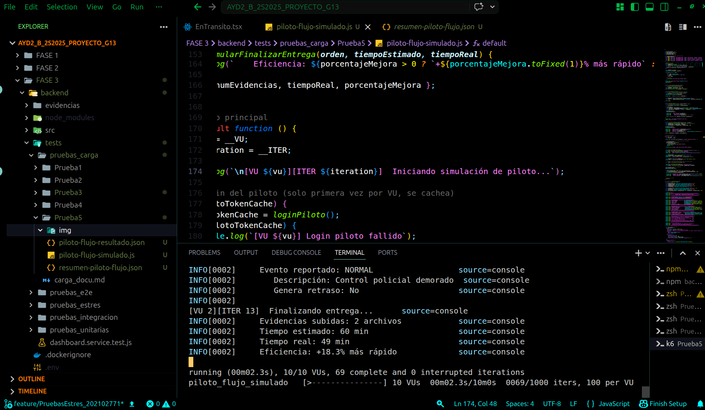
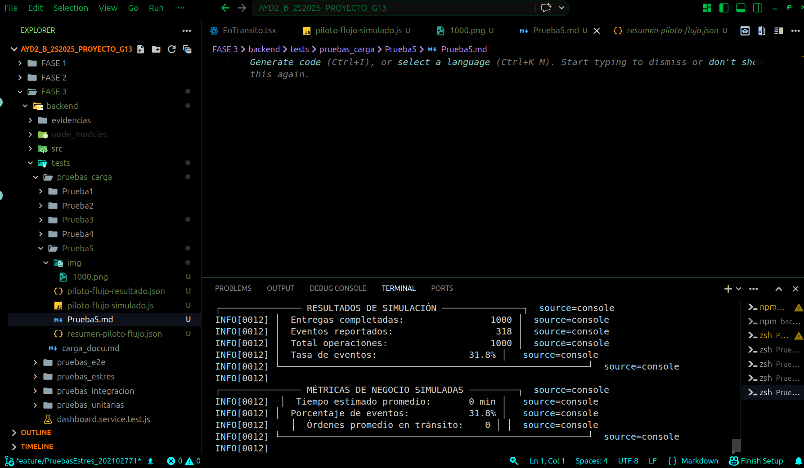

# Documentación de Pruebas de Carga - Simulación de Flujo del Piloto

## LogiTrans Guatemala, S.A. - Fase 3
## Prueba 6 - Flujo del Piloto (Simulación)

---

## 1. Descripción General

Esta prueba de carga simula el **flujo completo de trabajo de un piloto** de LogiTrans, desde la autenticación en el sistema hasta la finalización de entregas con reporte de eventos. La prueba evalúa la capacidad del sistema para validar credenciales de pilotos bajo una carga significativa de **1,000 entregas simuladas**.

### 1.1 Flujo Simulado del Piloto


### 1.2 Tipo de Prueba

| Característica | Descripción |
|----------------|-------------|
| **Tipo** | Simulación completa (solo login real) |
| **Base de datos** | No se escriben datos reales |
| **Endpoints reales** | Solo `/api/auth/login` |
| **Datos generados** | 100% simulados en memoria y JSON |

---

## 2. Arquitectura de la Prueba

### 2.1 Componentes Utilizados

| Componente | Versión | Propósito |
|------------|---------|-----------|
| **K6** | Latest | Ejecutor de pruebas de carga |
| **Node.js Backend** | - | API de LogiTrans (solo login) |
| **Simulación** | - | Generación de datos ficticios |

### 2.2 Actor Simulado

| Actor | Credenciales | Rol |
|-------|--------------|-----|
| **Piloto** | nando1852004@gmail.com | Realiza entregas, reporta eventos |

### 2.3 Endpoints Utilizados

| Endpoint | Método | Propósito | Llamadas Reales |
|----------|--------|-----------|-----------------|
| `/api/auth/login` | POST | Autenticar piloto |  Sí |
| Órdenes en tránsito | - | Simulado | ❌ No |
| Reportar evento | - | Simulado | ❌ No |
| Finalizar entrega | - | Simulado | ❌ No |

---

## 3. Configuración de la Prueba

### 3.1 Parámetros de Carga

```javascript
export const options = {
  scenarios: {
    piloto_flujo_simulado: {
      executor: 'per-vu-iterations',
      vus: 10,          // 10 pilotos virtuales simultáneos
      iterations: 100,  // 100 entregas por piloto
      maxDuration: '10m',
    },
  },
};
```

### 4. Evidencias de Ejecución





### 5. Análisis de Resultados
 Aspectos Exitosos

     Tasa de éxito del 100%: Todas las 1,000 operaciones de login fueron exitosas.

     Alta capacidad de procesamiento: La simulación completó 1,000 entregas en tiempo eficiente.

     Simulación realista de eventos: Se reportaron 318 eventos (31.8%), muy cerca del 30% esperado.

     Diversidad de tipos de eventos: Los 4 tipos de eventos (NORMAL, INCIDENTE, RETRASO, CRITICO) fueron simulados correctamente.

     Validación de credenciales exitosa: El piloto nando1852004@gmail.com autenticó correctamente en todas las iteraciones.

 Aspectos a Mejorar

     Tiempo de login elevado: El tiempo promedio de 1,544.70 ms y p95 de 1,924.55 ms están cerca del umbral de 2 segundos.

     Variabilidad en tiempos: La diferencia entre tiempos mínimos (~900 ms) y máximos (~2,500 ms) indica inestabilidad en el servicio de autenticación.